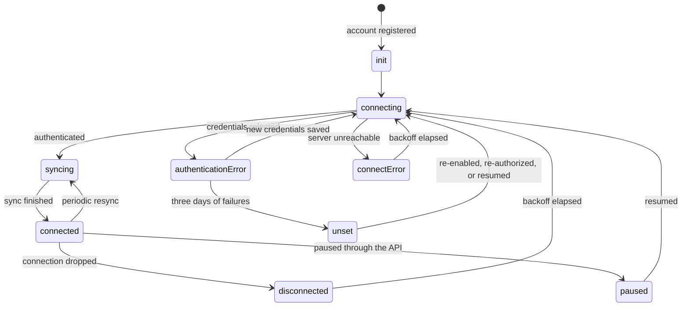

# Managing Accounts

This guide covers the complete lifecycle of account management in EmailEngine, including creating, updating, monitoring, and deleting accounts using both the API and web dashboard.

## Account Lifecycle

### Account States

Every account in EmailEngine has a state that indicates its current status:

| State | Description | Can Send/Receive | Actions |
|-------|-------------|------------------|---------|
| `init` | The account was just registered and has not connected yet | No | Wait |
| `connecting` | Connecting to the mail server or authorizing with the provider | Limited | Wait for connection |
| `syncing` | Connected and performing the initial or a periodic mailbox sync | Yes | Operations allowed |
| `connected` | Connected and watching for changes. This is the healthy steady state | Yes | All operations available |
| `disconnected` | The connection dropped and EmailEngine is retrying with backoff | No | Wait for the retry |
| `authenticationError` | The credentials were rejected. Requires re-authentication before syncing resumes | No | Update credentials or re-authorize |
| `connectError` | The server could not be reached or the TLS handshake failed. Retried with backoff | No | Check network, server status |
| `paused` | Syncing was paused through the API. No connection is maintained | No | Resume syncing |
| `unset` | The account is not syncing: either no IMAP or OAuth2 configuration is set, or syncing was switched off, by the operator or automatically after repeated authentication failures | No | Finish the setup, or [re-enable the account](#disabling-and-enabling-accounts) |

Two different things put an account in `unset`, and the account object tells them apart. `imap.disabled` is `true` in both cases; `authFailureDisabledAt` (since v2.79.4) is a timestamp when EmailEngine [switched the account off itself](#accounts-switched-off-after-authentication-failures) and `null` when the operator did.

### State Transitions



## Adding Accounts


*Accounts list showing connected email accounts*


*Detailed view of a connected account showing status, sync information, and configuration*

### Via API (Programmatic)

#### IMAP/SMTP with Password

Register a new account using the [account registration API](/docs/api/post-v-1-account):

```bash
curl -X POST https://emailengine.example.com/v1/account \
  -H "Authorization: Bearer YOUR_TOKEN" \
  -H "Content-Type: application/json" \
  -d '{
    "account": "user123",
    "name": "John Doe",
    "email": "john@example.com",
    "imap": {
      "host": "imap.example.com",
      "port": 993,
      "secure": true,
      "auth": {
        "user": "john@example.com",
        "pass": "password123"
      }
    },
    "smtp": {
      "host": "smtp.example.com",
      "port": 587,
      "secure": false,
      "auth": {
        "user": "john@example.com",
        "pass": "password123"
      }
    }
  }'
```

[See IMAP/SMTP setup guide →](/docs/accounts/imap-smtp)

#### OAuth2 (Gmail/Outlook)

```bash
curl -X POST https://emailengine.example.com/v1/account \
  -H "Authorization: Bearer YOUR_TOKEN" \
  -H "Content-Type: application/json" \
  -d '{
    "account": "user123",
    "name": "John Doe",
    "email": "john@gmail.com",
    "oauth2": {
      "provider": "AAABhaBPHscAAAAH",
      "accessToken": "ACCESS_TOKEN_FROM_GOOGLE",
      "refreshToken": "REFRESH_TOKEN_FROM_GOOGLE",
      "auth": {
        "user": "john@gmail.com"
      }
    }
  }'
```

`provider` is the ID of an OAuth2 application registered in EmailEngine, shown on **Integrations** > **OAuth2 Apps**, not the name of the provider and not the client ID from Google or Azure. `auth.user` is required: it is the mailbox the tokens belong to.

[See Gmail OAuth2 guide →](./gmail/gmail-imap)
[See Outlook OAuth2 guide →](./microsoft-365/outlook-365)

#### Service Accounts (Google Workspace)

```bash
curl -X POST https://emailengine.example.com/v1/account \
  -H "Authorization: Bearer YOUR_TOKEN" \
  -H "Content-Type: application/json" \
  -d '{
    "account": "user123",
    "name": "John Doe",
    "email": "john@company.com",
    "oauth2": {
      "provider": "AAABhaBPHscAAAAI",
      "auth": {
        "user": "john@company.com"
      }
    }
  }'
```

[See Service Accounts guide →](./gmail/google-service-accounts)

#### Authentication Server

```bash
curl -X POST https://emailengine.example.com/v1/account \
  -H "Authorization: Bearer YOUR_TOKEN" \
  -H "Content-Type: application/json" \
  -d '{
    "account": "user123",
    "name": "John Doe",
    "email": "john@outlook.com",
    "imap": {
      "useAuthServer": true,
      "host": "outlook.office365.com",
      "port": 993,
      "secure": true
    },
    "smtp": {
      "useAuthServer": true,
      "host": "smtp-mail.outlook.com",
      "port": 587,
      "secure": false
    }
  }'
```

[See Authentication Server guide →](./authentication-server)

### Via Hosted Authentication Form

Generate a form URL and redirect users to complete setup:

```bash
curl -X POST https://emailengine.example.com/v1/authentication/form \
  -H "Authorization: Bearer YOUR_TOKEN" \
  -H "Content-Type: application/json" \
  -d '{
    "account": "user123",
    "email": "john@gmail.com",
    "name": "John Doe",
    "redirectUrl": "https://myapp.com/settings"
  }'
```

**Response:**
```json
{
  "url": "https://emailengine.example.com/accounts/new?data=eyJhY2NvdW50IjoidXNlcjEyMyJ9.k3Qb"
}
```

Direct user to this URL. After completing setup, they'll be redirected to your `redirectUrl`.

[Learn more about hosted authentication →](/docs/accounts/hosted-authentication)

### Via Web Dashboard

1. Navigate to **Accounts** in the EmailEngine dashboard
2. Click **Add an account**, enter a display name and, optionally, an account identifier, then click **Continue**
3. On the hosted authentication form, choose **Standard IMAP** or one of the enabled OAuth2 apps (for example, a "Sign in with Microsoft" button)
4. Complete setup
5. Account appears in accounts list

## Retrieving Account Information

### Get Single Account

```bash
curl https://emailengine.example.com/v1/account/user123 \
  -H "Authorization: Bearer YOUR_TOKEN"
```

**Response:**
```json
{
  "account": "user123",
  "name": "John Doe",
  "email": "john@gmail.com",
  "state": "connected",
  "syncTime": "2024-01-15T10:30:00.000Z",
  "type": "gmail",
  "authFailureDisabledAt": null,
  "oauth2": {
    "provider": "AAABhaBPHscAAAAH",
    "auth": { "user": "john@gmail.com" },
    "expires": "2024-01-15T11:30:00.000Z"
  },
  "imap": {
    "host": "imap.gmail.com",
    "port": 993,
    "secure": true
  },
  "smtp": {
    "host": "smtp.gmail.com",
    "port": 587,
    "secure": false
  },
  "path": "*",
  "subconnections": [],
  "counters": {
    "events": {
      "messageNew": 158,
      "messageSent": 42,
      "messageDeleted": 5
    }
  }
}
```

### List All Accounts

```bash
curl https://emailengine.example.com/v1/accounts \
  -H "Authorization: Bearer YOUR_TOKEN"
```

**Response:**
```json
{
  "accounts": [
    {
      "account": "user123",
      "name": "John Doe",
      "email": "john@gmail.com",
      "type": "gmail",
      "state": "connected"
    },
    {
      "account": "user456",
      "name": "Jane Smith",
      "email": "jane@outlook.com",
      "type": "outlook",
      "state": "unset",
      "authFailureDisabledAt": "2026-08-20T09:12:44.000Z"
    }
  ],
  "total": 2,
  "page": 0,
  "pages": 1
}
```

List entries carry `authFailureDisabledAt` only for accounts that EmailEngine [switched off after repeated authentication failures](#accounts-switched-off-after-authentication-failures); it is omitted otherwise.

### Filter Accounts

**By state:**
```bash
curl "https://emailengine.example.com/v1/accounts?state=connected" \
  -H "Authorization: Bearer YOUR_TOKEN"
```

**By email pattern:**
```bash
curl "https://emailengine.example.com/v1/accounts?query=@gmail.com" \
  -H "Authorization: Bearer YOUR_TOKEN"
```

**Pagination:**
```bash
curl "https://emailengine.example.com/v1/accounts?page=1&pageSize=20" \
  -H "Authorization: Bearer YOUR_TOKEN"
```

## Updating Accounts

### Update Basic Information

Use the [update account API](/docs/api/put-v-1-account-account):

```bash
curl -X PUT https://emailengine.example.com/v1/account/user123 \
  -H "Authorization: Bearer YOUR_TOKEN" \
  -H "Content-Type: application/json" \
  -d '{
    "name": "John Doe (Updated)",
    "email": "john.doe@gmail.com"
  }'
```

`expectedEmail` is set the same way. It restricts which address may be used the next time the account is set up through a [hosted authentication form](/docs/accounts/hosted-authentication#requiring-a-specific-address); send `null` to remove the restriction.

### Update IMAP/SMTP Settings

**Update specific IMAP properties (recommended):**

```bash
curl -X PUT https://emailengine.example.com/v1/account/user123 \
  -H "Authorization: Bearer YOUR_TOKEN" \
  -H "Content-Type: application/json" \
  -d '{
    "imap": {
      "partial": true,
      "port": 993,
      "secure": true
    }
  }'
```

**Replace entire IMAP configuration:**

```bash
curl -X PUT https://emailengine.example.com/v1/account/user123 \
  -H "Authorization: Bearer YOUR_TOKEN" \
  -H "Content-Type: application/json" \
  -d '{
    "imap": {
      "host": "imap.newserver.com",
      "port": 993,
      "secure": true,
      "auth": {
        "user": "john@newserver.com",
        "pass": "newpassword"
      }
    }
  }'
```

:::warning Partial Updates
Use `"partial": true` inside the `imap` or `smtp` object to update only specific fields. Without it, you'll replace the entire configuration, which may lose existing settings like auth credentials or special folder paths.

The flag itself belongs on `imap`, `smtp`, or `oauth2` and nowhere deeper. The merge it performs is recursive, though, so sending `auth: { pass: "..." }` under a partial update keeps the stored `auth.user`.
:::

### Update OAuth2 Tokens

```bash
curl -X PUT https://emailengine.example.com/v1/account/user123 \
  -H "Authorization: Bearer YOUR_TOKEN" \
  -H "Content-Type: application/json" \
  -d '{
    "oauth2": {
      "partial": true,
      "accessToken": "new.access.token",
      "refreshToken": "new.refresh.token"
    }
  }'
```

### Enable Sub-Connections

Monitor additional folders in real-time:

```bash
curl -X PUT https://emailengine.example.com/v1/account/user123 \
  -H "Authorization: Bearer YOUR_TOKEN" \
  -H "Content-Type: application/json" \
  -d '{
    "subconnections": [
      "\\Sent",
      "Important",
      "Projects"
    ]
  }'
```

**Benefits:**
- Instant webhooks for messages in these folders
- Real-time notifications
- Better CRM integration

**Limits:**
- Uses additional IMAP connections
- Most servers limit to 10-15 concurrent connections
- Use sparingly

[Learn more about sub-connections →](/docs/advanced/performance-tuning#sub-connections-for-selected-folders)

### Configure Path Filtering

Sync and monitor only specific folders:

```bash
curl -X PUT https://emailengine.example.com/v1/account/user123 \
  -H "Authorization: Bearer YOUR_TOKEN" \
  -H "Content-Type: application/json" \
  -d '{
    "path": [
      "INBOX",
      "\\Sent",
      "\\Drafts",
      "Important"
    ]
  }'
```

**What this does:**
- EmailEngine will **sync and monitor** only the listed folders
- Unlisted folders will **not trigger webhooks** when messages change
- You can still **access unlisted folders via API** (list messages, search, etc.)
- Reduces resource usage by limiting what EmailEngine actively monitors

[Learn more about path filtering →](/docs/advanced/performance-tuning#limiting-indexed-folders)

### Set Custom Sent Mail Path

If EmailEngine doesn't correctly identify your Sent folder:

```bash
curl -X PUT https://emailengine.example.com/v1/account/user123 \
  -H "Authorization: Bearer YOUR_TOKEN" \
  -H "Content-Type: application/json" \
  -d '{
    "imap": {
      "partial": true,
      "sentMailPath": "Sent Items"
    }
  }'
```

Common sent folder names:
- `Sent` (most providers)
- `Sent Messages`
- `Sent Items` (Microsoft Exchange)
- `[Gmail]/Sent Mail` (Gmail)

## Reconnecting Accounts

If an account enters an error state, trigger a reconnection:

```bash
curl -X PUT https://emailengine.example.com/v1/account/user123/reconnect \
  -H "Authorization: Bearer YOUR_TOKEN" \
  -H "Content-Type: application/json" \
  -d '{"reconnect": true}'
```

**When to Use:**
- Account in `authenticationError` state
- Account in `connectError` state
- After updating credentials
- After network issues resolved

**What It Does:**
- Closes the existing connections
- Assigns a fresh client and connects again
- The state moves to `connecting` and then follows the result

### Reconnect Response

**Reconnect requested:**
```json
{
  "reconnect": true
}
```

**Account switched off by EmailEngine:**
```json
{
  "reconnect": false
}
```

Since v2.79.4, an account that EmailEngine [switched off after repeated authentication failures](#accounts-switched-off-after-authentication-failures) is not reconnected, because the connection setup checks the disable flag before dialing out and the request would report success while changing nothing. Supply working credentials, or use **Resume syncing** in the admin interface. The same response is returned when the body is missing or `reconnect` is `false`.

**Account Not Found:**
```json
{
  "statusCode": 404,
  "error": "Not Found",
  "message": "Account record was not found for requested ID"
}
```

`error` carries the HTTP status phrase and `message` the explanation. See [Error codes](/docs/reference/error-codes).

## Disabling and Enabling Accounts

### Disable Account

Temporarily stop syncing without deleting the account. The switch is `imap.disabled`, and `partial: true` keeps the rest of the IMAP configuration:

```bash
curl -X PUT https://emailengine.example.com/v1/account/user123 \
  -H "Authorization: Bearer YOUR_TOKEN" \
  -H "Content-Type: application/json" \
  -d '{
    "imap": {
      "partial": true,
      "disabled": true
    }
  }'
```

**Effect:**
- Closes all connections
- Stops webhook notifications
- Account data retained
- Can be re-enabled later

**Use Cases:**
- Temporarily pause account
- Maintenance periods
- User subscription expired
- Testing without deleting

:::warning Always set `partial` when updating `imap` or `smtp`
Without it, the object you send **replaces** the stored one. A body of `{"imap": {"disabled": true}}` therefore discards the host, port, and credentials, and the account stops working.
:::

The same flag applies to accounts that connect through the Gmail API or the Microsoft Graph API, even though they have no other IMAP settings. In the admin interface it is the "Disable IMAP" checkbox on the account edit page, which is shown for accounts that connect over IMAP.

### Enable Account

Re-enable a disabled account:

```bash
curl -X PUT https://emailengine.example.com/v1/account/user123 \
  -H "Authorization: Bearer YOUR_TOKEN" \
  -H "Content-Type: application/json" \
  -d '{
    "imap": {
      "partial": true,
      "disabled": false
    }
  }'
```

The account keeps its credentials and folder state throughout, so resuming does not re-download the mailbox. Request a [reconnect](#reconnecting-accounts) if it does not pick up on its own.

### Accounts switched off after authentication failures

EmailEngine sets the same `imap.disabled` flag itself when an account keeps failing authentication. Once the first failure in the current run is older than [`EENGINE_MAX_IMAP_AUTH_FAILURE_TIME`](/docs/configuration/environment-variables#max-imap-auth-failure-time) (three days by default), the account is switched off rather than retried forever, which spares the mail server a login loop and the provider's token endpoint a refresh loop for a revoked grant. When that happens:

- `imap.disabled` is set to `true`, the connection is closed, and the account reports the state `unset`
- `authFailureDisabledAt` in the [account object](/docs/api/get-v-1-account-account) carries the time of the disable; it is `null` for an account the operator disabled, so it is what tells the two apart
- `lastError` records the disable as the account's last error, with the provider's rejection in `lastError.response`
- An [`authenticationError`](/docs/webhooks/authenticationerror) webhook is sent for the disable, even though the underlying error has already been reported once
- `PUT /v1/account/{account}/reconnect` answers `{"reconnect": false}` and does nothing, because the connection setup checks the flag before dialing out
- In the admin interface the account page shows a "Syncing was switched off" alert with the time, and the accounts list badges it "Syncing switched off"

Any of the following turns syncing back on:

- **Supply working credentials.** Re-authorizing an OAuth2 account through the [hosted authentication form](/docs/accounts/hosted-authentication) or the account page's **Re-authenticate** button, or registering the account again with `POST /v1/account`, lifts the flag and reconnects the account. `PUT /v1/account/{account}` lifts it when the body carries new OAuth2 tokens, sets `imap.disabled` to `false`, replaces the whole `imap` object, or, in releases after v2.79.4, changes `imap.auth` in a partial update. In v2.79.4 itself a partial update that only changes the password keeps the flag, so add `"disabled": false` next to the new password there
- **Resume syncing** on the account page in the admin interface retries with the stored credentials. This is the only admin path for a Gmail API or Microsoft Graph account, whose edit page has no IMAP settings and therefore no "Disable IMAP" checkbox
- **Saving the edit form** of an IMAP account with new credentials. In releases after v2.79.4 the "Disable IMAP" checkbox is left unchecked for an account the safety net switched off, so the save writes `disabled: false` along with the credentials. In v2.79.4 the box is pre-checked and has to be cleared by hand
- `{"imap": {"partial": true, "disabled": false}}` through the API, as [above](#enable-account)

If the credentials are still bad, the failures start counting again from the resume, and the account is switched off once more after the window passes.

Version notes:

- Before v2.79.3 the safety net only applied to password IMAP accounts; Gmail and Microsoft OAuth2 accounts with a revoked refresh token were retried indefinitely. v2.79.3 extended it to OAuth2 accounts, so an upgraded instance switches every account already past the threshold off on its next failed refresh
- v2.79.4 added `authFailureDisabledAt`, the recovery through re-authorization and `PUT /v1/account/{account}`, the `{"reconnect": false}` answer, and the admin alert and **Resume syncing** button. In v2.79.3 re-authorization left the flag in place; clearing `imap.disabled` through the API, or the "Disable IMAP" checkbox on an IMAP account's edit page, was the only way back
- An account switched off by v2.79.3 has no timestamp of its own. On the first start of a later version, EmailEngine backfills the marker for every OAuth2 account that carries `imap.disabled` together with the stored disable reason, using the time of that start rather than the unknown time of the disable, so those accounts become recoverable by the paths above. This runs once per Redis database. The accounts list recognizes the same signature and badges those accounts "Syncing switched off" even before the backfill has run
- Releases after v2.79.4 also stop parking [delegated accounts](/docs/accounts/microsoft-365/shared-mailboxes): a shared mailbox has no credential of its own, so only the account it borrows the token from is switched off, and re-authorizing that account brings the shared mailboxes back with it. The same releases include OAuth2 accounts registered with `imap: false` in the safety net, which v2.79.3 and v2.79.4 had skipped

In v2.79.4 an IMAP account in this state is reported with the type `sending` and `sendOnly: true` everywhere, because the two are told apart only by `authFailureDisabledAt`. In releases after v2.79.4 the accounts listing and the admin interface keep the account's own type and show the IMAP settings card with the stored error, since send-only is a configuration and a switch-off is a fault. `GET /v1/account/{account}` still answers `sending` with `sendOnly: true` for such an account, so read the type from the listing, or read `authFailureDisabledAt`, which is unambiguous on both. An OAuth2 account keeps its `gmail` or `outlook` type in every version.

## Deleting Accounts

Permanently remove an account from EmailEngine using the [delete account API](/docs/api/delete-v-1-account-account):

```bash
curl -X DELETE https://emailengine.example.com/v1/account/user123 \
  -H "Authorization: Bearer YOUR_TOKEN"
```

**Response:**
```json
{
  "account": "user123",
  "deleted": true
}
```

**What Happens:**
- All connections closed immediately
- Account data removed from EmailEngine
- Webhook subscriptions cancelled
- Stored credentials deleted

**What Doesn't Happen:**
- Email data on mail server remains unchanged
- Messages are not deleted
- Server-side folders remain
- OAuth2 tokens remain valid (until revoked by provider or you)

**Revoking the OAuth2 grant on delete:**

Pass `revoke=true` to also revoke the upstream OAuth2 grant at the provider before the account is removed:

```bash
curl -X DELETE "https://emailengine.example.com/v1/account/user123?revoke=true" \
  -H "Authorization: Bearer YOUR_TOKEN"
```

This is currently supported for individual Gmail OAuth grants. For Gmail service-account integrations, Outlook, and non-OAuth2 accounts the flag is a no-op. If revocation fails, the failure is logged and the account is still deleted.

:::warning Irreversible
Deleting an account cannot be undone. You'll need to re-add the account if needed later.
:::

## Verifying Accounts

Before adding an account, verify credentials work:

```bash
curl -X POST https://emailengine.example.com/v1/verifyAccount \
  -H "Authorization: Bearer YOUR_TOKEN" \
  -H "Content-Type: application/json" \
  -d '{
    "imap": {
      "host": "imap.example.com",
      "port": 993,
      "secure": true,
      "auth": {
        "user": "john@example.com",
        "pass": "password123"
      }
    },
    "smtp": {
      "host": "smtp.example.com",
      "port": 587,
      "secure": false,
      "auth": {
        "user": "john@example.com",
        "pass": "password123"
      }
    }
  }'
```

**Response (Success):**
```json
{
  "imap": {
    "success": true
  },
  "smtp": {
    "success": true
  }
}
```

**Response (Failure):**
```json
{
  "imap": {
    "success": false,
    "error": "Invalid credentials",
    "code": "AUTHENTICATIONFAILED"
  },
  "smtp": {
    "success": true
  }
}
```

Use this before adding accounts to catch configuration errors early.

## Monitoring Account Health

### Check Account Status

```bash
curl https://emailengine.example.com/v1/account/user123 \
  -H "Authorization: Bearer YOUR_TOKEN"
```

**Key Fields to Monitor:**

```json
{
  "account": "user123",
  "state": "connected",
  "syncTime": "2024-01-15T10:30:00.000Z",
  "lastError": {
    "response": "Connection timeout",
    "serverResponseCode": "TIMEOUT"
  }
}
```

### Monitor All Accounts

Check for accounts in error states:

```bash
# Get accounts with authentication errors
curl "https://emailengine.example.com/v1/accounts?state=authenticationError" \
  -H "Authorization: Bearer YOUR_TOKEN"

# Get accounts with connection errors
curl "https://emailengine.example.com/v1/accounts?state=connectError" \
  -H "Authorization: Bearer YOUR_TOKEN"
```

### Set Up Monitoring Alerts

A periodic check only has to ask for the one state that does not resolve itself:

```bash
#!/bin/bash

stuck=$(curl -s "https://emailengine.example.com/v1/accounts?state=authenticationError&pageSize=1000" \
  -H "Authorization: Bearer YOUR_TOKEN")

count=$(echo "$stuck" | jq '.total')

if [ "$count" -gt 0 ]; then
  echo "$count account(s) need re-authentication:"
  echo "$stuck" | jq -r '.accounts[] | "- \(.account) (\(.email))"'
  # hand off to your alerting here
fi
```

`authenticationError` is the state worth paging on: it persists until someone updates the credentials or the user re-authorizes. `connectError` and `disconnected` are retried automatically, so alert on those only when an account stays there across several consecutive checks.

An account that has been failing for three days leaves `authenticationError` for `unset` when EmailEngine [switches it off](#accounts-switched-off-after-authentication-failures), so a check that only asks for `authenticationError` loses sight of exactly the accounts that have needed attention the longest. List `?state=unset` as well and keep the entries that carry `authFailureDisabledAt`:

```bash
curl -s "https://emailengine.example.com/v1/accounts?state=unset&pageSize=1000" \
  -H "Authorization: Bearer YOUR_TOKEN" \
  | jq -r '.accounts[] | select(.authFailureDisabledAt) | "- \(.account) switched off at \(.authFailureDisabledAt)"'
```

For an event-driven alternative to polling, subscribe to the [`authenticationError`](/docs/webhooks/authenticationerror) webhook, or follow the [account state stream](/docs/api-reference/accounts-api#streaming-account-state-changes).

## Bulk Operations

### Add Multiple Accounts

```bash
#!/bin/bash

# Read accounts from CSV
while IFS=, read -r account_id email password; do
  curl -X POST https://emailengine.example.com/v1/account \
    -H "Authorization: Bearer YOUR_TOKEN" \
    -H "Content-Type: application/json" \
    -d "{
      \"account\": \"$account_id\",
      \"email\": \"$email\",
      \"imap\": {
        \"host\": \"imap.example.com\",
        \"port\": 993,
        \"secure\": true,
        \"auth\": {
          \"user\": \"$email\",
          \"pass\": \"$password\"
        }
      }
    }"

  # Rate limit
  sleep 1
done < accounts.csv
```

### Update Multiple Accounts

There is no bulk account-update endpoint, so apply the change per account. Pace the loop rather than firing every request at once, since each update that changes connection settings causes a reconnect:

```bash
#!/bin/bash

# Watch the Sent folder in real time on every account
for account in $(curl -s "https://emailengine.example.com/v1/accounts?pageSize=1000" \
  -H "Authorization: Bearer YOUR_TOKEN" | jq -r '.accounts[].account'); do

  curl -s -X PUT "https://emailengine.example.com/v1/account/$account" \
    -H "Authorization: Bearer YOUR_TOKEN" \
    -H "Content-Type: application/json" \
    -d '{"subconnections": ["\\Sent"]}' > /dev/null

  sleep 0.1
done
```

Each sub-connection is an additional IMAP connection per account, so read [Sub-Connections](/docs/advanced/performance-tuning#sub-connections-for-selected-folders) before enabling one everywhere.

### Delete Multiple Accounts

```bash
#!/bin/bash

# Delete all accounts matching pattern
accounts=$(curl -s "https://emailengine.example.com/v1/accounts?query=test" \
  -H "Authorization: Bearer YOUR_TOKEN" \
  | jq -r '.accounts[].account')

for account in $accounts; do
  echo "Deleting $account"
  curl -X DELETE "https://emailengine.example.com/v1/account/$account" \
    -H "Authorization: Bearer YOUR_TOKEN"
  sleep 0.5
done
```

## Common Account Management Patterns

### Automatic Reconnection

EmailEngine already retries `connectError` and `disconnected` accounts with backoff, so a reconnect loop over them mostly adds load. Reconnect explicitly after you change something, such as rotating a password or completing a re-authorization:

```bash
curl -X PUT "https://emailengine.example.com/v1/account/user123/reconnect" \
  -H "Authorization: Bearer YOUR_TOKEN" \
  -H "Content-Type: application/json" \
  -d '{ "reconnect": true }'
```

:::caution The request body is required
`{"reconnect": true}` must be present. The flag defaults to `false`, so a `PUT` with an empty body is accepted and does nothing.
:::

An account in `authenticationError` will not recover from a reconnect on its own, because the credentials are still the rejected ones. Fix the credentials first, which triggers a reconnect by itself. An account that EmailEngine has already [switched off](#accounts-switched-off-after-authentication-failures) refuses the reconnect outright and answers `{"reconnect": false}`.

### Credential Rotation

Update only the password and let the reconnect follow from the change:

```bash
curl -X PUT "https://emailengine.example.com/v1/account/user123" \
  -H "Authorization: Bearer YOUR_TOKEN" \
  -H "Content-Type: application/json" \
  -d '{
    "imap": { "partial": true, "auth": { "pass": "new-password" } },
    "smtp": { "partial": true, "auth": { "pass": "new-password" } }
  }'
```

The merge is recursive, so the stored `auth.user` is kept and only the password changes. A changed `imap` object triggers a reconnect on its own, so no separate reconnect call is needed. If EmailEngine had already [switched the account off](#accounts-switched-off-after-authentication-failures), the partial update keeps `imap.disabled` in place; add `"disabled": false` to the `imap` object to resume syncing with the new password.

## See Also

- [Account types](/docs/accounts) - Choosing between IMAP, OAuth2, and the native provider APIs
- [Hosted authentication](/docs/accounts/hosted-authentication) - Letting EmailEngine collect credentials from the user
- [IMAP indexers](/docs/accounts/imap-indexers) - What a flush rebuilds, and which changes each indexer detects
- [Troubleshooting accounts](/docs/accounts/troubleshooting) - Diagnosing a connection that will not come up
- [Accounts API](/docs/api-reference/accounts-api) - The same operations as a reference
