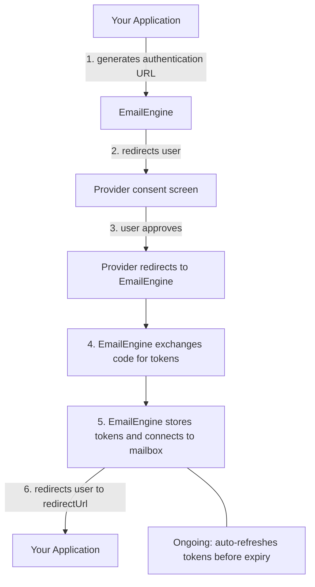

# OAuth2 Setup Guide

This guide explains OAuth2 authentication concepts and how to set up OAuth2 applications with EmailEngine. For provider-specific instructions, see the dedicated guides for [Gmail](./gmail/gmail-imap), [Outlook](./microsoft-365/outlook-365), [Mail.ru](./mail-ru), or [Google Service Accounts](./gmail/google-service-accounts).

## What is OAuth2?

OAuth2 is an authorization framework that allows applications to access user data without requiring passwords. Instead of storing passwords, your application receives temporary access tokens that can be refreshed automatically.

### What OAuth2 changes

- EmailEngine stores tokens rather than the mailbox password, and the user can revoke them at the provider without changing that password
- The application requests only the scopes it needs
- Accounts with two-factor authentication work without app passwords
- Users authenticate on the provider's own consent screen, and can review the grant there at any time

## OAuth2 Flow Overview

Understanding the OAuth2 flow helps troubleshoot issues:



EmailEngine handles the token exchange and refresh. Your application:

- Registers the OAuth2 application with the provider once
- Directs users to the EmailEngine authentication URL

EmailEngine does the rest: token exchange, storage, and refresh.

## Supported Providers in EmailEngine

EmailEngine supports OAuth2 for:

### Gmail / Google Workspace

**Protocol Options:**

- **IMAP/SMTP with OAuth2** - Standard protocols with OAuth2 authentication
- **Gmail API** - The Gmail REST API instead of IMAP and SMTP

**Account Types:**

- **Internal Apps** - Google Workspace organization only
- **Service Accounts** - Google Workspace with domain-wide delegation
- **Public Apps** - Any Gmail user (requires Google's app verification)

[Gmail IMAP OAuth2 Setup](./gmail/gmail-imap)
[Gmail API Setup](./gmail/gmail-api)
[Google Service Accounts](./gmail/google-service-accounts)

### Outlook / Microsoft 365

**Protocol Options:**

- **IMAP/SMTP with OAuth2** - Standard protocols with OAuth2 authentication
- **Microsoft Graph API** - Native Microsoft 365 API

**Account Types:**

- **Single Tenant** - Your organization only
- **Multi-Tenant** - Any Microsoft 365 organization
- **Personal Accounts** - Outlook.com, Hotmail.com, Live.com
- **Combined** - Organizations + personal accounts

**Application Access (Client Credentials):**

- **Application permissions** - App authenticates as itself, no user login needed
- Uses `client_credentials` grant type with MS Graph API only
- Requires Azure AD admin consent and a specific tenant ID
- Best for automated systems accessing mailboxes without user interaction

[Outlook OAuth2 Setup](./microsoft-365/outlook-365)
[Outlook Application Access](./microsoft-365/outlook-client-credentials)

### Mail.ru

**Protocol Options:**

- **IMAP/SMTP with OAuth2** - Standard protocols with OAuth2 authentication

**Required Scopes:**

- `userinfo` - Basic user profile
- `mail.imap` - IMAP access

[Mail.ru OAuth2 Setup](./mail-ru)

## Setting Up OAuth2 in EmailEngine

### Overview of Steps

1. **Create OAuth2 app** with the provider (Google Cloud Console or Azure AD)
2. **Configure consent screen** and permissions
3. **Get credentials** (Client ID and Client Secret)
4. **Add to EmailEngine** under **Integrations** > **OAuth2 Apps**
5. **Test** by adding an account

### OAuth2 Application Types

The **Create OAuth2 app** menu offers one entry per provider type. The `provider` value is what the [OAuth2 applications API](/docs/api/post-v-1-oauth-2) calls the same thing:

| Menu entry | `provider` | Flow |
| --- | --- | --- |
| Gmail | `gmail` | User consent; IMAP/SMTP or the Gmail API, chosen under **Base scopes** |
| Gmail Service Accounts | `gmailService` | Domain-wide delegation, no per-user consent |
| Outlook (delegated) | `outlook` | User consent; IMAP/SMTP or MS Graph API, chosen under **Base scopes** |
| Outlook (application) | `outlookService` | Client credentials, MS Graph API only, no user login |
| Mail.ru | `mailRu` | User consent; IMAP/SMTP |

Whether a Gmail or Outlook app uses IMAP/SMTP or the provider API is not a separate application type: it is the **Base scopes** choice on the app's form (`baseScopes` in the API: `imap` or `api`). A Gmail app can also have Cloud Pub/Sub as its base scope (`pubsub`); such an app carries the push-notification subscription for Gmail API accounts rather than mailbox access, see [Gmail Pub/Sub](/docs/accounts/gmail/gmail-pubsub).

### Required Information

When configuring OAuth2 in EmailEngine, you'll need:

**From Provider (Google/Microsoft):**

- **Client ID** - Identifies your application
- **Client Secret** - Authenticates your application
- **Redirect URI** - Where users return after consent

**For EmailEngine:**

- **Application name** - The name shown in the app list and on the hosted authentication form
- **Base scopes** - Protocol to use (IMAP/SMTP or the provider API)
- **Enable this app** - Whether the app is offered on authentication forms

### Configuration in EmailEngine

Navigate to **Integrations** > **OAuth2 Apps** in EmailEngine dashboard.


**Add New Application:**

1. Click **Create OAuth2 app** and select the provider type (see the table above)


2. Fill in the application details:


- **Application name**: For example "Production Outlook"
- **Enable this app**: Check to offer the app on authentication forms
- **Client Id** (Gmail) or **Azure Application Id** (Outlook): From the provider console
- **Client Secret**: From the provider console
- **Redirect URL**: Your Service URL + `/oauth`. The form pre-fills this from the `serviceUrl` setting
- **Base scopes**: IMAP/SMTP, or the provider API (MS Graph API or Gmail API)
- **Supported account types** (Outlook): `common`, `organizations`, `consumers`, or a specific **Directory (tenant) ID**. Stored as `authority` in the API
- **Azure cloud environment** (Outlook): the worldwide cloud unless the tenant lives in a US Government or China cloud. Stored as `cloud`


3. Click **Register app** to save


The application now appears in your OAuth2 configuration list:


### Credentials File Upload

Google lets you download the client credentials as a JSON file; Microsoft credentials are copied from the portal by hand.

**Google credentials file** (starts with `client_secret_`):

```json
{
  "web": {
    "client_id": "123456789.apps.googleusercontent.com",
    "client_secret": "abcdef123456",
    "redirect_uris": ["https://emailengine.example.com/oauth"]
  }
}
```

**Microsoft credentials** (entered manually):

- Application (client) ID
- Client secret value

The **Load configuration from the JSON file** button on the Gmail app form fills in the client ID, the client secret and the Google Cloud project ID from this file. It reads the `web` key only, so the file has to come from a **Web application** client rather than a desktop one, and it warns when the redirect URL on the form is not among the file's `redirect_uris`.

### Verifying the App Setup

After configuring an OAuth2 app, use the **Verify setup** button on the app's page in the EmailEngine dashboard (or the [`POST /v1/oauth2/{app}/verify`](/docs/api/post-v-1-oauth-2-app-verify) API endpoint, available since v2.68.0) to test the configuration before connecting accounts.

The verifier runs the provider authentication chain step by step. The response carries `ok`, which is `true` when no step failed, and a `steps` array where each entry has an `id`, a `label`, a `status` of `ok`, `fail` or `skip`, a `message`, and for failures a `hint` on how to fix it:

- **Service-account apps (`gmailService`, `outlookService`)** - checks the credentials, the token exchange, and domain-wide delegation. Pass a mailbox address as `account` to also perform a live IMAP login or a Gmail/MS Graph API probe against that mailbox; set `testConnection` to `false` to skip that live step.
- **User-consent apps (`gmail`, `outlook`, `mailRu`)** - checks the stored configuration only. The end-user authorization step is reported as skipped, because a token exchange needs a user's consent.

The verifier is read-only: it does not modify any mailbox and does not send mail.

## OAuth2 Scopes

Scopes define what your application can access.

### Gmail Scopes

**For IMAP/SMTP:**

| Scope                      | Purpose                              |
| -------------------------- | ------------------------------------ |
| `https://mail.google.com/` | Full IMAP and SMTP access (required) |

EmailEngine adds `openid`, `email` and `profile` to every user-consent Gmail request, whichever base scope the app has. They identify the signed-in user and are not requested for service-account apps.

**For Gmail API:**

| Scope          | Purpose                                                              |
| -------------- | -------------------------------------------------------------------- |
| `gmail.modify` | Full Gmail API access (read, write, delete, but not admin functions) |

**Narrower Scopes (if required by Google):**

| Scope            | Access                 | Notes                                                                          |
| ---------------- | ---------------------- | ------------------------------------------------------------------------------ |
| `gmail.readonly` | Read-only access       | Listing labels works with this scope alone; creating and renaming them does not |
| `gmail.send`     | Send emails only       | Cannot read messages, and an account with only this scope runs send-only        |
| `gmail.labels`   | List and manage labels | Paired with `gmail.readonly` in the read-only presets so label management works |

:::warning gmail.labels turns a send-only app into a read app
EmailEngine treats an account as having read access when the granted scopes include any of `gmail.modify`, `gmail.readonly`, `gmail.labels` or `https://mail.google.com/`. Adding `gmail.labels` to an application meant for sending only therefore makes EmailEngine list messages, which Google then refuses.
:::

See the [Gmail API Scopes Reference](/docs/accounts/gmail/gmail-api-scopes) for detailed setup instructions and EmailEngine feature availability for each scope combination.

### Outlook Scopes

**For IMAP/SMTP:**

| Scope                   | Purpose                                   |
| ----------------------- | ----------------------------------------- |
| `IMAP.AccessAsUser.All` | Read and manage emails via IMAP           |
| `SMTP.Send`             | Send emails via SMTP (enabled by default) |
| `offline_access`        | Allow token refresh (required)            |
| `openid`, `profile`     | Read the signed-in user's identity        |

If your application doesn't need sending capabilities, you can disable `SMTP.Send` via the **Disabled scopes** field in EmailEngine's OAuth2 app settings.

**For MS Graph API:**

| Scope            | Purpose                                |
| ---------------- | -------------------------------------- |
| `Mail.ReadWrite` | Read and manage emails                 |
| `Mail.Send`      | Send emails                            |
| `offline_access` | Allow token refresh (required)         |
| `User.Read`      | Read the signed-in user's profile      |

:::info offline_access Scope
The `offline_access` scope allows EmailEngine to refresh access tokens in the background without user interaction.

- **Gmail**: Google has no such scope. EmailEngine requests `access_type=offline` and `prompt=consent` on every authorization, which is what makes Google issue a refresh token
- **Outlook**: EmailEngine adds `offline_access` to every scope set it requests
:::

### Additional Scopes

You can add extra scopes if you want to use OAuth2 tokens for other APIs:

**Example - Add Google Calendar access:**

```
https://www.googleapis.com/auth/calendar
```

Enter them under **Additional scopes** on the app's form, one scope per line. The API field is `extraScopes`.

:::warning Microsoft Additional Scopes
A Microsoft access token is issued for one resource, so an app cannot mix the two resource endpoints. With **IMAP/SMTP** as the base scope, every additional scope must come from `https://outlook.office.com/`; with **MS Graph API** as the base scope, every additional scope must come from `https://graph.microsoft.com/`. The form states this rule but does not validate the list; a mixed list is rejected by Microsoft when the user is sent to authorize. So a token that is meant to reach other Graph APIs (calendars, files) needs an app with the MS Graph API base scope.
:::

[Learn more about using tokens for other APIs](./oauth2-token-management)

### Disabled Scopes

If Google/Microsoft requires narrower scopes, you can disable the default wide scope:

**Disabled scopes** section, one scope per line (the API field is `skipScopes`):

```
https://mail.google.com/
```

This removes the wide scope from consent requests.

## Account Types and Tenant Configuration

### Gmail Account Types

**Internal Apps:**

- Only for Google Workspace organizations
- No security audit required
- Limited to organization's domain

**External Apps (Testing):**

- Limited to 100 test users added by hand
- Refresh tokens expire after 7 days
- Not suitable for production

**External Apps (Production):**

- Available to any Gmail user
- Requires Google's app verification, which for a restricted scope includes a security assessment
- Google may reject broad scopes like `https://mail.google.com/`

### Outlook Account Types

Configure via **Supported account types** field:

- `common` - Organizations + personal accounts (most flexible)
- `consumers` - Personal accounts only (@outlook.com, @hotmail.com)
- `organizations` - Microsoft 365 organizations only
- `<directory-id>` - Specific organization only (use Directory/Tenant ID)

**Mapping to Azure:**

| Azure Setting       | EmailEngine Value |
| ------------------- | ----------------- |
| Any org + personal  | `common`          |
| Personal only       | `consumers`       |
| Any organization    | `organizations`   |
| Single organization | Use Directory ID  |

## Redirect URLs

The redirect URL is where users return after granting consent.

### Format

```
{emailengine-url}/oauth
```

**Examples:**

- `https://emailengine.example.com/oauth` for a deployed instance
- `http://localhost:3000/oauth` for an instance started locally for development; both Google and Microsoft accept plain HTTP for `localhost` only

### Requirements

- Must be HTTPS, except for `localhost`
- Must match exactly between provider and EmailEngine, including case, port and any trailing slash
- Must be reachable from the user's browser, since the provider redirects the user there

## Advanced OAuth2 Features

### Authentication Server

An application that already runs its own OAuth2 flow can keep the tokens and hand EmailEngine a fresh one whenever it connects. Point the `authServer` setting at your endpoint:

```bash
curl -X POST https://emailengine.example.com/v1/settings \
  -H "Authorization: Bearer YOUR_TOKEN" \
  -H "Content-Type: application/json" \
  -d '{
    "authServer": "https://api.example.com/email/auth"
  }'
```

Then register accounts with `useAuthServer` set on the `oauth2` object, or on `imap` and `smtp` for password accounts, and no credentials of their own. EmailEngine asks the endpoint for a credential each time it opens a connection, rather than storing and refreshing a token itself.

[Learn more about authentication servers](./authentication-server)

### Pre-filled Email

When generating authentication URLs, you can pre-fill the user's email:

```bash
curl -X POST https://emailengine.example.com/v1/authentication/form \
  -H "Authorization: Bearer YOUR_TOKEN" \
  -H "Content-Type: application/json" \
  -d '{
    "account": "user123",
    "email": "user@gmail.com",
    "redirectUrl": "https://myapp.com/settings"
  }'
```

### Delegated Access (Shared Mailboxes)

For Microsoft 365 shared mailboxes:

```bash
curl -X POST https://emailengine.example.com/v1/authentication/form \
  -H "Authorization: Bearer YOUR_TOKEN" \
  -H "Content-Type: application/json" \
  -d '{
    "account": "shared-support",
    "email": "support@company.com",
    "delegated": true,
    "redirectUrl": "https://myapp.com/settings"
  }'
```

[Learn more about shared mailboxes](./microsoft-365/outlook-365#shared-mailboxes)

### Service Accounts (Google Workspace)

Access any user's mailbox without individual consent:

```json
{
  "oauth2": {
    "provider": "AAABhaBPHscAAAAI",
    "auth": {
      "user": "user@company.com"
    }
  }
}
```

`provider` is the ID of the service-account application you registered in EmailEngine.

Requires domain-wide delegation setup.

[Learn more about service accounts](./gmail/google-service-accounts)

## See Also

- [Gmail OAuth2 over IMAP](/docs/accounts/gmail/gmail-imap) - The Google Cloud side, step by step
- [Outlook OAuth2](/docs/accounts/microsoft-365/outlook-365) - The Azure side, step by step
- [Gmail API scopes](/docs/accounts/gmail/gmail-api-scopes) - Which scope combination supports which feature
- [OAuth2 token management](/docs/accounts/oauth2-token-management) - Using the stored tokens against other provider APIs
- [Hosted authentication](/docs/accounts/hosted-authentication) - Sending users through the consent flow
