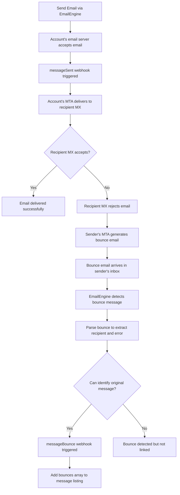

import Tabs from '@theme/Tabs';
import TabItem from '@theme/TabItem';

# Bounce Detection and Handling

EmailEngine automatically detects and tracks email bounces, providing detailed bounce information through webhooks and message listings. Learn how to handle bounce notifications and maintain email list hygiene.

## Overview

Email bounces occur when a sent message cannot be delivered to the recipient. EmailEngine monitors incoming emails for bounce responses and extracts detailed bounce information, including:

- **Recipient address** that bounced
- **Bounce type** (hard bounce, soft bounce)
- **Error message** from the receiving server
- **Original message** headers and content
- **SMTP status codes** and diagnostic information

Note: EmailEngine does not use [VERP addresses](https://en.wikipedia.org/wiki/Variable_envelope_return_path). It detects bounces by parsing standard bounce message formats sent by mail servers.

## How Bounce Detection Works

When you send an email through EmailEngine:

1. **Email Sent** - EmailEngine submits the email to the account's email server (Gmail, Outlook, etc.)
2. **messageSent Event** - The account's server accepts the email and EmailEngine triggers `messageSent`
3. **MTA Delivery Attempt** - The account's Mail Transfer Agent (MTA) attempts to deliver to the recipient's mail server (MX)
4. **Recipient MX Rejects** - If the recipient server rejects the email (user unknown, mailbox full, etc.)
5. **Bounce Email Generated** - The sender's MTA generates a bounce response email (a human-readable informational message explaining the delivery failure) and sends it to the sender's inbox
6. **EmailEngine Detects Bounce** - EmailEngine monitors the inbox and detects the bounce email by recognizing common bounce message patterns
7. **Bounce Parsed** - EmailEngine parses the bounce email to extract the bounced recipient address, error message, and original message details
8. **messageBounce Event** - If EmailEngine can identify which original message bounced (via Message-ID or other headers), it triggers the `messageBounce` webhook

When a bounce is detected, EmailEngine:

1. **Parse Bounce Email** - Extract bounce information from the human-readable bounce message
2. **Match Original Message** - Link bounce to sent message via Message-ID (when available)
3. **Send Webhook** - Deliver `messageBounce` webhook to your application
4. **Add to Message** - Attach bounce data to sent message in listings

### Bounce Detection Flow



## Bounce Types

### Hard Bounces

Permanent delivery failures that will not succeed on retry:

- **User unknown** - Email address doesn't exist
- **Domain not found** - Domain doesn't exist or has no MX records
- **Mailbox full** - Recipient's mailbox is over quota (often permanent)
- **Account disabled** - Recipient account has been closed

**Example error messages:**
```
550 No such user here
550 5.1.1 User unknown
550 Requested action not taken: mailbox unavailable
```

### Soft Bounces

Temporary delivery failures that might succeed on retry:

- **Mailbox temporarily unavailable** - Server issues
- **Message too large** - Exceeds recipient's size limit
- **Spam filter rejection** - Message blocked by content filter
- **Rate limiting** - Too many messages sent too quickly

**Example error messages:**
```
450 4.2.1 The user you are trying to contact is receiving mail too quickly
452 4.2.2 The email account that you tried to reach is over quota
```

### Bounce Action Codes

EmailEngine extracts action codes from bounce emails (these follow the standard action codes used in bounce messages):

- `failed` - Permanent failure (hard bounce)
- `delayed` - Temporary failure (soft bounce)
- `delivered` - Successfully delivered (not a bounce)
- `relayed` - Relayed to another server
- `expanded` - Mailing list expansion

## Sending Email and Tracking Bounces

### Send an Email

Send an email and capture the Message-ID:

```bash
curl -XPOST "https://emailengine.example.com/v1/account/john@example.com/submit" \
  -H "Authorization: Bearer YOUR_TOKEN" \
  -H "Content-Type: application/json" \
  -d '{
    "to": {
      "address": "unknown@ethereal.email"
    },
    "subject": "Test message",
    "text": "This email should bounce!"
  }'
```

Response includes the Message-ID needed to track bounces:

```json
{
  "response": "Queued for delivery",
  "messageId": "<3e013ba5-3bd2-a5f6-b102-5997c7d4d843@example.com>",
  "sendAt": "2024-10-13T12:10:34.845Z",
  "queueId": "183cc1a89ddfe365bbb"
}
```

**Save this `messageId` value** - you'll need it to correlate bounce notifications.

### Receive Bounce Webhook

When the email bounces, EmailEngine sends a `messageBounce` webhook:

```json
{
  "serviceUrl": "https://emailengine.example.com",
  "account": "john@example.com",
  "date": "2024-10-13T12:10:40.980Z",
  "event": "messageBounce",
  "data": {
    "bounceMessage": "AAAADAAAByc",
    "recipient": "unknown@ethereal.email",
    "action": "failed",
    "response": {
      "source": "smtp",
      "message": "550 No such user here",
      "status": "5.0.0"
    },
    "mta": "mx.ethereal.email",
    "queueId": "B7D3F8220C",
    "messageId": "<3e013ba5-3bd2-a5f6-b102-5997c7d4d843@example.com>",
    "messageHeaders": {
      "return-path": ["<john@example.com>"],
      "content-type": ["text/plain; charset=utf-8"],
      "from": ["John Doe <john@example.com>"],
      "to": ["unknown@ethereal.email"],
      "subject": ["Test message"],
      "message-id": ["<3e013ba5-3bd2-a5f6-b102-5997c7d4d843@example.com>"],
      "date": ["Wed, 12 Oct 2022 12:10:34 +0000"]
    }
  }
}
```

### Webhook Payload Fields

| Field | Description |
|-------|-------------|
| `bounceMessage` | ID of the bounce notification message |
| `recipient` | Email address that bounced |
| `action` | Bounce action: `failed`, `delayed`, etc. |
| `response.message` | Error message from receiving server |
| `response.status` | SMTP status code (e.g., `5.0.0`) |
| `response.source` | Source of error: `smtp`, `dns`, etc. |
| `response.category` | ML-classified bounce category (see below) |
| `response.recommendedAction` | Suggested action to take |
| `response.blocklist` | Blocklist details if applicable |
| `response.retryAfter` | Suggested retry delay in seconds |
| `mta` | Hostname of the MTA that generated the bounce |
| `queueId` | Queue ID from the bouncing MTA |
| `messageId` | Message-ID of the original sent email |
| `messageHeaders` | Original email headers |

## Checking Bounce Information

### Via Message Listing

Bounce information is also attached to sent messages in folder listings.

List sent messages:

```bash
curl "https://emailengine.example.com/v1/account/john@example.com/messages?path=Sent" \
  -H "Authorization: Bearer YOUR_TOKEN"
```

Messages with bounces include a `bounces` array:

```json
{
  "total": 472,
  "page": 0,
  "pages": 24,
  "messages": [
    {
      "id": "AAAABgAAAdk",
      "uid": 473,
      "date": "2024-10-13T12:10:34.000Z",
      "subject": "Test message",
      "from": {
        "name": "John Doe",
        "address": "john@example.com"
      },
      "to": [
        {
          "address": "unknown@ethereal.email"
        }
      ],
      "bounces": [
        {
          "message": "AAAADAAAByc",
          "recipient": "unknown@ethereal.email",
          "action": "failed",
          "response": {
            "message": "550 No such user here",
            "status": "5.0.0"
          },
          "date": "2024-10-13T12:10:40.003Z"
        }
      ]
    }
  ]
}
```

**Why an array?** Each email can have multiple recipients, and each can bounce with different errors.

### Via API Query

Get bounce information for a specific message:

```bash
curl "https://emailengine.example.com/v1/account/john@example.com/message/AAAABgAAAdk" \
  -H "Authorization: Bearer YOUR_TOKEN"
```

Response includes full bounce details in the `bounces` array.

## Handling Bounces in Your Application

Bounce handling comes down to correlating two events that can arrive minutes or hours apart:

1. **When you send**, store the `messageId` returned by the submit endpoint against whatever your application calls a recipient - a contact row, a campaign entry, a support ticket.
2. **When a `messageBounce` webhook arrives**, look up that same value in `data.messageId` and act on the record you find.

EmailEngine does not use [VERP](https://en.wikipedia.org/wiki/Variable_envelope_return_path) return paths, so the Message-ID is the join key. It survives the round trip because the bouncing MTA quotes the original headers back, and EmailEngine reads them out of the bounce report.

```javascript
// 1. On send: remember which recipient this Message-ID belongs to
const res = await fetch(`${EE_URL}/v1/account/${account}/submit`, {
  method: 'POST',
  headers: { Authorization: `Bearer ${TOKEN}`, 'Content-Type': 'application/json' },
  body: JSON.stringify({ to: { address: recipient }, subject, text })
});
const { messageId } = await res.json();
await db.sentMessages.insert({ messageId, recipient });

// 2. On webhook: resolve it back
app.post('/webhooks', async (req, res) => {
  res.sendStatus(200); // acknowledge first, process afterwards

  if (req.body.event !== 'messageBounce') return;

  const { messageId, recipient, response } = req.body.data;
  const sent = await db.sentMessages.findOne({ messageId });

  await recordBounce(sent?.recipient || recipient, response);
});
```

Acknowledge the webhook before doing the work. A delivery that fails or exceeds the per-attempt timeout is retried up to 10 times with exponential backoff, so a slow handler turns one bounce into several deliveries of the same event. Make `recordBounce()` idempotent.

What `recordBounce()` should do depends on *why* the message bounced, which is what the classification below tells you.

## SMTP Status Codes

Understanding SMTP status codes helps interpret bounces:

### 5.x.x - Permanent Failures (Hard Bounces)

| Code | Description |
|------|-------------|
| 5.1.1 | Bad destination mailbox address (user unknown) |
| 5.1.2 | Bad destination system address (domain not found) |
| 5.2.1 | Mailbox disabled, not accepting messages |
| 5.2.2 | Mailbox full |
| 5.4.4 | Unable to route (no DNS records) |
| 5.7.1 | Delivery not authorized, message refused |

### 4.x.x - Temporary Failures (Soft Bounces)

| Code | Description |
|------|-------------|
| 4.2.1 | Mailbox temporarily unavailable |
| 4.2.2 | Mailbox full (temporary - might clear space) |
| 4.4.1 | Connection timed out |
| 4.7.1 | Delivery temporarily suspended (greylisting) |

### Common Bounce Messages

```
# Hard bounces
550 5.1.1 User unknown
550 5.1.2 Host or domain name not found
550 5.2.1 Mailbox disabled
550 5.2.2 Mailbox full
550 5.7.1 Message rejected due to content

# Soft bounces
450 4.2.1 Mailbox temporarily unavailable
452 4.2.2 Mailbox full
451 4.4.1 Connection timeout
450 4.7.1 Greylisting in effect
```

## ML-Powered Bounce Classification

EmailEngine uses machine learning to classify bounce messages into detailed categories, going beyond basic hard/soft bounce distinction. This classification helps you take more precise action on bounced emails.

### Classification Categories

The `response.category` field provides one of these classifications:

| Category | Description | Recommended Action |
|----------|-------------|-------------------|
| `user_unknown` | Recipient email address does not exist | Remove from mailing list |
| `invalid_address` | Bad email syntax or domain not found | Remove from mailing list |
| `mailbox_disabled` | Account suspended or disabled | Remove from mailing list |
| `mailbox_full` | Over quota, storage exceeded | Retry later |
| `greylisting` | Temporary rejection, retry later | Retry after delay |
| `rate_limited` | Too many connections or messages | Retry after delay |
| `server_error` | Timeout or connection failed | Retry later |
| `ip_blacklisted` | Sender IP on a blocklist (RBL) | Use different sending IP |
| `domain_blacklisted` | Sender domain on a blocklist | Fix DNS/authentication |
| `auth_failure` | DMARC, SPF, or DKIM failure | Fix email authentication |
| `relay_denied` | Relaying not permitted | Fix mail server config |
| `spam_blocked` | Message detected as spam | Review email content |
| `policy_blocked` | Local policy rejection | Review and contact admin |
| `virus_detected` | Infected content detected | Remove malicious content |
| `geo_blocked` | Geographic/country-based rejection | Use different sending IP |
| `unknown` | Unclassified bounce type | Review manually |

### Recommended Actions

The `response.recommendedAction` field tells you how to handle the bounce:

| Action | Description | When Used |
|--------|-------------|-----------|
| `remove` | Remove email from all mailing lists | Invalid addresses, disabled accounts |
| `retry` | Retry delivery after a delay | Temporary issues like greylisting, rate limits |
| `review` | Manual review required | Spam blocks, policy rejections |
| `fix_configuration` | Fix sender configuration | Authentication failures, relay issues |
| `retry_different_ip` | Retry from another IP address | IP blocklist issues |
| `remove_content` | Remove problematic content | Virus detection |

### Blocklist Detection

When a bounce indicates a blocklist issue, the `response.blocklist` object provides details:

```json
{
  "response": {
    "message": "550 Service unavailable; Client host [1.2.3.4] blocked using zen.spamhaus.org",
    "category": "ip_blacklisted",
    "recommendedAction": "retry_different_ip",
    "blocklist": {
      "name": "Spamhaus ZEN",
      "type": "ip"
    }
  }
}
```

The `blocklist.type` indicates whether the issue is with your IP address (`ip`), your domain (`domain`), or a URI mentioned in the message content (`uri`). If the bounce message references multiple blocklists, the response contains a `lists` array instead, where each entry has `name` and `type` fields: `{"lists": [{"name": "...", "type": "..."}, ...]}`.

### Retry Timing

When bounce messages contain timing hints (e.g., "try again in 5 minutes"), the `response.retryAfter` field provides the suggested delay in seconds:

```json
{
  "response": {
    "message": "450 4.7.1 Greylisted, please try again in 300 seconds",
    "category": "greylisting",
    "recommendedAction": "retry",
    "retryAfter": 300
  }
}
```

### Acting on the Classification

Branch on `recommendedAction` rather than on `category`. The action set is small and stable, while categories are added as the classifier learns new bounce shapes, and an unrecognized category would otherwise fall through your logic silently.

<Tabs>
<TabItem value="nodejs" label="Node.js" default>

```javascript
async function recordBounce(recipient, response = {}) {
  const category = response.category || 'unknown';

  switch (response.recommendedAction || 'review') {
    case 'remove':
      // Permanent: the address will never accept mail
      await db.contacts.update({ email: recipient }, { status: 'bounced', category });
      break;

    case 'retry':
      // Temporary: greylisting, rate limits, a full mailbox
      await scheduleRetry(recipient, response.retryAfter || 3600);
      break;

    case 'retry_different_ip':
      // The sending IP is blocklisted, the address is fine
      await queueForAlternateIP(recipient, response.blocklist);
      break;

    case 'fix_configuration':
      // SPF/DKIM/DMARC or relay problem, no per-recipient action helps
      await alertAdmin(category, response.message);
      break;

    case 'remove_content':
      await quarantineCampaign(recipient, response.message);
      break;

    default:
      await flagForReview(recipient, category, response.message);
  }
}
```

</TabItem>
<TabItem value="python" label="Python">

```python
def record_bounce(recipient, response=None):
    response = response or {}
    category = response.get('category', 'unknown')
    action = response.get('recommendedAction', 'review')

    if action == 'remove':
        # Permanent: the address will never accept mail
        contacts.update(recipient, status='bounced', category=category)
    elif action == 'retry':
        # Temporary: greylisting, rate limits, a full mailbox
        schedule_retry(recipient, response.get('retryAfter', 3600))
    elif action == 'retry_different_ip':
        # The sending IP is blocklisted, the address is fine
        queue_for_alternate_ip(recipient, response.get('blocklist'))
    elif action == 'fix_configuration':
        # SPF/DKIM/DMARC or relay problem, no per-recipient action helps
        alert_admin(category, response.get('message'))
    elif action == 'remove_content':
        quarantine_campaign(recipient, response.get('message'))
    else:
        flag_for_review(recipient, category, response.get('message'))
```

</TabItem>
</Tabs>

:::caution Classification is advisory
`category` and `recommendedAction` come from a machine learning model reading the server's error text, and they are absent entirely if classification fails. Always default to a review path, and never delete a contact on a single `remove` without also checking `response.status` for a `5.x.x` code if the record matters.
:::

## See Also

- [messageBounce webhook](/docs/webhooks/messagebounce) - Full payload reference for the bounce event
- [messageDeliveryError](/docs/webhooks/messagedeliveryerror) and [messageFailed](/docs/webhooks/messagefailed) - Failures EmailEngine sees while submitting, before a message ever reaches the recipient's server
- [Suppression Lists](/docs/advanced/blocklists) - Stop sending to addresses that have already bounced
- [Email Authentication Testing](/docs/advanced/email-authentication-testing) - Diagnose the SPF, DKIM, and DMARC problems behind `fix_configuration` bounces
- [Webhook Overview](/docs/webhooks/overview) - Delivery, retries, and routing
