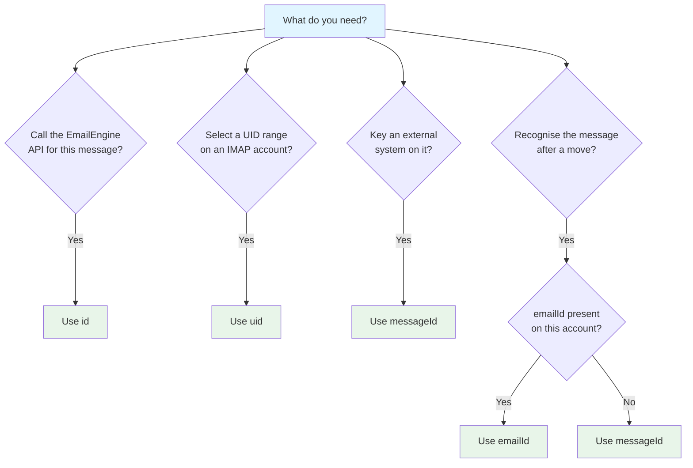

# Message IDs Explained

A message returned by EmailEngine carries several identifiers: `id`, `uid`, `emailId`, `threadId` and `messageId`. Under the hood there is also an IMAP sequence number. Each one has a different scope and a different lifetime, and choosing the wrong one is the most common cause of a "message not found" error after a move.

## Quick Reference

| Identifier    | Stability                                | Scope              | Use it for                                          |
| ------------- | ---------------------------------------- | ------------------ | --------------------------------------------------- |
| **id**        | Stable while the message stays in its folder (IMAP); permanent (Gmail API, MS Graph) | This EmailEngine instance | Every API call that addresses a message |
| **uid**       | Stable within a folder                   | One IMAP folder    | UID range searches on IMAP accounts                 |
| **emailId**   | Permanent                                | The email entity   | Tracking a message across folders where available  |
| **threadId**  | Permanent                                | The conversation   | Grouping messages into threads where available     |
| **messageId** | Permanent                                | Global             | Integration with external systems, deduplication    |
| **Sequence**  | Changes during a session                 | IMAP protocol      | Nothing; EmailEngine does not expose it            |

## The `id` Property

### What It Is

The `id` is the identifier EmailEngine uses in every message URL: `GET /v1/account/{account}/message/{id}`, `DELETE`, `PUT .../move`, and so on.

**Example**: `"AAAADAAAB40"`

What it contains depends on the backend the account uses:

| Backend | What `id` is | Survives a move? |
| ------- | ------------ | ---------------- |
| IMAP | A packed reference to the folder plus the message UID (see below) | No. The message gets a new `id` in the destination folder |
| Gmail API | The Gmail message ID, the same value as `emailId` | Yes. A Gmail move is a label change |
| MS Graph | The Graph message ID, the same value as `emailId`. EmailEngine requests immutable IDs from Graph | Yes |

### How the IMAP `id` Is Built

For an IMAP account EmailEngine packs two 32-bit numbers into a URL-safe base64 string: a per-account folder number and the IMAP UID. The folder number is allocated the first time EmailEngine sees a folder, and the mapping from that number back to the folder path and its `UIDVALIDITY` is stored in Redis with the account. The string is short and lets EmailEngine locate the message on the server without a lookup by `Message-ID`.

:::warning An `id` only means something to the instance that issued it
The folder number in an IMAP `id` is resolved through Redis. Another EmailEngine instance cannot resolve it, and it stops resolving if that Redis database is flushed or restored from a backup taken before the folder was first seen.

Store `messageId` next to any `id` you persist for longer than a request. It is a property of the email itself, so it survives all of the above. See [Choosing an Identifier](#choosing-the-right-identifier) below.
:::

### Old IDs Become Invalid After a Move (IMAP)

```javascript
// The message is in INBOX
const message = await getMessage("account1", "AAAADAAAB40");

// Move it to Archive. The response carries the new id
const moveResponse = await moveMessage("account1", "AAAADAAAB40", "Archive");
const newId = moveResponse.id;

// The old id now returns 404 for this account
```

The move response carries the new `id`; use it for any follow-up call. For cross-folder tracking that does not depend on the move response, use `emailId` or `messageId`.

## The `uid` Property

### What It Is

The IMAP **Unique Identifier** (UID) is an integer assigned by the IMAP server within a folder. The API reports it as `uid` on IMAP accounts only.

**Example**: `2240`

### Characteristics

- **Folder-specific**: Each folder has its own UID sequence
- **Ascending**: A new message always gets a higher UID than the messages already in the folder
- **Not reused**: A deleted UID is not reassigned in that folder for as long as the folder's `UIDVALIDITY` value stays the same. If the server resets `UIDVALIDITY` (after a folder rebuild, for example), every UID in that folder changes, and so does every IMAP `id` that referenced it
- **Changes on move**: A moved message gets a new UID in the destination folder
- **IMAP only**: The Gmail API and MS Graph backends have no UIDs, so `uid` is absent from their messages and UID range searches return nothing useful for them

### When to Use

Use `uid` for range-based operations on IMAP accounts:

```bash
curl -X POST "https://emailengine.example.com/v1/account/user123/search?path=INBOX" \
  -H "Authorization: Bearer YOUR_ACCESS_TOKEN" \
  -H "Content-Type: application/json" \
  -d '{"search": {"uid": "100:500"}}'
```

This matches every message whose UID is between 100 and 500. The search value accepts the IMAP sequence-set syntax, so `"150,200,250"` is valid too.

### How It Works

Think of `uid` as a database table's auto-incrementing primary key:

**Folder: INBOX (UIDVALIDITY: 123456)**

| UID | Subject  | From    | Notes |
|-----|----------|---------|-------|
| 100 | Hello    | john@   | |
| 101 | Welcome  | jane@   | |
| 105 | Update   | bob@    | UIDs 102-104 were deleted |
| 106 | Reminder | alice@  | |

UIDs 102-104 were deleted and will not be reused in this folder.

### UID and Folder Moves

When you move a message:

1. The original UID is expunged from the source folder
2. The message appears in the destination folder with a new UID
3. Neither UID is reused

**Example: Move message UID 105 from INBOX to Archive**

| Folder | Before Move | After Move |
|--------|-------------|------------|
| **INBOX** | UID 105 (to be moved) | UID 106<br/>UID 107 |
| **Archive** | UID 50<br/>UID 51 | UID 50<br/>UID 51<br/>UID 52 (same message, new UID) |

## The `emailId` Property

### What It Is

A **stable identifier for the email entity itself** that does not change when the message is moved or copied.

**Example**: `"187a29df5a2"`

### Availability

`emailId` is present only when the backend provides one:

| Backend | Source of `emailId` |
| ------- | ------------------- |
| IMAP server advertising `OBJECTID` (RFC 8474) | The `EMAILID` fetch item |
| Gmail over IMAP (`X-GM-EXT-1`) | `X-GM-MSGID` |
| Gmail API | The Gmail message ID (same value as `id`) |
| MS Graph | The Graph message ID (same value as `id`) |

Other IMAP servers, including most self-hosted ones, return no `emailId`. The same rule applies to `threadId`, which comes from `THREADID` (OBJECTID) or `X-GM-THRID` on IMAP and from the thread or conversation ID on the API backends. See [Threading](/docs/sending/threading) for what a `threadId` is good for.

Always check for it before relying on it:

```javascript
const trackingId = message.emailId || message.messageId;
```

### When to Use

Use `emailId` when you need to recognise the same message in two folders:

```javascript
const message1 = await getMessage("account1", id1);
const message2 = await getMessage("account1", id2);

if (message1.emailId && message1.emailId === message2.emailId) {
  console.log("Same email in different folders");
}
```

It is also a search term: `{"search": {"emailId": "187a29df5a2"}}` finds the message wherever it is. See [Searching messages](/docs/receiving/searching#uid-and-id-operators).

## The `messageId` Property

### What It Is

The value of the email's `Message-ID` header, which the sending system generates to be globally unique.

**Example**: `"<01000187a29df5a2@example.com>"`

### Characteristics

- **From the email header**: RFC 5322 `Message-ID`
- **Globally unique by convention**: Uniqueness is not enforced. Senders can reuse a value or omit the header, and a copy of the message in another mailbox carries the same value
- **Permanent**: Travels with the message through moves, copies and forwards between accounts
- **Available on every backend**: It is a property of the email, not of the server

### When to Use

Use `messageId` for:

1. **Integration with external systems**: Most mail-aware systems already key on `Message-ID`
2. **Deduplication**: Detect the same message arriving twice, or in two accounts
3. **Thread reconstruction**: `inReplyTo` and `references` on a message contain the `Message-ID` values of its parents
4. **Persistence**: The one identifier that stays valid after an EmailEngine reinstall, a Redis restore, or a migration to another instance

### Example: Deduplication

```javascript
const processedIds = new Set();

function processWebhook(webhook) {
  const messageId = webhook.data.messageId;

  if (!messageId) {
    // No Message-ID header. Fall back to the EmailEngine id for this event
    handleNewEmail(webhook.data);
    return;
  }

  if (processedIds.has(messageId)) {
    return;
  }

  processedIds.add(messageId);
  handleNewEmail(webhook.data);
}
```

### Searching by Message-ID

Use a header search to find a message by its `Message-ID`:

```bash
curl -X POST "https://emailengine.example.com/v1/account/user123/search?path=INBOX" \
  -H "Authorization: Bearer YOUR_ACCESS_TOKEN" \
  -H "Content-Type: application/json" \
  -d '{"search": {"header": {"Message-ID": "<123@abc.example.com>"}}}'
```

### Thread Tracking

The `messageId` property works together with two related fields:

```json
{
  "messageId": "<current-message@example.com>",
  "inReplyTo": "<parent-message@example.com>",
  "references": [
    "<original-message@example.com>",
    "<parent-message@example.com>"
  ]
}
```

To rebuild a conversation without a `threadId`, start from the first message's `messageId`, find replies whose `inReplyTo` matches, and follow the `references` chain.

## Sequence Numbers

IMAP sequence numbers give a message's position within a folder (1, 2, 3, ...). They are part of the IMAP protocol and EmailEngine does not expose them, because they change whenever a message earlier in the folder is expunged:

```text
INBOX before:           INBOX after expunging 1:
Seq 1: Message A        Seq 1: Message B  (was 2)
Seq 2: Message B        Seq 2: Message C  (was 3)
Seq 3: Message C        Seq 3: Message D  (was 4)
Seq 4: Message D
```

:::info Internal Implementation
IMAP servers push untagged `EXPUNGE` and `FETCH` responses using sequence numbers. EmailEngine keeps an ordered list of each folder's UIDs in Redis and resolves the sequence number against that list before acting on the notification. This only happens with the `full` [IMAP indexer](/docs/accounts/imap-indexers); the `fast` indexer ignores these notifications, which is one reason it does not report flag changes or deletions.
:::

## Attachment and Text Identifiers

Attachments and text bodies have their own opaque identifiers, returned in `attachments[].id` and `text.id` on message details. They are built on top of the message identifier: on IMAP the attachment `id` packs the same folder-and-UID reference as the message `id` together with the MIME part number, and on the API backends it packs the provider's message ID together with what the provider needs to fetch the part. Treat them as opaque strings, obtain them from a message details or webhook payload, and use them with `GET /v1/account/{account}/attachment/{attachment}` and `GET /v1/account/{account}/text/{text}` on the same instance. Like the IMAP message `id`, they are not portable between instances.

## Choosing the Right Identifier

### Decision Tree



### Use Case Examples

**1. Display a message in a UI**

```javascript
// The id comes from the message list
const id = "AAAADAAAB40";

const response = await fetch(`https://emailengine.example.com/v1/account/user123/message/${id}`, {
  headers: { Authorization: "Bearer YOUR_ACCESS_TOKEN" }
});
const message = await response.json();
```

**Use**: `id`

**2. Sync messages to a database**

```javascript
for (const msg of messages) {
  db.upsert({
    account: account,
    messageId: msg.messageId,
    emailId: msg.emailId || null,
    id: msg.id,
    subject: msg.subject
  });
}
```

**Use**: `messageId` as the primary key, `emailId` when present, `id` for the next API call.

**3. Track email in a CRM**

```javascript
function handleWebhook(webhook) {
  const messageId = webhook.data.messageId;
  const existing = crm.findEmail(messageId);

  if (existing) {
    crm.updateEmail(messageId, webhook.data);
  } else {
    crm.createEmail(messageId, webhook.data);
  }
}
```

**Use**: `messageId`

**4. Tell a move from a delete**

On an IMAP account a move produces two webhooks: `messageDeleted` from the source folder and `messageNew` in the destination. The `messageDeleted` payload carries only the `id` and `uid` of the removed message, so the link between the two events has to come from data you stored when the message first arrived:

```javascript
// Populated from messageNew webhooks: id -> emailId
const emailIdById = new Map();

function handleMessageNew(webhook) {
  const { id, emailId } = webhook.data;
  if (emailId) {
    emailIdById.set(id, emailId);
  }
}

function handleMessageDeleted(webhook) {
  const emailId = emailIdById.get(webhook.data.id);
  emailIdById.delete(webhook.data.id);

  // Give the messageNew for the destination folder time to arrive
  setTimeout(() => {
    const newLocation = emailId ? findByEmailId(emailId) : null;
    if (newLocation) {
      console.log("Message moved to:", newLocation.path);
    } else {
      console.log("Message deleted, or moved on a server without emailId");
    }
  }, 1000);
}
```

Gmail API and MS Graph accounts keep the same `id` across a move, so no correlation is needed there.

**Use**: `emailId` where available, otherwise `messageId` stored the same way.

**5. Bulk operations on a UID range**

```bash
curl -X PUT "https://emailengine.example.com/v1/account/user123/messages/delete?path=INBOX" \
  -H "Authorization: Bearer YOUR_ACCESS_TOKEN" \
  -H "Content-Type: application/json" \
  -d '{"search": {"uid": "100:500"}}'
```

**Use**: `uid`

## Common Pitfalls

### 1. Reusing an IMAP `id` After a Move

```javascript
// Fails: the id belonged to the source folder
await moveMessage(account, oldId, "Archive");
await updateMessage(account, oldId, { seen: true }); // 404

// Works: take the id from the move response
const moveResponse = await moveMessage(account, oldId, "Archive");
await updateMessage(account, moveResponse.id, { seen: true });
```

### 2. Assuming `emailId` Is Always Present

```javascript
function trackMessage(message) {
  const trackingId = message.emailId || message.messageId || message.id;
  db.save({ id: trackingId });
}
```

### 3. Not Checking for a Missing `messageId`

```javascript
if (message.messageId) {
  processedIds.add(message.messageId);
} else {
  // No Message-ID header; key on the EmailEngine id for this account instead
  processedIds.add(`${account}:${message.id}`);
}
```

## Summary

| Identifier    | When to Use                 | Stability            | Availability         |
| ------------- | --------------------------- | -------------------- | -------------------- |
| **id**        | EmailEngine API calls       | Per folder on IMAP; permanent on Gmail API and MS Graph | Always |
| **uid**       | UID range searches          | Per folder, per `UIDVALIDITY` | IMAP only            |
| **emailId**   | Cross-folder tracking       | Permanent            | OBJECTID or Gmail IMAP servers, Gmail API, MS Graph |
| **messageId** | External integration, dedup | Permanent            | Whenever the header is present, which is almost always |
| **Sequence**  | Nothing                     | Changes during a session | Not exposed      |

**General guidance**:

- **Use `id`** for every EmailEngine API call, taking it from the latest response
- **Use `uid`** for UID range searches on IMAP accounts
- **Use `emailId`** for cross-folder tracking when the account provides one
- **Use `messageId`** for external integration, deduplication, and anything you persist
- **Store all of them** when you sync messages to your own database

## See Also

- [Message operations](/docs/receiving/message-operations) - Where each identifier appears in practice
- [Threading](/docs/sending/threading) - What a `threadId` is for, and which providers assign one
- [Searching messages](/docs/receiving/searching) - Searching by `uid`, `emailId`, `threadId` and headers
- [Messages API](/docs/api-reference/messages-api) - The fields these identifiers occupy
- [Webhooks overview](/docs/webhooks/overview) - The events whose payloads carry these identifiers
