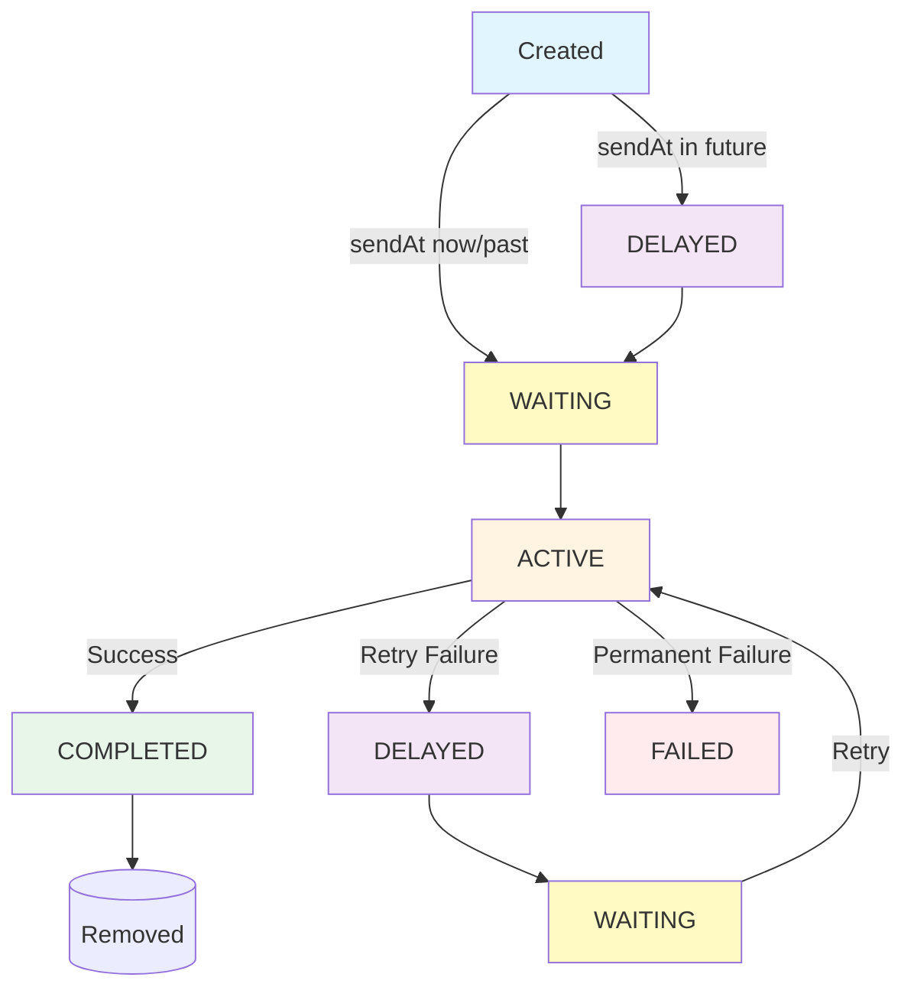

<!--
SOURCE: sources/blog/2022-09-11-interpreting-queue-types.md
Migrated to documentation format with technical guidance on queue internals.
-->

# Queue Management

EmailEngine uses [BullMQ](https://docs.bullmq.io/) for background task processing. Understanding how queues work helps you monitor performance, troubleshoot issues, and optimize your EmailEngine deployment.

## Overview

EmailEngine manages two primary queues for different operations:

- **Submit Queue**: Email sending jobs
- **Notify Queue**: Webhook delivery jobs

All queues are backed by Redis and monitored through Bull Board (previously Arena), accessible via **System → Queues** in the EmailEngine interface.

## Accessing Bull Board

**Navigation**: System → Queues

Bull Board provides a web interface for:
- Viewing queue statistics
- Inspecting job details
- Managing jobs (retry, delete)
- Monitoring queue health
- Debugging failures


*Bull Board main dashboard showing all queues and their statistics*


*Submit queue showing email sending jobs and their status*

## Queue Types

### 1. Submit Queue

**Purpose**: Handles all outbound email sending operations.

**Job Creation**: Created when:
- API `/v1/account/{account}/submit` endpoint called
- SMTP message received
- Scheduled email reaches send time

**Job Data**: Submit jobs are named `queued` (immediate) or `delayed` (scheduled with `sendAt`). The job data contains only metadata - the actual message content is stored separately in Redis and loaded by the submit worker at send time:

```json
{
  "account": "example",
  "queueId": "1812477e7ed5330eda4",
  "gateway": null,
  "messageId": "<uuid@example.com>",
  "envelope": {
    "from": "sender@example.com",
    "to": ["recipient@example.com"]
  },
  "subject": "Email subject",
  "proxy": null,
  "localAddress": null,
  "created": 1760774400000
}
```

**Success Outcome**: `messageSent` webhook emitted, job moves to Completed

**Failure Outcome**: Job retries (moves to Delayed) or fails permanently (moves to Failed)

### 2. Notify Queue

**Purpose**: Handles webhook delivery to your application.

**Job Creation**: Created when:
- New email arrives (`messageNew`)
- Message sent/failed (`messageSent`, `messageFailed`)
- Account events (`accountAdded`, `authenticationError`)
- Any webhook-enabled event occurs

**Job Data**: Notify jobs are named after the event type (e.g., `messageNew`), and the job data is the webhook payload itself. The target URL is not stored in the job - it is resolved from settings at delivery time:

```json
{
  "serviceUrl": "https://emailengine.example.com",
  "account": "example",
  "date": "2025-10-18T08:00:00.000Z",
  "event": "messageNew",
  "data": {}
}
```

**Success Outcome**: Your endpoint returns 2xx status, job moves to Completed

**Failure Outcome**: Job retries or fails, webhook not delivered

## Job Lifecycle

Every job moves through different states during its lifecycle.

### Job States

#### 1. Waiting

**Description**: Jobs ready to be processed immediately.

**How Jobs Enter**:
- Newly created without `sendAt` date
- Moved from Delayed when scheduled time reached
- Moved from Paused when queue resumed

**What Happens**: Workers pick jobs from here one by one and move them to Active.

**Example**: Email submitted via API for immediate delivery.

#### 2. Active

**Description**: Jobs currently being processed by a worker.

**How Jobs Enter**: Picked from Waiting queue by available worker.

**What Happens**:
- Email sending: SMTP connection established, message transmitted
- Webhook delivery: HTTP POST request sent to your endpoint

**Exit Paths**:
- **Success**: Move to Completed
- **Retriable Failure**: Move to Delayed (will retry)
- **Permanent Failure**: Move to Failed (no more retries)

**Example**: EmailEngine currently sending email to SMTP server.

#### 3. Delayed

**Description**: Jobs scheduled for future processing.

**How Jobs Enter**:
- Created with `sendAt` in future
- Failed in Active but within retry limit
- Manually delayed via API

**What Happens**: Jobs wait until delay time expires, then move to Waiting.

**Delay Reasons**:
- **Scheduled Send**: User specified `sendAt` timestamp
- **Retry After Failure**: Failed delivery, scheduled for retry using exponential backoff with a 5-second base delay (e.g., 5s, 10s, 20s, 40s, etc.)

**Example**: Email scheduled for tomorrow 9am or failed email waiting 30 seconds before retry.

#### 4. Completed

**Description**: Successfully processed jobs.

**How Jobs Enter**: Job completed successfully in Active state.

**What Happens**: Job stored for reference (if retention enabled), otherwise discarded.

**Retention**: By default, Completed jobs are immediately removed. Enable retention in **Configuration → General → Queue Management → Job History Limit**.

**Example**: Email successfully delivered to SMTP server.

#### 5. Failed

**Description**: Jobs that permanently failed after exhausting all retries.

**How Jobs Enter**: Job failed in Active state and retry limit reached.

**What Happens**: Job stored for debugging. No further processing.

**Retention**: Failed jobs are kept by default, unlike Completed jobs. A failure is the only record that a delivery was given up on, so it is retained even when the Job History Limit is 0. The defaults are the last 500 entries per queue for 7 days, adjustable with `EENGINE_QUEUE_KEEP_FAILED` and `EENGINE_QUEUE_KEEP_FAILED_AGE`.

**Common Failures**:
- SMTP authentication failed
- Recipient address invalid
- Webhook endpoint unreachable

**Example**: Email rejected by SMTP server with "User unknown" error after all retries.

#### 6. Paused

**Description**: Jobs held in queue while queue is paused.

**How Jobs Enter**: Jobs that would go to Waiting while queue paused.

**What Happens**: Jobs wait until queue resumed, then move to Waiting.

**Use Case**: Temporarily stop processing for maintenance or debugging.

**Example**: Queue paused via Bull Board, new emails accumulate here.

## Job Lifecycle Diagram



## Monitoring Queue Health

### Queue Metrics

**Key Metrics to Monitor**:

1. **Waiting Count**: Jobs pending processing
   - High count: Workers overloaded or slow
   - Normal: 0-10 for low traffic, higher for busy systems

2. **Active Count**: Jobs currently processing
   - Should match worker concurrency
   - Higher than expected: Workers stuck

3. **Delayed Count**: Scheduled or retrying jobs
   - Normal for scheduled emails
   - High count: Many failures and retries

4. **Failed Count**: Permanently failed jobs
   - Should be low (< 1% of completed)
   - High count: Systemic issue (authentication, configuration)

5. **Completed Count**: Successfully processed jobs
   - Indicates throughput
   - Only visible if retention enabled (Failed jobs are retained regardless)

### Health Indicators

**Healthy Queue**:
```
Waiting:   5
Active:    2
Delayed:   10 (scheduled)
Failed:    0
Completed: 1000
```

**Problematic Queue**:
```
Waiting:   500  ← Backlog building
Active:    10   ← Workers maxed out
Delayed:   200  ← Many retries
Failed:    50   ← High failure rate
```

### Bull Board Monitoring

**Dashboard View**:
1. Navigate to **System → Queues**
2. View all queues at a glance
3. Check counts for each state
4. Identify queues with issues

**Per-Queue View**:
1. Click on queue name (e.g., "Submit")
2. View detailed statistics
3. Browse jobs by state
4. Inspect individual jobs

## Job Inspection

### Viewing Job Details

**Steps**:
1. Go to **System → Queues**
2. Select queue (Submit, Notify, Documents)
3. Select job state tab (Waiting, Active, Failed, etc.)
4. Click on a job to view details

**Job Information**:
- Job ID
- Creation timestamp
- Processing attempts
- Data payload
- Error messages (if failed)
- Processing duration
- Next retry time (if delayed)

### Failed Job Analysis

**Example Failed Submit Job**:

```json
{
  "id": "1812477e7ed5330eda4",
  "name": "queued",
  "data": {
    "account": "example",
    "queueId": "1812477e7ed5330eda4",
    "gateway": null,
    "messageId": "<uuid@example.com>",
    "envelope": {
      "from": "sender@example.com",
      "to": ["invalid@nonexistent.com"]
    },
    "subject": "Test",
    "proxy": null,
    "localAddress": null,
    "created": 1760774400000
  },
  "failedReason": "535 5.7.8 Authentication failed",
  "attemptsMade": 10,
  "stacktrace": [
    "Error: 535 5.7.8 Authentication failed",
    "at SMTPConnection._actionAUTHComplete",
    "..."
  ]
}
```

**Diagnosis**: SMTP authentication failing, check account credentials.

### Common Failure Patterns

#### Submit Queue

**Authentication Failures**:
```
Error: 535 5.7.8 Authentication failed
```
**Solution**: Check account password or OAuth token

**Network Errors**:
```
Error: ETIMEDOUT Connection timeout
```
**Solution**: Check SMTP server reachable, firewall rules

**Recipient Rejected**:
```
Error: 550 5.1.1 User unknown
```
**Solution**: Verify recipient address, no retry needed

#### Notify Queue

**Connection Refused**:
```
Error: ECONNREFUSED connect ECONNREFUSED 192.168.1.100:443
```
**Solution**: Check webhook URL, server running

**Timeout**:
```
Error: Timeout: webhook endpoint did not respond within 90000ms
```
**Solution**: Optimize webhook handler, respond faster. The default webhook HTTP timeout is 90 seconds (override with `EENGINE_FETCH_TIMEOUT`).

**Invalid Response**:
```
Error: Unexpected status code: 500
```
**Solution**: Check webhook handler logs for errors

## Queue Management Operations

### Enable Job Retention

Completed jobs are removed as soon as they finish. To keep them for debugging:

**Steps**:
1. Navigate to **Configuration → General**
2. Find **Job History Limit**
3. Set to desired number (e.g., 100)
4. Click **Save**

**Recommendation**: Keep 50-100 jobs for debugging without excessive memory use.

Failed jobs are not covered by this setting. They are retained by default, because a failed job is the only record that a delivery was given up on:

| Variable | Default | Description |
|----------|---------|-------------|
| `EENGINE_QUEUE_KEEP_FAILED` | `500` | Failed entries retained per queue |
| `EENGINE_QUEUE_KEEP_FAILED_AGE` | `604800` | How long failed entries are retained, in seconds (7 days) |

Raising the Job History Limit above 500 raises the failed-entry floor with it. Lower these if Redis memory is tight: a `messageNew` webhook payload can carry up to `notifyTextSize` of message text, and a receiver that is down turns every event into a retained entry.

### Retry Failed Job

**Steps**:
1. Go to **System → Queues**
2. Select queue
3. Go to **Failed** tab
4. Find job to retry
5. Click **Retry** button

**Use Case**: Retry after fixing underlying issue (e.g., corrected credentials, restored service).

### Delete Job

**Steps**:
1. Go to **System → Queues**
2. Select queue and job state
3. Find job
4. Click **Delete** button

**Use Case**: Remove stuck jobs, clear old scheduled emails, clean up queue.

### Pause Queue

**Steps**:
1. Go to **System → Queues**
2. Select queue
3. Click **Pause** button

**Effect**:
- Workers stop processing jobs
- Active jobs complete
- New jobs go to Paused state
- Existing Waiting jobs move to Paused

**Use Case**: Maintenance, debugging, testing.

### Resume Queue

**Steps**:
1. Go to **System → Queues**
2. Select paused queue
3. Click **Resume** button

**Effect**:
- Jobs move from Paused to Waiting
- Workers start processing again

### Empty Queue

**Steps**:
1. Go to **System → Queues**
2. Select queue
3. Select job state (e.g., Failed, Completed)
4. Click **Empty** button

**Effect**: Removes all jobs in that state.

**Use Case**: Clear old completed/failed jobs, reset queue.

**Warning**: Cannot be undone!

## Webhooks and Queue Interactions

### Webhook Emission

Webhooks are emitted at specific queue state transitions:

**Submit Queue**:
- **Completed**: `messageSent` webhook
- **Failed**: `messageFailed` webhook
- **Delayed** (from Active): `messageDeliveryError` webhook

**Notify Queue**:
- No webhooks (webhooks don't trigger webhooks)

**Documents Queue**:
- No webhooks (internal indexing)

### Webhook Delivery Flow

1. Event occurs (email sent)
2. Job added to Notify queue (Waiting)
3. Worker picks job (Active)
4. HTTP POST sent to webhook URL
5. If 2xx response: job moves to Completed
6. If error: job moves to Delayed or Failed

### Webhook Retry Strategy

**Retry Attempts**: 10 (fixed - only email submission retries are configurable, via the `deliveryAttempts` setting)

**Retry Delays**: Exponential backoff with a 5-second base delay (5s, 10s, 20s, 40s, 80s, etc.)

**Exceptions**: A destination EmailEngine refuses itself - a blocked address, or an endpoint that answers with a redirect - moves to Failed on the first attempt, since retrying cannot change the outcome. See [Blocked destinations and redirects](/docs/webhooks/overview#blocked-destinations-and-redirects).

**After All Retries Exhausted**: Job moves to Failed, webhook not delivered.

## Performance Tuning

### Worker Concurrency

Control how many workers process jobs simultaneously for different queue types:

**Environment Variables**:

```bash
# Account workers (default: 4) - handles account synchronization (IMAP, Gmail API, Outlook/Graph)
EENGINE_WORKERS=4

# Webhook workers (default: 1) - handles webhook delivery
EENGINE_WORKERS_WEBHOOKS=1

# Submit workers (default: 1) - handles email sending
EENGINE_WORKERS_SUBMIT=1
```

**Trade-offs**:
- More workers: Higher throughput, more resource usage
- Fewer workers: Lower throughput, lower resource usage

### Redis Performance

BullMQ depends on Redis performance:

**Optimize Redis**:
- Use Redis 6+ for better performance
- Enable persistence (AOF or RDB)
- Monitor memory usage
- Use dedicated Redis instance for production

**Redis Connection**:
```bash
# Configure Redis URL
EENGINE_REDIS=redis://localhost:6379

# Alternative: Use REDIS_URL
REDIS_URL=redis://localhost:6379
```

## Observing Queue Activity

EmailEngine's queues are internal. They are a BullMQ implementation detail rather than a public interface, so treat the Redis database as EmailEngine's private storage: adding your own jobs to these queues, or writing to their Redis keys, corrupts state that EmailEngine assumes it owns.

To follow what the queues are doing, use the paths that are supported:

| What you want | How to get it |
|---------------|---------------|
| Inspect individual jobs, including failures with full error details | **System > Queues** (Bull Board) in the admin interface |
| React to delivery outcomes in your own code | [Webhooks](/docs/webhooks/overview), in particular [`messageSent`](/docs/webhooks/messagesent), [`messageDeliveryError`](/docs/webhooks/messagedeliveryerror), and [`messageFailed`](/docs/webhooks/messagefailed) |
| Check where a specific queued message stands | [`GET /v1/outbox/{queueId}`](/docs/api/get-v-1-outbox-queueid), which reports `progress.status`, `attemptsMade`, and `nextAttempt` |
| Cancel a message that has not been sent yet | [`DELETE /v1/outbox/{queueId}`](/docs/api/delete-v-1-outbox-queueid) |
| Track queue depth over time | The [Prometheus metrics endpoint](/docs/advanced/monitoring#prometheus-metrics) |

Every one of these survives an upgrade. Direct queue access does not: job names, payload shapes, and retry options change between EmailEngine releases without notice.

## See Also

- [Monitoring](/docs/advanced/monitoring) - Metrics, health checks, and alerting
- [Outbox and Queue](/docs/sending/outbox-queue) - The sending queue from the application's side
- [Performance Tuning](/docs/advanced/performance-tuning) - Worker counts and Redis sizing
- [Webhook Overview](/docs/webhooks/overview) - Delivery guarantees and retry behavior
