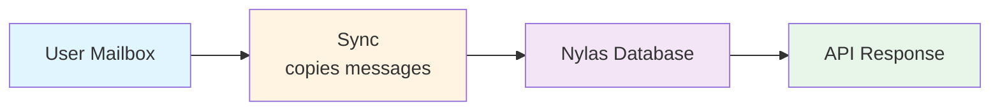
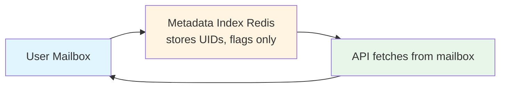

import Price from '@site/src/components/Price';

# EmailEngine vs Nylas: Which Email API is Right for You?

This comparison covers features, pricing models, and deployment options for two ways of putting an email API in front of your users' mailboxes: EmailEngine, which you host, and Nylas, which is hosted for you.

A shorter, decision-focused version, covering architecture, pricing arithmetic, and where each product wins, is on the main site: [EmailEngine vs Nylas](https://emailengine.app/nylas-alternative).

:::info About the Nylas figures on this page
Statements about Nylas describe its public [product page](https://www.nylas.com/products/email-api/) and [pricing page](https://www.nylas.com/pricing/) as read on 26 August 2026. Nylas revises both, and this page is not updated when it does. Statements about EmailEngine describe version 2.79.4.
:::

:::info Summary

- **Nylas:** Fully managed SaaS with a wider feature set and a per-account price
- **EmailEngine:** Self-hosted, flat annual license, mailbox data stays on your infrastructure

Choose based on your priorities: operational overhead vs control and cost.
:::

## Quick Comparison Table

| Feature                  | EmailEngine                 | Nylas                              |
| ------------------------ | --------------------------- | ---------------------------------- |
| **Hosting**              | Self-hosted                 | Fully managed SaaS                 |
| **Data Storage**         | Metadata only, in your Redis | Mailbox data synced into Nylas infrastructure |
| **Pricing Model**        | Flat yearly license<Price /> | Monthly base fee per plan, plus a charge per connected account above the included ones |
| **Getting started**      | Install and configure an instance | Sign up                     |
| **Data Residency**       | Your infrastructure         | Nylas cloud                        |
| **Read Performance**     | On demand from the mail server | Served from the synced copy     |
| **Parallelism**          | One IMAP connection per mailbox, requests queued | Parallel at the API layer |
| **AI features**          | MCP endpoint for AI agents (beta); no built-in classification | AI message cleaning, threading, bounce detection |
| **Compliance**           | Your controls, your audits  | SOC 2 Type II, ISO 27001, HIPAA, GDPR and CCPA listed |
| **Support**              | Direct from the developers  | Tiered, enterprise plans with SLAs |

## Key Architectural Differences

### Hosting Model

**Nylas:**

- Cloud-hosted service
- No infrastructure management
- Scaling handled by the vendor
- **Trade-off:** Vendor dependency, mailbox data leaves your network

**EmailEngine:**

- Self-hosted on your infrastructure
- You manage servers, scaling, backups
- Full control over deployment
- **Trade-off:** Operational responsibility

**Best for:**

- **Nylas:** Teams without DevOps capacity
- **EmailEngine:** Teams with existing infrastructure or strict data requirements

---

### Data Storage Architecture

**Nylas:**

- **Stores:** A synced copy of mailbox data ("bi-directional sync for email and calendar")
- **Advantages:** Fast reads, search over the synced copy
- **Disadvantages:** Data stored on third-party servers

**EmailEngine:**

- **Stores:** Message UIDs, flags, folder structure only
- **Advantages:** Minimal data exposure, no third-party storage
- **Disadvantages:** Every read goes to the mail server, so it is bounded by the server's speed and limits

**Best for:**

- **Nylas:** Performance-critical applications, heavy search
- **EmailEngine:** Privacy-critical applications, compliance requirements

### Concurrent Requests

**Nylas:**

- Requests are served from the Nylas API layer in parallel
- Underlying provider limits still apply (Microsoft, for example, limits concurrent requests per mailbox)

**EmailEngine:**

- One primary IMAP connection per mailbox, so requests for the same mailbox are serialized and queue behind each other; during the initial sync some read operations are moved to a secondary connection
- Direct exposure to the mail server's limits
- Gmail API and Microsoft Graph accounts use HTTP calls rather than a single connection, and are bounded by those APIs' quotas instead

## Feature Comparison

### Core Email Features

| Feature          | EmailEngine                    | Nylas           |
| ---------------- | ------------------------------ | --------------- |
| IMAP/SMTP        | Yes                            | Yes             |
| Gmail API        | Yes                            | Yes             |
| Outlook/Exchange | Yes                            | Yes             |
| OAuth2           | Yes                            | Yes             |
| Webhooks         | Yes                            | Yes             |
| Send emails      | Yes                            | Yes             |
| Attachments      | Yes                            | Yes             |
| Search           | Yes (IMAP search, or the provider API's search) | Yes  |
| Labels/Tags      | Yes                            | Yes             |
| Bounce detection | Yes                            | Yes             |
| Threading        | Partial (Gmail, Microsoft Graph, Yahoo) | Yes    |

:::info EmailEngine Threading Support
EmailEngine provides native threading only where the provider does:

- **Gmail** (IMAP + OAuth2 or Gmail API): thread IDs from Gmail
- **Microsoft 365** (Graph API only): conversation IDs from Graph. The IMAP backend does not support threading
- **Yahoo/AOL/Verizon** (IMAP): thread IDs through the OBJECTID extension (RFC 8474)
- **Other IMAP providers**: no native threading; build threads from the `Message-ID`, `In-Reply-To`, and `References` headers

Nylas advertises threading across providers, managed on its side.

See [Provider-Specific Threading Support](/docs/sending/threading/provider-support) for details.
:::

### Integration Features

| Feature          | EmailEngine                    | Nylas                         |
| ---------------- | ------------------------------ | ----------------------------- |
| REST API         | Yes, with an OpenAPI spec      | Yes                           |
| Webhooks         | Yes                            | Yes                           |
| Webhook retry    | Yes                            | Yes                           |
| Batch operations | Yes (mail merge, multi-message actions) | Yes                  |
| Rate limiting    | Per-token limits you set, plus whatever the mail server enforces | Built-in |
| SDKs             | Official PHP SDK; other languages use the REST API | Official SDKs |
| AI agents        | MCP endpoint (beta)            | Agent accounts (see pricing)  |

## Pricing Deep Dive

### EmailEngine Pricing

**Structure:**

- **Annual license:** Flat annual fee<Price />, excluding VAT - see [postalsys.com/plans](https://postalsys.com/plans)
- **Unlimited mailboxes**
- **Unlimited API calls**
- **Unlimited instances**

**Your costs:**

| Cost Component      | Amount                                                       |
| ------------------- | ------------------------------------------------------------ |
| EmailEngine License | Flat annual fee<Price />, see [pricing](https://postalsys.com/plans) |
| Infrastructure      | Variable (VPS/cloud)                                         |
| DevOps Time         | Variable                                                     |

**Cost scales with infrastructure, not mailbox count.**

---

### Nylas Pricing

Nylas publishes its rates at [nylas.com/pricing](https://www.nylas.com/pricing/). The figures change, so this page describes the shape of the model as read on 26 August 2026 rather than quoting them:

1. **Sandbox**: free, a small number of connected accounts, for development and testing
2. **Calendar**: a monthly base fee that includes a few connected accounts, then a per-account monthly charge above that
3. **Full Platform**: the same structure with a higher base fee and per-account charge, covering email, calendar, and the rest of the platform, plus a separate allowance and per-unit charge for agent accounts
4. **Enterprise**: contact sales; volume discounts, dedicated support, uptime guarantees, and a BAA for HIPAA

A separate Notetaker plan for meeting recording is priced by usage and has no email component, so it is outside this comparison.

**Cost scales with connected account count.**

---

**Choose Nylas if:**

- You have few mailboxes, so the per-account charge stays below a flat license plus hosting
- You value zero DevOps time at a high premium
- You want the AI message cleaning and cross-provider threading Nylas does on its side
- You prefer fully managed SaaS

**Choose EmailEngine if:**

- You have enough mailboxes that a per-account price outgrows a flat one. Work the break-even out from the current Nylas rates and your hosting costs
- You have DevOps capacity or existing infrastructure
- Data sovereignty and privacy are priorities
- You want predictable, flat-rate pricing

## Operational Considerations

### Scaling

| Aspect                 | EmailEngine                                        | Nylas                              |
| ---------------------- | -------------------------------------------------- | ---------------------------------- |
| **Vertical Scaling**   | Increase server resources (CPU, RAM)               | Managed by the vendor              |
| **Horizontal Scaling** | Not supported: instances do not coordinate, so two instances on one Redis both sync every account | Managed by the vendor |
| **Manual Sharding**    | Possible: one Redis database per instance, accounts split between them | Not needed  |
| **Bottleneck**         | Usually Redis or the network path to the mail servers | Provider API quotas             |
| **Max Scale**          | Up to several thousand mailboxes per instance, see [Performance Tuning](/docs/advanced/performance-tuning) | Managed by the vendor |
| **Scaling Effort**     | Manual configuration required                      | None on your side                  |

**Best for:**

- **EmailEngine:** Small to medium scale (under a few thousand mailboxes per instance)
- **Nylas:** Any scale where you do not want to run the infrastructure

---

### Data Sovereignty and Compliance

| Aspect                        | EmailEngine             | Nylas                |
| ----------------------------- | ----------------------- | -------------------- |
| **Data Location**             | Your infrastructure     | Nylas cloud          |
| **Encryption Key Control**    | You control             | Nylas controls       |
| **Data Retention Control**    | You control             | Nylas manages        |
| **GDPR**                      | No third-party processor for mailbox data | Listed as compliant, with a DPA |
| **HIPAA**                     | Your own controls       | Listed as compliant, BAA on enterprise plans |
| **SOC 2 Type II**             | You must implement      | Listed as certified  |
| **ISO 27001**                 | You must implement      | Listed as certified  |
| **Compliance Implementation** | Your responsibility     | Vendor-provided documentation |

**Best for:**

- **EmailEngine:** Strict data residency requirements (banking, healthcare, EU), full data control
- **Nylas:** Need pre-certified compliance, professional audit support

## Use Case Recommendations

### Choose EmailEngine If:

**- You have DevOps capacity**

- In-house infrastructure team
- Comfortable with Docker or a VM
- Can monitor and maintain services

**- Data sovereignty is critical**

- Banking, healthcare, legal
- European companies with GDPR concerns
- Government contracts

**- Cost is a major factor**

- High mailbox count
- Predictable flat pricing needed
- Limited budget

**- You need real-time webhooks**

- Chat-like applications
- Instant notification requirements
- Time-critical workflows

**- You want source-available code**

- Want to audit and inspect code
- Source code available for review
- Licensed under a commercial license, not open source
- Requires a paid license to use

---

### Choose Nylas If:

**- Zero DevOps overhead desired**

- Small team focused on product
- No infrastructure expertise
- Want fully managed solution

**- You want the vendor-side processing**

- AI message cleaning
- Threading across every provider
- Scheduler and calendar products

**- You need parallel performance**

- High concurrent request volume
- Multiple users per mailbox
- Performance-critical application

**- You want enterprise support**

- SLA guarantees
- Dedicated support team
- Professional services
- Compliance documentation

**- You're building a calendar app**

- Calendar API needed
- Scheduler integration
- Complex meeting workflows

## Bottom Line

**EmailEngine is best for:**

- Cost-sensitive deployments with many mailboxes
- Data sovereignty requirements
- Real-time webhook needs
- Teams with DevOps capability

**Nylas is best for:**

- Zero-ops preference
- Vendor-side AI processing and threading
- Calendar-heavy applications
- Enterprise compliance needs

Choose based on your specific constraints and priorities, not on generic "best" claims.

## See Also

- [EmailEngine vs Unipile](/docs/comparison/emailengine-vs-unipile) - The other managed alternative
- [Introduction](/docs/getting-started/introduction) - What EmailEngine is and is not
- [Licensing and privacy](/docs/licensing) - What the license covers and what leaves your server
- [Installation](/docs/installation) - The self-hosting work a managed service saves you
- [Performance tuning](/docs/advanced/performance-tuning) - What one instance can carry
