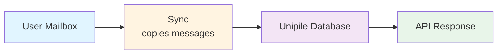
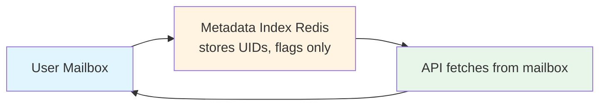

import Price from '@site/src/components/Price';

# EmailEngine vs Unipile: Email API Comparison

This page compares an email-only, self-hosted API (EmailEngine) with a multi-channel managed service (Unipile), to help you choose the right one for your project.

A shorter, decision-focused version, covering channel scope, pricing arithmetic, and where each product wins, is on the main site: [EmailEngine vs Unipile](https://emailengine.app/unipile-alternative).

:::info About the Unipile figures on this page
Statements about Unipile describe its public [website](https://www.unipile.com/) and [pricing page](https://www.unipile.com/pricing-api/) as read on 26 August 2026. Unipile revises both, and this page is not updated when it does. "Not advertised" in a table means the feature is not listed on those pages, not that it is absent. Statements about EmailEngine describe version 2.79.4.
:::

:::info Summary

- **Unipile:** Fully managed SaaS with multi-channel messaging (email, LinkedIn, WhatsApp, Instagram, Telegram) and calendars
- **EmailEngine:** Self-hosted, email only, flat annual license, mailbox data stays on your infrastructure

Choose based on your priorities: multi-channel integration vs control and cost.
:::

## Quick Comparison Table

| Feature                  | EmailEngine                 | Unipile                                 |
| ------------------------ | --------------------------- | --------------------------------------- |
| **Hosting**              | Self-hosted                 | Fully managed SaaS, cloud only          |
| **Data Storage**         | Metadata only, in your Redis | Synced into Unipile infrastructure     |
| **Pricing Model**        | Flat yearly license<Price /> | Per connected account per month, volume tiers |
| **Getting started**      | Install and configure an instance | Sign up                           |
| **Data Residency**       | Your infrastructure         | Unipile cloud                           |
| **Multi-Channel**        | Email only                  | Email, LinkedIn, WhatsApp, Instagram, Telegram |
| **Calendar**             | No                          | Google Calendar and Outlook Calendar    |
| **Compliance**           | Your controls, your audits  | SOC 2 Type II and GDPR listed           |
| **Support**              | Direct from the developers  | Vendor support                          |

## Key Architectural Differences

### Hosting Model

**Unipile:**

- Cloud-hosted service (SaaS only)
- No infrastructure management
- Scaling handled by the vendor
- **Trade-off:** Vendor dependency, no self-hosted option

**EmailEngine:**

- Self-hosted on your infrastructure
- You manage servers, scaling, backups
- Full control over deployment
- **Trade-off:** Operational responsibility

**Best for:**

- **Unipile:** Teams without DevOps capacity that need multi-channel messaging
- **EmailEngine:** Teams with existing infrastructure or strict data requirements

---

### Data Storage Architecture

**Unipile:**

- **Stores:** Synced messages and metadata across the connected channels
- **Advantages:** Fast reads, one inbox model across channels
- **Disadvantages:** Data stored on third-party servers

**EmailEngine:**

- **Stores:** Message UIDs, flags, folder structure only
- **Advantages:** Minimal data exposure, no third-party storage
- **Disadvantages:** Every read goes to the mail server, so it is bounded by the server's speed and limits

**Best for:**

- **Unipile:** Multi-channel communication apps
- **EmailEngine:** Maximum privacy, full data control on your own infrastructure

---

### Scope of Integration

**Unipile:**

- Email (Gmail, Outlook, IMAP)
- LinkedIn messaging
- WhatsApp
- Instagram
- Telegram
- Calendar (Google, Outlook)

**EmailEngine:**

- Email only (Gmail, Microsoft 365, IMAP/SMTP)
- Protocol-level email features: bounce detection, delivery tracking, mail merge, stored templates, an SMTP interface, an IMAP proxy

**Best for:**

- **Unipile:** Sales outreach, recruiting, CRM integrations that need several channels
- **EmailEngine:** Email-focused applications requiring maximum control

## Feature Comparison

### Core Email Features

| Feature          | EmailEngine                    | Unipile            |
| ---------------- | ------------------------------ | ------------------ |
| IMAP/SMTP        | Yes                            | Yes                |
| Gmail            | Yes (Gmail API or IMAP)        | Yes                |
| Outlook          | Yes (Microsoft Graph or IMAP)  | Yes                |
| OAuth2           | Yes, your own OAuth2 apps      | Yes, hosted authentication |
| Webhooks         | Yes                            | Yes                |
| Send emails      | Yes                            | Yes                |
| Attachments      | Yes                            | Yes                |
| Search           | Yes (IMAP search, or the provider API's search) | Not advertised |
| Labels/Tags      | Yes                            | Not advertised     |
| Threading        | Partial (Gmail, Microsoft Graph, Yahoo) | Not advertised |
| Bounce Detection | Yes                            | Not advertised     |
| Mail Merge       | Yes                            | Not advertised     |
| Templates        | Yes (server-side)              | Not advertised     |

### Beyond Email

| Feature            | EmailEngine | Unipile                  |
| ------------------ | ----------- | ------------------------ |
| LinkedIn Messaging | No          | Yes                      |
| WhatsApp           | No          | Yes                      |
| Instagram DM       | No          | Yes                      |
| Telegram           | No          | Yes                      |
| Calendar Sync      | No          | Yes (Google, Outlook)    |

### Integration Features

| Feature          | EmailEngine                    | Unipile                       |
| ---------------- | ------------------------------ | ----------------------------- |
| REST API         | Yes, with an OpenAPI spec      | Yes                           |
| Webhooks         | Yes                            | Yes                           |
| Webhook retry    | Yes                            | Not advertised                |
| Batch operations | Yes (mail merge, multi-message actions) | Not advertised       |
| Rate limiting    | Per-token limits you set, plus whatever the mail server enforces | Unlimited API calls advertised; provider limits apply |
| SDKs             | Official PHP SDK; other languages use the REST API | SDK and n8n integration advertised |
| AI agents        | MCP endpoint (beta)            | MCP advertised                |

## Pricing Deep Dive

### EmailEngine Pricing

**Structure:**

- **Annual license:** Flat annual fee<Price />, excluding VAT - see [postalsys.com/plans](https://postalsys.com/plans)
- **Unlimited mailboxes**
- **Unlimited API calls**
- **Unlimited instances**

**Your costs:**

| Cost Component      | Amount                                                       |
| ------------------- | ------------------------------------------------------------ |
| EmailEngine License | Flat annual fee<Price />, see [pricing](https://postalsys.com/plans) |
| Infrastructure      | Variable (VPS/cloud)                                         |
| DevOps Time         | Variable                                                     |

**Cost scales with infrastructure, not mailbox count.**

---

### Unipile Pricing

Unipile publishes its rates at [unipile.com/pricing-api](https://www.unipile.com/pricing-api/). The figures change, so this page describes the shape of the model as read on 26 August 2026 rather than quoting them:

- **Per connected account per month.** Each linked identity (a LinkedIn profile, a WhatsApp number, an email address) is one account; a Gmail or Outlook account with its calendar counts once
- **Volume tiers.** A flat monthly minimum covers the smallest tier, then the per-account rate steps down as the account count grows, with custom pricing above the largest tier
- **Quoted in euros**, with a dollar column alongside; prices exclude VAT
- **Billed post-paid** at 30-day intervals on the peak number of linked accounts in the period
- **All features on every tier:** every channel, unlimited API calls, webhooks, hosted authentication
- **Free trial:** 7 days, no credit card required

**Cost scales with connected account count.**

---

**Choose Unipile if:**

- You need multi-channel messaging (LinkedIn, WhatsApp, Instagram, Telegram)
- You do not want to self-host
- You're building a CRM, ATS, or sales outreach tool

**Choose EmailEngine if:**

- You only need email integration
- You want to self-host for maximum control
- You have enough mailboxes that a per-account price outgrows a flat one. Work the break-even out from the current Unipile rates and your hosting costs
- Data must stay on your own infrastructure

## Operational Considerations

### Scaling

| Aspect                 | EmailEngine                                        | Unipile                              |
| ---------------------- | -------------------------------------------------- | ------------------------------------ |
| **Vertical Scaling**   | Increase server resources (CPU, RAM)               | Managed by the vendor                |
| **Horizontal Scaling** | Not supported: instances do not coordinate, so two instances on one Redis both sync every account | Managed by the vendor |
| **Bottleneck**         | Usually Redis or the network path to the mail servers | Provider limits                   |
| **Max Scale**          | Up to several thousand mailboxes per instance, see [Performance Tuning](/docs/advanced/performance-tuning) | Managed by the vendor |
| **Scaling Effort**     | Manual configuration required                      | None on your side                    |

**Best for:**

- **EmailEngine:** Small to medium scale (under a few thousand mailboxes per instance)
- **Unipile:** Any scale where you do not want to run the infrastructure, especially when multi-channel is needed

---

### Provider Limits

Neither product removes the limits of the underlying providers. Gmail and Microsoft 365 cap how much mail an account may send per day, and LinkedIn and WhatsApp cap messaging activity per account. Unipile advertises no API rate limits of its own; EmailEngine enforces only the [per-token limits](/docs/api-reference/access-tokens) you configure. In both cases the mail server's own limits are what you hit first.

---

### Data Sovereignty and Compliance

| Aspect                        | EmailEngine             | Unipile               |
| ----------------------------- | ----------------------- | --------------------- |
| **Data Location**             | Your infrastructure     | Unipile cloud         |
| **Encryption Key Control**    | You control             | Unipile controls      |
| **Data Retention Control**    | You control             | Unipile manages       |
| **GDPR**                      | No third-party processor for mailbox data | Listed as compliant |
| **SOC 2 Type II**             | You must implement      | Listed as certified   |
| **Compliance Implementation** | Your responsibility     | Vendor-provided documentation |

**Best for:**

- **EmailEngine:** Maximum data control, no third-party data storage
- **Unipile:** Managed compliance documentation without running the infrastructure

## Use Case Recommendations

### Choose EmailEngine If:

**- You only need email**

- No LinkedIn, WhatsApp, or calendar requirements
- Deep email protocol features needed (bounce detection, mail merge)
- Email-focused application

**- Data sovereignty is critical**

- Banking, healthcare, legal
- Government contracts
- Data must never leave your infrastructure

**- Cost is a major factor**

- High mailbox count
- Predictable flat pricing needed
- No per-account fees

**- You want source-available code**

- Want to audit and inspect code
- Source code available for review

---

### Choose Unipile If:

**- You need multi-channel messaging**

- LinkedIn outreach automation
- WhatsApp business messaging
- Unified inbox across channels

**- You're building a CRM or ATS**

- Sales outreach tools
- Recruiting platforms
- Customer communication hubs

**- Zero DevOps overhead desired**

- No infrastructure to manage
- Small team focused on product
- Want fully managed solution

**- Vendor compliance documentation is sufficient**

- GDPR compliance needed
- Third-party hosting acceptable
- SOC 2 Type II certification required

## Bottom Line

**EmailEngine is best for:**

- Email-only applications
- Self-hosted requirements
- Cost-sensitive deployments with many mailboxes
- Maximum data control

**Unipile is best for:**

- Multi-channel communication (email, LinkedIn, WhatsApp, Instagram, Telegram)
- CRM, ATS, and outreach tool development
- Managed compliance documentation
- Zero-ops preference

**Key difference:** EmailEngine is email-focused and self-hosted; Unipile is multi-channel and cloud-only. If you only need email and want full control, choose EmailEngine. If you need LinkedIn, WhatsApp, and other channels with managed hosting, choose Unipile.

## See Also

- [EmailEngine vs Nylas](/docs/comparison/emailengine-vs-nylas) - The other managed alternative
- [Introduction](/docs/getting-started/introduction) - What EmailEngine is and is not
- [Account types](/docs/accounts) - The providers EmailEngine connects to
- [Licensing and privacy](/docs/licensing) - What the license covers and what leaves your server
- [Performance tuning](/docs/advanced/performance-tuning) - What one instance can carry
