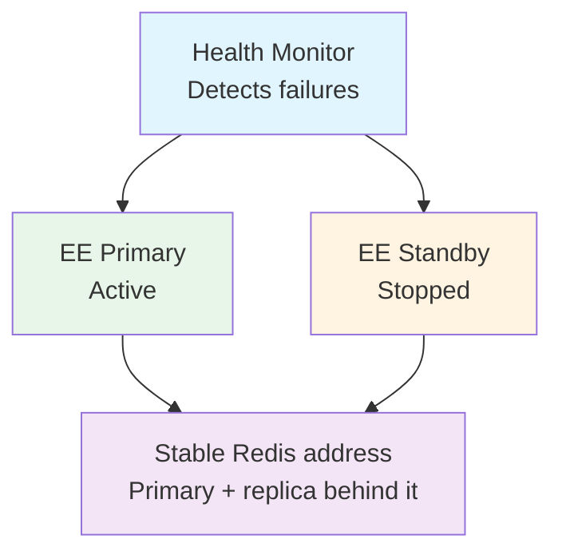
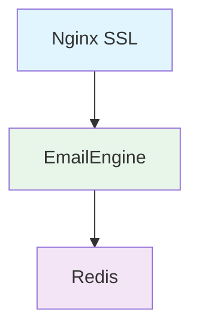
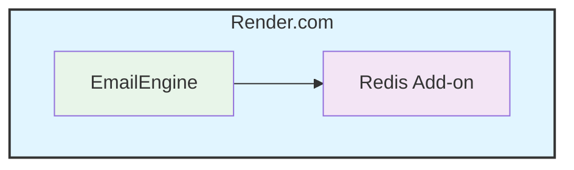
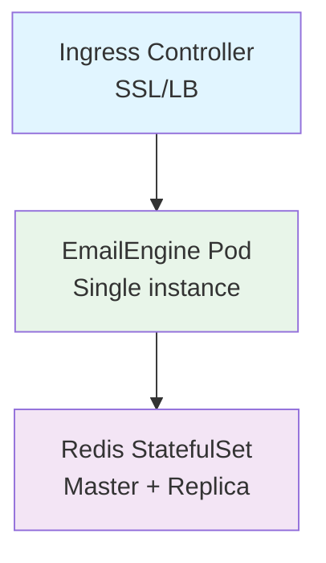

# Deploying EmailEngine

This guide helps you choose the right deployment method and provides best practices for production deployments.

## Deployment Options

EmailEngine can be deployed in various ways depending on your infrastructure and requirements:

| Method | Complexity | Best For | Scaling |
|--------|------------|----------|---------|
| [Docker](#docker) | Low | Quick start, containers | Vertical |
| [Docker Compose](#docker-compose) | Low | Development, small teams | Limited |
| [Kubernetes](#kubernetes) | High | Enterprise, cloud-native | Vertical |
| [SystemD Service](#systemd-service) | Medium | Bare metal, VPS | Vertical |
| [Render.com](#rendercom) | Low | Managed hosting | Vertical |
| [Nginx Reverse Proxy](#nginx-reverse-proxy) | Medium | Production with SSL | N/A |

## Quick Comparison

### Docker
**Pros:**
- Quick to set up
- Isolated environment
- Easy updates
- Portable

**Cons:**
- Requires Docker knowledge
- Single container limitations

**When to use:** Quick start, development, simple production

[Docker deployment guide →](/docs/installation/docker)

---

### Docker Compose
**Pros:**
- Multi-container orchestration
- Easy configuration
- Development-friendly
- Includes Redis setup

**Cons:**
- Not production-grade at scale
- Limited high-availability options

**When to use:** Development, staging, small production

[Docker Compose setup →](/docs/installation/docker#docker-compose-recommended)

---

### Kubernetes
**Pros:**
- Declarative configuration and secrets
- Automatic restarts on failure
- Health probes and resource limits

**Cons:**
- Complex setup
- Requires K8s knowledge
- Higher resource overhead

**When to use:** Enterprise, large scale, cloud deployments

[Kubernetes deployment →](/docs/deployment/kubernetes)

---

### SystemD Service
**Pros:**
- Native Linux integration
- No containerization overhead
- Full system access
- Easy log management

**Cons:**
- Manual dependency management
- OS-specific
- Manual updates

**When to use:** VPS, bare metal, traditional Linux servers

[SystemD service guide →](./systemd.md)

---

### Render.com
**Pros:**
- Fully managed
- Zero DevOps
- Auto SSL
- Built-in monitoring

**Cons:**
- Vendor lock-in
- Cost at scale
- Limited customization

**When to use:** Quick deployment, prototyping, small teams

[Render deployment →](./render.md)

---

### Nginx Reverse Proxy
**Pros:**
- SSL/TLS termination
- Load balancing
- Security hardening
- Rate limiting

**Cons:**
- Additional component
- Configuration complexity

**When to use:** Production deployments requiring HTTPS

[Nginx proxy setup →](./nginx-proxy.md)

## Choosing the Right Method

### For Development

**Recommended:** Docker Compose

```yaml
services:
  redis:
    image: redis:7-alpine
  emailengine:
    image: postalsys/emailengine:v2
    ports:
      - "3000:3000"
    environment:
      - EENGINE_REDIS=redis://redis:6379/2
```

**Why:** Quick setup, easy to tear down, includes all dependencies.

### For Production (Small Scale)

**Recommended:** Docker + Render.com OR SystemD + Nginx

**Docker on Render:**
- Managed hosting
- Auto SSL
- Simple deployment

**SystemD + Nginx:**
- Full control
- Cost-effective
- VPS-friendly

### For Production (Large Scale)

**Recommended:** Kubernetes

**What it gives you:**
- Automatic restarts and health probes
- Declarative secrets and configuration
- A single, larger pod: EmailEngine still runs as one replica (see [Scaling Strategies](#scaling-strategies))

## Production Checklist

Before deploying to production, ensure you have:

### Infrastructure

- [ ] Redis 6.2 or newer deployed with persistence enabled (see [Redis](/docs/configuration/redis))
- [ ] Sufficient Redis memory (1-2 MiB per account, provisioned twice over)
- [ ] Fast network connection to Redis (< 5ms latency)
- [ ] HTTPS/TLS configured
- [ ] Firewall rules configured

### Configuration

- [ ] `EENGINE_SECRET` set to a stable random value (32 bytes, `openssl rand -hex 32`) so stored credentials are encrypted
- [ ] OAuth2 applications configured
- [ ] Webhook endpoints configured
- [ ] Base URL set correctly
- [ ] License key activated

### Monitoring

- [ ] Prometheus scraping `/metrics` with a `metrics`-scoped token
- [ ] Log aggregation configured
- [ ] Health check endpoints monitored
- [ ] Alerts configured for errors
- [ ] Backup strategy for Redis

### Security

- [ ] Secrets stored securely (not in code)
- [ ] Network access restricted
- [ ] API tokens rotated regularly
- [ ] Redis password protected
- [ ] Regular security updates

[Complete security checklist →](./security.md)

## Scaling Strategies

### Vertical Scaling (Only Supported Method)

:::warning No Horizontal Scaling
EmailEngine does NOT support running multiple instances against the same Redis. Each instance would independently sync all accounts, causing conflicts and resource waste.
:::

**Increase resources on single instance:**

- More CPU cores (increase `EENGINE_WORKERS`)
- More RAM (more concurrent accounts)
- Faster network (reduce latency)

**Configuration:**
```bash
EENGINE_WORKERS=16           # Match CPU cores
EENGINE_WORKERS_WEBHOOKS=8
EENGINE_WORKERS_SUBMIT=4
```

**Good for:** Several thousand accounts per instance

**Manual Sharding (Advanced):** For very large deployments, you can run completely separate EmailEngine instances with separate Redis databases and manually distribute accounts across them. This requires your application to route requests appropriately.

[Scaling guide →](../advanced/performance-tuning.md)

## High Availability

### Redis HA (Recommended Approach)

Since EmailEngine doesn't support multiple instances, focus on Redis high availability:

**Requirements:**

1. **Single EmailEngine instance** (primary)
2. **Standby EmailEngine instance** (cold standby, not running)
3. **A Redis primary with a replica**, and a failover mechanism that presents one stable address. EmailEngine connects to a single `redis://` or `rediss://` host; it does not speak the Sentinel protocol, and Redis Cluster is not supported. Put the promotion behind a virtual IP, a DNS name you update, or a proxy that follows the primary
4. **Persistent storage** for Redis
5. **Health monitoring** to detect failures

### Architecture Example



**Failover Process:**
1. Health monitor detects primary failure
2. Manually start standby instance (or use orchestration tool)
3. Standby connects to the same Redis address, which now resolves to the promoted replica
4. Service resumes with minimal downtime

### Health Check Endpoint

```bash
curl https://emailengine.example.com/health
```

**Response:**
```json
{
  "success": true
}
```

The endpoint needs no authentication. It checks that every configured IMAP worker thread is running, then writes, reads back and deletes a probe key in Redis; a 500 with `Not all IMAP workers available` or `Database check failed` as the message reports which check failed. It says nothing about individual accounts. Use the [account list](/docs/api/get-v-1-accounts) or the `imap_connections` metric for those.

## Environment-Specific Configuration

### Development

```bash
# .env.development
EENGINE_LOG_LEVEL=trace
EENGINE_PORT=3001
EENGINE_REDIS=redis://localhost:6379/8
```

### Staging

```bash
# .env.staging
EENGINE_LOG_LEVEL=debug
EENGINE_SETTINGS='{"serviceUrl":"https://staging-email.example.com"}'
EENGINE_REDIS=redis://staging-redis:6379/2
```

### Production

```bash
# .env.production
EENGINE_LOG_LEVEL=info
EENGINE_SETTINGS='{"serviceUrl":"https://emailengine.example.com"}'
EENGINE_REDIS=redis://prod-redis:6379/2
EENGINE_SECRET=${ENCRYPTION_KEY}
```

`.env` files are read from the directory EmailEngine is started in. `NODE_ENV` has no effect on EmailEngine's own behavior.

## Common Deployment Patterns

### Pattern 1: Single Server

**Use case:** Small teams, < 100 accounts



[Setup guide →](./nginx-proxy.md)

---

### Pattern 2: Managed Platform

**Use case:** Quick deployment, minimal DevOps



[Render deployment →](./render.md)

---

### Pattern 3: Kubernetes Cluster

**Use case:** Enterprise, high availability



Note: EmailEngine runs as a single instance only. Kubernetes is used for container orchestration, health monitoring, and automatic restarts rather than horizontal scaling.

[Kubernetes guide →](/docs/deployment/kubernetes)

## Migration & Updates

### Version Updates

**Docker:**
```bash
docker pull postalsys/emailengine:v2
docker stop emailengine
docker rm emailengine
docker run ... postalsys/emailengine:v2
```

**SystemD:**
```bash
# Download new version
wget https://go.emailengine.app/emailengine.tar.gz
tar xzf emailengine.tar.gz
sudo mv emailengine /usr/local/bin/
sudo chmod +x /usr/local/bin/emailengine

# Restart service
systemctl restart emailengine
```

**Kubernetes:**
```bash
kubectl set image deployment/emailengine \
  emailengine=postalsys/emailengine:v2.79.4
```

Pin a version tag here: with a floating tag such as `v2` the image reference does not change and no rollout happens.

### Updates with Brief Downtime

Since EmailEngine doesn't support multiple instances, updates will have brief downtime:

**Kubernetes recreate strategy:**
```yaml
spec:
  replicas: 1
  strategy:
    type: Recreate
```

**Docker Compose:**
```bash
docker compose pull emailengine
docker compose up -d --no-deps emailengine
```

### Backup Before Updates

```bash
# Backup Redis data
redis-cli --rdb /backup/dump.rdb

# Or use BGSAVE
redis-cli BGSAVE
cp /var/lib/redis/dump.rdb /backup/
```

## Monitoring & Observability

### Metrics

The Prometheus metrics endpoint is available at `/metrics` on the main API server (same port as the web interface and API). It requires authentication with a token that has the `metrics` scope.

**Access metrics:**
```bash
curl https://emailengine.example.com/metrics \
  -H "Authorization: Bearer YOUR_METRICS_TOKEN"
```

### Logging

**Docker logs:**
```bash
docker logs -f emailengine
```

**SystemD logs:**
```bash
journalctl -u emailengine -f
```

**Log aggregation:**
- ELK Stack (Elasticsearch, Logstash, Kibana)
- Grafana Loki
- Datadog
- CloudWatch

[Monitoring setup →](../advanced/monitoring.md)

## See Also

- [Security](/docs/deployment/security) - What to lock down before going live
- [Compliance and data handling](/docs/deployment/compliance) - What EmailEngine stores and what it sends out
- [Monitoring](/docs/advanced/monitoring) - Health checks and metrics for a deployed instance
- [Performance tuning](/docs/advanced/performance-tuning) - Sizing workers and connections
- [Installation](/docs/installation) - Getting the software onto the host in the first place
