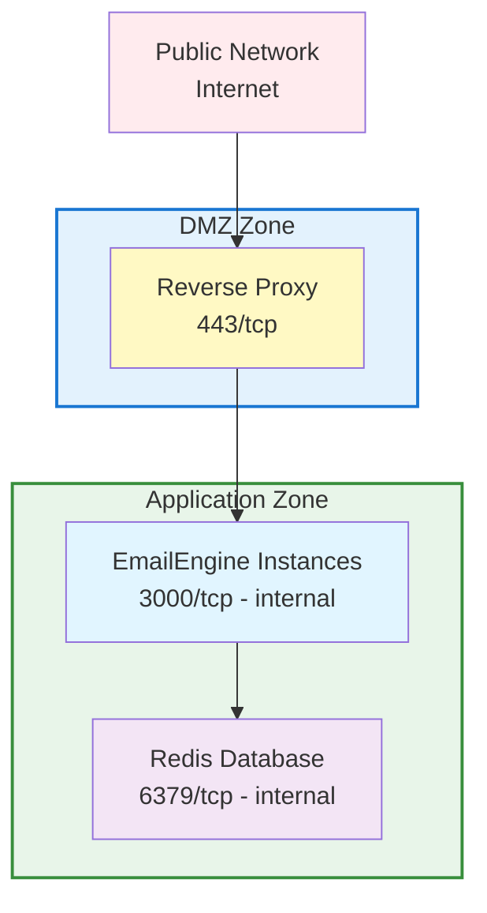

# Production Security Guide

What to lock down before an EmailEngine instance faces the network.

:::warning Security First
EmailEngine handles sensitive data including email credentials, OAuth tokens, and message content. Proper security configuration is critical.
:::

## Overview

This guide covers:

- Network security and firewall configuration
- Authentication and access control (passwords, passkeys, SSO)
- Audit logging for authentication events
- Encryption at rest and in transit
- API security
- Redis security
- GDPR compliance

## Network Security

### Firewall Configuration

**Only expose necessary ports:**

```bash
# Ubuntu/Debian (ufw)
sudo ufw allow 22/tcp      # SSH
sudo ufw allow 80/tcp      # HTTP (for Let's Encrypt)
sudo ufw allow 443/tcp     # HTTPS
sudo ufw deny 3000/tcp     # Block direct EmailEngine access
sudo ufw deny 6379/tcp     # Block direct Redis access
sudo ufw enable

# CentOS/RHEL (firewalld)
sudo firewall-cmd --permanent --add-service=ssh
sudo firewall-cmd --permanent --add-service=http
sudo firewall-cmd --permanent --add-service=https
sudo firewall-cmd --reload
```

**Block EmailEngine and Redis from external access:**

```bash
# iptables rules
sudo iptables -A INPUT -p tcp --dport 3000 -s 127.0.0.1 -j ACCEPT
sudo iptables -A INPUT -p tcp --dport 3000 -j DROP
sudo iptables -A INPUT -p tcp --dport 6379 -s 127.0.0.1 -j ACCEPT
sudo iptables -A INPUT -p tcp --dport 6379 -j DROP
```

:::tip Outbound Connections
These rules control inbound traffic. If your firewall also restricts outbound connections, see [Outbound Connection Whitelist](#outbound-connection-whitelist) for domains that EmailEngine needs to reach.
:::

### VPN Setup

For secure remote access to the admin interface, consider using a VPN:

```bash
# WireGuard example
sudo apt install wireguard

# Generate keys
wg genkey | tee privatekey | wg pubkey > publickey

# Configure /etc/wireguard/wg0.conf
[Interface]
Address = 10.0.0.1/24
PrivateKey = <server-private-key>
ListenPort = 51820

[Peer]
PublicKey = <client-public-key>
AllowedIPs = 10.0.0.2/32
```

Once your VPN is configured, restrict admin interface access to VPN IP ranges using the methods described in [Admin Interface Access Control](#admin-interface-access-control) below.

### Network Segmentation

**Isolate EmailEngine and Redis:**



### Outbound Connection Whitelist

If EmailEngine is deployed behind a firewall that blocks outbound connections, you must whitelist the following domains for EmailEngine to function correctly.

:::info Proxy Limitations
EmailEngine's [proxy settings](/docs/accounts/imap-smtp#proxy-configuration) apply only to IMAP and SMTP connections. HTTP requests to the domains listed below are **not** routed through the configured proxy and require direct network access or a system-wide HTTP proxy.
:::

#### Required Domains

These domains are required for core EmailEngine functionality:

| Domain | Port | Purpose |
|--------|------|---------|
| `postalsys.com` | 443 | License validation and trial provisioning. Required for all licensed installations. |

#### OAuth2 Provider Domains

Required based on which OAuth2 providers you use:

**Google (Gmail):**

| Domain | Port | Purpose |
|--------|------|---------|
| `oauth2.googleapis.com` | 443 | OAuth2 token exchange and refresh for Gmail accounts |
| `gmail.googleapis.com` | 443 | Gmail API for profile info and message operations (when using API mode) |
| `pubsub.googleapis.com` | 443 | Gmail push notifications for real-time updates (when using Pub/Sub) |

**Microsoft (Outlook/Office 365):**

| Domain | Port | Purpose |
|--------|------|---------|
| `login.microsoftonline.com` | 443 | OAuth2 token exchange and refresh for Outlook accounts |
| `graph.microsoft.com` | 443 | Microsoft Graph API for mail operations (when using API mode) |

**Microsoft Government Cloud (GCC-High):**

| Domain | Port | Purpose |
|--------|------|---------|
| `login.microsoftonline.us` | 443 | OAuth2 tokens for GCC-High/DoD environments |
| `graph.microsoft.us` | 443 | Microsoft Graph API for GCC-High |
| `dod-graph.microsoft.us` | 443 | Microsoft Graph API for DoD |

**Microsoft China (21Vianet):**

| Domain | Port | Purpose |
|--------|------|---------|
| `login.chinacloudapi.cn` | 443 | OAuth2 tokens for Microsoft China |
| `microsoftgraph.chinacloudapi.cn` | 443 | Microsoft Graph API for China |

**Mail.ru:**

| Domain | Port | Purpose |
|--------|------|---------|
| `oauth.mail.ru` | 443 | OAuth2 token exchange, refresh, and user info retrieval |

#### Optional Feature Domains

These domains are only needed if you use specific features:

| Domain | Port | Purpose |
|--------|------|---------|
| `autoconfig.thunderbird.net` | 443 | Mozilla ISP database for automatic IMAP/SMTP server detection. Used when adding accounts without manual server configuration. |
| `api.github.com` | 443 | Checks for new EmailEngine releases. Used by the update notification feature in the admin dashboard. Disable with `EENGINE_UPDATE_CHECK_DISABLED=true` (since v2.76.0). |
| `api.nodemailer.com` | 443 | SMTP delivery testing service. Used by the "Test Delivery" feature to verify SMTP configuration. |
| `acme-v02.api.letsencrypt.org` | 443 | Let's Encrypt ACME protocol. Required only if using EmailEngine's built-in TLS certificate provisioning. |
| `*.okta.com` | 443 | Okta SSO authentication. Required only if using Okta single sign-on for the admin interface. |
| Your OIDC provider | 443 | OpenID Connect discovery, token exchange, and userinfo requests. Required only if using OIDC single sign-on for the admin interface. |

#### User-Configured Endpoints

These endpoints depend on your specific configuration:

| Endpoint Type | Purpose |
|---------------|---------|
| Webhook URLs | URLs configured in EmailEngine settings for webhook delivery. Whitelist your webhook receiver endpoints. |
| Elasticsearch URLs | If using document store for email indexing and AI embeddings. Whitelist your Elasticsearch cluster. |
| IMAP/SMTP servers | Mail servers for connected accounts. Typically ports 993 (IMAPS), 465/587 (SMTPS/submission), 143 (IMAP), 25 (SMTP). |

#### Minimal Whitelist Example

For a typical deployment using Gmail and Outlook OAuth2 with IMAP:

```bash
# Required
postalsys.com:443

# Gmail OAuth2
oauth2.googleapis.com:443

# Outlook OAuth2
login.microsoftonline.com:443

# Your webhook endpoint
webhooks.yourcompany.com:443

# Mail servers (examples)
imap.gmail.com:993
smtp.gmail.com:465
outlook.office365.com:993
smtp.office365.com:587
```

## Authentication Security

### EENGINE_SECRET

EmailEngine uses `EENGINE_SECRET` as the master encryption key for all sensitive data stored in Redis. This environment variable is critical for security and data recovery.

:::danger Critical - Store This Secret Permanently
The `EENGINE_SECRET` must be stored permanently in your configuration. If lost, you cannot decrypt any stored credentials and must re-authenticate all accounts.
:::

**What EENGINE_SECRET encrypts:**

- Account passwords (IMAP/SMTP credentials)
- OAuth2 access tokens
- OAuth2 refresh tokens
- OAuth2 application client secrets

**Generate a secure secret:**

```bash
# Generate a 32-byte (256-bit) secret
openssl rand -hex 32
# Example output: a1b2c3d4e5f6...64 hex characters
```

**Store permanently (choose one method):**

```bash
# Option 1: SystemD service file (recommended for Linux servers)
# Edit /etc/systemd/system/emailengine.service
[Service]
Environment="EENGINE_SECRET=your-generated-secret-here"

# Then reload and restart:
sudo systemctl daemon-reload
sudo systemctl restart emailengine

# Option 2: Environment file
echo "EENGINE_SECRET=your-generated-secret-here" >> /etc/emailengine/.env

# Option 3: Secret management service (production)
# AWS Secrets Manager, HashiCorp Vault, Azure Key Vault, etc.
```

**Requirements:**

- Minimum 32 characters (64 hex characters recommended)
- Must remain constant across restarts
- Must be backed up securely
- Same secret required for all EmailEngine instances sharing the same Redis database

For migrating existing data, rotating secrets, and detailed encryption procedures, see the [Secret Encryption](/docs/advanced/encryption) guide.

### API Token Management

EmailEngine supports two types of tokens:

1. **System-wide tokens**: Full access to all accounts and endpoints
2. **Account-specific tokens**: Restricted to a single account

**Generate tokens via web UI:**

1. Log in to EmailEngine admin interface
2. Navigate to **Integrations** → **Access Tokens**
3. Click **Generate New Token**
4. Set description and permissions
5. Copy the token immediately (shown only once)

**Generate tokens via CLI:**

```bash
# System-wide token
emailengine tokens issue -d "Admin token" -s "*" --dbs.redis="redis://127.0.0.1:6379/8"

# Account-specific token
emailengine tokens issue -d "User token" -s "api" -a "account_id" --dbs.redis="redis://127.0.0.1:6379/8"
```

For complete token management details including scopes, export/import, and revocation, see [Access Tokens](/docs/api-reference/access-tokens).

**Store tokens securely:**

```bash
# Environment variables (not in code!)
export EMAILENGINE_API_TOKEN=your-generated-token

# Or use secret management service
# AWS Secrets Manager, HashiCorp Vault, etc.
```

### OAuth2 Security

EmailEngine supports multiple OAuth2 applications, configured through the web UI or API. OAuth2 credentials are stored encrypted in Redis, not in environment variables.

**Managing OAuth2 applications:**

- **Web UI:** Navigate to **Integrations** > **OAuth2 Apps** to create and manage OAuth2 applications
- **API:** Use the `/v1/oauth2` endpoints to create, list, update, and delete OAuth2 apps

**Creating an OAuth2 app via API:**

```bash
curl -X POST https://emailengine.example.com/v1/oauth2 \
  -H "Authorization: Bearer TOKEN" \
  -H "Content-Type: application/json" \
  -d '{
    "name": "My Gmail App",
    "provider": "gmail",
    "clientId": "xxx.apps.googleusercontent.com",
    "clientSecret": "GOCSPX-xxx",
    "enabled": true
  }'
```

:::info OAuth2 Credential Storage
OAuth2 app credentials are encrypted at rest using [`EENGINE_SECRET`](#eengine_secret). EmailEngine automatically manages access tokens, refresh tokens, and handles token refresh.
:::

**OAuth2 redirect URI restrictions:**

| Redirect URI | Allowed | Reason |
|--------------|---------|--------|
| `https://emailengine.example.com/oauth` | Yes | Valid HTTPS endpoint |
| `https://emailengine.example.com/oauth/callback` | Yes | Valid HTTPS callback |
| `http://emailengine.example.com/oauth` | No | Missing HTTPS |
| `https://*/oauth` | No | Wildcards not permitted |
| `http://localhost/oauth` | Dev only | Acceptable for local development |

**Microsoft Graph webhook subscriptions:**

When using Microsoft Graph API for Outlook accounts, Microsoft sends webhook notifications to EmailEngine for real-time updates. These URLs must be publicly accessible:

| Endpoint | Purpose |
|----------|---------|
| `/oauth/msg/notification` | Receives change notifications for messages |
| `/oauth/msg/lifecycle` | Receives subscription lifecycle events |

By default, EmailEngine uses `serviceUrl` for these webhook URLs. If EmailEngine is fully firewalled but you need to expose only the webhook endpoints, configure a separate `notificationBaseUrl`:

```bash
# In Configuration > General, or via API:
# serviceUrl: https://internal.example.com (firewalled)
# notificationBaseUrl: https://webhooks.example.com (publicly accessible)
```

This allows you to:
- Keep EmailEngine's main interface and API behind a firewall
- Expose only `/oauth/msg/*` endpoints via a dedicated reverse proxy
- Use a separate domain specifically for Microsoft webhook callbacks

### Admin Interface Access Control

Restrict access to the EmailEngine admin interface (`/admin/*` routes) using IP-based filtering. You can use EmailEngine's built-in filtering, reverse proxy rules, or both for defense in depth.

import Tabs from '@theme/Tabs';
import TabItem from '@theme/TabItem';

<Tabs>
<TabItem value="emailengine" label="EmailEngine Built-in" default>

Use the `EENGINE_ADMIN_ACCESS_ADDRESSES` environment variable to restrict admin interface access:

```bash
# Allow only specific IPs and CIDRs to access admin interface
EENGINE_ADMIN_ACCESS_ADDRESSES=127.0.0.0/8,163.11.23.156

# Multiple addresses separated by commas
EENGINE_ADMIN_ACCESS_ADDRESSES=10.0.0.0/8,192.168.1.0/24,203.0.113.42
```

**How it works:**

- Only IP addresses matching the list can access admin pages
- Non-matching visitors receive an error message
- API endpoints are not affected (protected by API tokens instead)
- Supports both individual IPs and CIDR notation

**Common use cases:**

```bash
# Localhost only (development)
EENGINE_ADMIN_ACCESS_ADDRESSES=127.0.0.1

# Office network + VPN
EENGINE_ADMIN_ACCESS_ADDRESSES=203.0.113.0/24,10.8.0.0/24

# Multiple specific IPs
EENGINE_ADMIN_ACCESS_ADDRESSES=198.51.100.1,198.51.100.2,198.51.100.3
```

**SystemD service configuration:**

```bash
# /etc/systemd/system/emailengine.service
[Service]
Environment="EENGINE_SECRET=your-secret-here"
Environment="EENGINE_ADMIN_ACCESS_ADDRESSES=127.0.0.0/8,10.0.0.0/8"
Environment="EENGINE_REDIS=redis://localhost:6379/8"
```

</TabItem>
<TabItem value="nginx" label="Nginx">

If using Nginx as a reverse proxy, you can restrict access at the proxy level:

```nginx
# Nginx configuration
location /admin {
    allow 10.0.0.0/8;      # VPN network
    allow 203.0.113.0/24;  # Office network
    allow 127.0.0.1;       # Localhost
    deny all;
    proxy_pass http://localhost:3000;
}
```

</TabItem>
<TabItem value="caddy" label="Caddy">

If using Caddy as a reverse proxy, use the `remote_ip` matcher:

```caddyfile
emailengine.example.com {
    @blocked_admin {
        path /admin/*
        not remote_ip 127.0.0.1 10.0.0.0/24 203.0.113.0/24
    }
    respond @blocked_admin 403

    reverse_proxy localhost:3000
}
```

</TabItem>
</Tabs>

:::tip Defense in Depth
For production deployments, combine `EENGINE_ADMIN_ACCESS_ADDRESSES` with reverse proxy IP restrictions. This provides multiple layers of protection in case one layer is misconfigured.
:::

:::warning Running behind a reverse proxy
If you also set `EENGINE_API_PROXY=true`, EmailEngine matches this allowlist against the address in the `X-Forwarded-For` header rather than the connecting socket. Declare which peers are your proxies:

```bash
EENGINE_API_PROXY=true
EENGINE_API_PROXY_ADDRESSES=10.0.0.0/8
```

Without `EENGINE_API_PROXY_ADDRESSES`, EmailEngine trusts the header from any peer, so a client that can reach the port directly can present whatever address the allowlist expects and walk straight through it. See [Trusted Proxy Addresses](/docs/reference/configuration-options#trusted-proxy-addresses).
:::

### Passkey Authentication (WebAuthn)

EmailEngine supports passkey (WebAuthn) authentication for the admin interface. Passkeys provide passwordless login using biometric sensors, hardware security keys, or platform authenticators like Touch ID and Windows Hello.

**Benefits over password authentication:**

- Phishing-resistant - passkeys are bound to the specific domain
- No passwords to remember, leak, or brute-force
- Bypasses TOTP requirement - passkeys are inherently multi-factor
- Works with platform authenticators (Touch ID, Face ID, Windows Hello) and roaming authenticators (YubiKey, Titan)

:::info Service URL Required
Passkey registration requires a configured Service URL (`serviceUrl`). The URL's hostname is used as the WebAuthn Relying Party ID. Without a Service URL, the "Add passkey" button is disabled.
:::

**Setting up passkeys:**

1. Ensure `serviceUrl` is configured in **Configuration** > **General**
2. Navigate to **Account** > **Security** (click your username in the top-right)
3. In the **Passkeys** section, click **Add passkey**
4. Enter your current password to verify your identity
5. Enter a descriptive name (e.g., "MacBook Touch ID", "YubiKey")
6. Follow your browser's WebAuthn prompt to register the authenticator

You can register up to 20 passkeys per admin user.

**Signing in with a passkey:**

1. Navigate to the admin login page
2. Click **Sign in with a passkey**
3. Follow your browser's WebAuthn prompt

Passkey authentication bypasses the TOTP requirement - if you have TOTP configured, you will not be prompted for it when signing in with a passkey.

**Managing passkeys:**

- View all registered passkeys on the **Account** > **Security** page
- Each passkey shows its name and registration date
- Remove individual passkeys using the **Remove** button

:::warning Password Changes Clear Passkeys
Changing the admin password immediately deletes all registered passkeys for that user. This is a security measure to prevent unauthorized passkey-only access if the password is compromised. Re-register your passkeys after a password change.
:::

**Security details:**

- Only public keys are stored server-side - private keys never leave the authenticator device
- Registration requires current password verification
- Registration challenges expire after 5 minutes and are single-use
- Maximum 20 passkeys per admin user
- Per-IP rate limiting protects all passkey endpoints (registration and authentication)
- All passkey events (registration, deletion, login success, and login failure) are logged with method, username, and IP address

### Audit Logging

EmailEngine logs all admin authentication events with structured data for security monitoring.

**Logged events:**

| Event | Fields |
|---|---|
| Successful password login | method: `password`, user, IP address |
| Failed password login | method: `password`, error, IP address |
| Successful TOTP verification | method: `totp`, user, IP address |
| Failed TOTP verification | method: `totp`, error, IP address |
| Successful passkey login | method: `passkey`, user, IP address |
| Failed passkey login | method: `passkey`, error, IP address |
| Passkey registered | method: `passkey`, user, passkey name, IP address |
| Passkey deleted | method: `passkey`, user, credential ID, IP address |
| Passkeys cleared (password change) | user |

These events are written to the application log (stdout). Use these log entries to detect unauthorized access attempts and feed them into your SIEM or log aggregation system.

### Single Sign-On (SSO)

EmailEngine supports single sign-on for the admin interface, either through any OpenID Connect provider (Keycloak, Microsoft Entra ID, Google, Authentik, and others) or through the dedicated Okta integration. When signed in through SSO, multi-factor authentication is handled by the identity provider - EmailEngine does not prompt for TOTP - and the local password, TOTP, and passkey settings cannot be managed from that session.

#### OpenID Connect

**Setup:**

1. Register a confidential web application (authorization code flow) at your identity provider
2. Set the sign-in redirect URI to `{serviceUrl}/admin/login/oidc`
3. Configure the environment variables:

```bash
OIDC_ISSUER=https://keycloak.example.com/realms/main
OIDC_CLIENT_ID=your-client-id
OIDC_CLIENT_SECRET=your-client-secret
# Optional: label for the sign-in button (default "SSO")
OIDC_PROVIDER_NAME=Keycloak
```

4. Restart EmailEngine

All three of `OIDC_ISSUER`, `OIDC_CLIENT_ID`, and `OIDC_CLIENT_SECRET` must be set. When enabled, a sign-in button appears on the admin login page, labeled with the provider name from `OIDC_PROVIDER_NAME`. Password login continues to work alongside SSO unless you enable SSO-only mode (see below).

At startup, EmailEngine fetches the provider's discovery document from `<issuer>/.well-known/openid-configuration`. The `issuer` value in the discovery document must exactly match `OIDC_ISSUER`. If discovery fails, for example because the identity provider is unreachable, SSO is disabled for that run and the regular password login remains available - an identity provider outage cannot lock you out of the admin interface.

**Restricting who can sign in:**

By default, anyone the identity provider authenticates can access the admin interface. Use the allow-list variables to narrow this down:

```bash
# Exact emails and/or @domain entries, comma-separated
OIDC_ALLOWED_USERS=admin@example.com,@example.com

# Group names, matched against the groups claim in the userinfo response
OIDC_ALLOWED_GROUPS=emailengine-admins
# Claim that carries group membership (default "groups"); dotted paths work too
OIDC_GROUPS_CLAIM=realm_access.roles
```

A user is allowed if they match either list. The allow-lists are re-checked on every request, so removing a user from the lists (and restarting EmailEngine) also ends their existing session.

**SSO-only mode:**

Set `OIDC_FORCED=true` to make SSO the only way to sign in. The login page then redirects straight to the identity provider, and password and passkey sign-in are refused. If discovery fails at startup, the local login form is shown as a fallback.

**Signing out of the identity provider:**

By default, signing out of EmailEngine only ends the EmailEngine session - the identity provider session stays active, so the next sign-in may complete without a prompt. Set `OIDC_LOGOUT=true` to also end the identity provider session on logout (RP-initiated logout). Optionally set `OIDC_POST_LOGOUT_REDIRECT_URI` to `{serviceUrl}/admin/login?loggedout=1` to return to an EmailEngine signed-out screen afterwards; this URL must be registered as a post-logout redirect URI at the identity provider. Without it, the identity provider shows its own logged-out page.

#### Okta

**Setup:**

1. Create a web application in the [Okta developer console](https://developer.okta.com/)
2. Set the sign-in redirect URI to `{serviceUrl}/admin/login/okta`
3. Configure the environment variables:

```bash
OKTA_OAUTH2_ISSUER=https://your-org.okta.com/oauth2/default
OKTA_OAUTH2_CLIENT_ID=your-client-id
OKTA_OAUTH2_CLIENT_SECRET=your-client-secret
```

4. Restart EmailEngine

All three environment variables must be set to enable Okta SSO. When enabled, a "Sign in with Okta" button appears on the admin login page.

For full details on the environment variables, see [SSO Configuration](/docs/configuration/environment-variables#single-sign-on-sso).

## Encryption

### Encryption at Rest

EmailEngine encrypts all sensitive credentials using the [`EENGINE_SECRET`](#eengine_secret) environment variable. All account passwords, OAuth2 tokens, and application secrets are automatically encrypted before storage in Redis using AES-256-GCM.

For detailed information on enabling encryption, migrating existing data, rotating secrets, and secret management best practices, see the [Secret Encryption](/docs/advanced/encryption) guide.

### Encryption in Transit

**Enforce TLS/SSL everywhere:**

```nginx
# Nginx: Redirect HTTP to HTTPS
server {
    listen 80;
    return 301 https://$server_name$request_uri;
}

# Strong SSL configuration
server {
    listen 443 ssl http2;

    ssl_protocols TLSv1.2 TLSv1.3;
    ssl_ciphers ECDHE-ECDSA-AES128-GCM-SHA256:ECDHE-RSA-AES128-GCM-SHA256;
    ssl_prefer_server_ciphers off;

    # HSTS
    add_header Strict-Transport-Security "max-age=63072000; includeSubDomains; preload" always;
}
```

**IMAP/SMTP connection security:**

```bash
# EmailEngine automatically uses TLS for IMAP/SMTP connections
# Verify in logs:
grep "Connection established" /var/log/emailengine/app.log
```

### Redis Encryption

**Enable Redis TLS:**

```bash
# redis.conf
port 0  # Disable non-TLS port
tls-port 6379
tls-cert-file /etc/redis/redis.crt
tls-key-file /etc/redis/redis.key
tls-ca-cert-file /etc/redis/ca.crt
```

**Configure EmailEngine to use Redis TLS:**

```bash
EENGINE_REDIS=rediss://localhost:6379  # Note: rediss:// (with 's')
```

### Secret Management

For `EENGINE_SECRET` storage options (SystemD, environment files, etc.), see [EENGINE_SECRET](#eengine_secret).

**Production secret management with external services:**

```bash
#!/bin/bash
# fetch-secrets.sh - Example using AWS Secrets Manager

# Fetch secrets from AWS
aws secretsmanager get-secret-value \
  --secret-id emailengine/production \
  --query SecretString \
  --output text > /tmp/secrets.json

# Write to .env file (EmailEngine loads .env from current directory)
echo "EENGINE_SECRET=$(jq -r .secret /tmp/secrets.json)" > .env
echo "EENGINE_REDIS=$(jq -r .redis /tmp/secrets.json)" >> .env

# Clean up
rm /tmp/secrets.json

# Start EmailEngine (will load .env automatically)
/usr/local/bin/emailengine
```

Similar patterns apply to HashiCorp Vault, Azure Key Vault, and Google Secret Manager.

## API Security

:::tip Internal API
The EmailEngine API is designed to be an internal resource, accessed only by your backend services. It should not be exposed directly to the public internet. Keep the API behind a firewall or restrict access to trusted IP addresses. With this architecture, API rate limiting is typically unnecessary.
:::

### Per-Token Rate Limiting

If you need to expose the API with account-specific tokens (rare use case), EmailEngine supports optional per-token rate limiting. Configure rate limits when creating access tokens:

```bash
curl -X POST http://localhost:3000/v1/token \
  -H "Authorization: Bearer ADMIN_TOKEN" \
  -H "Content-Type: application/json" \
  -d '{
    "account": "user123",
    "description": "Rate-limited user token",
    "scopes": ["api"],
    "restrictions": {
      "rateLimit": {
        "maxRequests": 100,
        "timeWindow": 60
      }
    }
  }'
```

| Field | Description |
|-------|-------------|
| `maxRequests` | Maximum requests allowed in the time window |
| `timeWindow` | Time window duration in seconds |

When rate limited, the API returns `429 Too Many Requests` with headers:

| Header | Description |
|--------|-------------|
| `X-RateLimit-Limit` | Maximum requests per window |
| `X-RateLimit-Remaining` | Requests remaining in window |
| `X-RateLimit-Reset` | Seconds until limit resets |

### IP Whitelisting

**Restrict API access by IP:**

```nginx
# Nginx geo module
geo $allowed_ip {
    default 0;
    203.0.113.0/24 1;    # Office network
    198.51.100.0/24 1;   # Data center
    10.0.0.0/8 1;        # VPN network
}

server {
    location /v1/ {
        if ($allowed_ip = 0) {
            return 403;
        }
        proxy_pass http://localhost:3000;
    }
}
```

### API Request Examples

**Using account IDs (not email addresses):**

```bash
# CORRECT: Use account ID
curl https://emailengine.example.com/v1/account/account_1234 \
  -H "Authorization: Bearer TOKEN"

# INCORRECT: Cannot use email address
# curl https://emailengine.example.com/v1/account/user@example.com

# Account ID might be same as email, but usually is different
# Always use the account ID returned during account creation
```

**Common API operations:**

```bash
# List accounts
curl https://emailengine.example.com/v1/accounts \
  -H "Authorization: Bearer TOKEN"

# Get account info (returns account ID)
curl https://emailengine.example.com/v1/account/account_1234 \
  -H "Authorization: Bearer TOKEN"

# Delete account
curl -X DELETE https://emailengine.example.com/v1/account/account_1234 \
  -H "Authorization: Bearer TOKEN"
```

## Redis Security

### Authentication

**Enable Redis authentication:**

```bash
# redis.conf
requirepass $(openssl rand -hex 32)

# Or use ACLs (Redis 6+)
user emailengine on >strongpassword ~* &* +@all
user default off
```

**Configure EmailEngine with Redis password:**

```bash
EENGINE_REDIS=redis://:password@localhost:6379
```

### Network Binding

**Bind Redis to localhost only:**

```bash
# redis.conf
bind 127.0.0.1 ::1

# Or specific internal IP
bind 10.0.1.100
```

### Redis Commands

EmailEngine uses `SCAN` (via `scanStream()`) for safe key iteration and `INFO` for statistics. It does not use the potentially dangerous `KEYS` command.

**Disable dangerous commands:**

```bash
# redis.conf
rename-command FLUSHDB ""
rename-command FLUSHALL ""
rename-command SHUTDOWN "SHUTDOWN_12345"
rename-command KEYS ""
```

:::tip Safe Key Operations
EmailEngine uses `SCAN` instead of `KEYS` for key iteration, which is the recommended approach for production Redis deployments. You can safely disable the `KEYS` command.
:::

### Redis ACLs (Redis 6+)

```bash
# Create user with restricted access (disable dangerous commands)
ACL SETUSER emailengine on >password ~* +@all -flushdb -flushall -keys

# Verify
ACL LIST
```

## Compliance

### GDPR Compliance

**Right to deletion:**

```bash
# API endpoint to delete account and all data
curl -X DELETE https://emailengine.example.com/v1/account/account_1234 \
  -H "Authorization: Bearer TOKEN"

# This deletes:
# - Account credentials
# - OAuth tokens
# - Account sync state
```

:::info What EmailEngine Stores
EmailEngine stores account credentials, OAuth tokens, and sync state in Redis. Email messages themselves are not stored - EmailEngine reads them from the mail server on demand.

Optionally, EmailEngine can be configured to retain the last N queue job entries (including webhook deliveries) as a FIFO buffer for debugging. By default, no job history is stored.
:::

## Security Checklist

### Pre-Deployment

- [ ] Generate strong `EENGINE_SECRET` (32+ characters)
- [ ] Store `EENGINE_SECRET` permanently (critical!)
- [ ] Configure Redis authentication
- [ ] Enable Redis persistence with `noeviction` policy
- [ ] Set up firewall rules
- [ ] Configure SSL/TLS certificates
- [ ] Set up secret management service
- [ ] Configure log rotation
- [ ] Plan backup strategy

### Post-Deployment

- [ ] Verify HTTPS is enforced
- [ ] Test firewall rules
- [ ] Verify Redis is not publicly accessible
- [ ] Check SSL certificate auto-renewal
- [ ] Register passkeys for admin accounts (phishing-resistant login)
- [ ] Configure log aggregation (including auth audit logs)
- [ ] Perform security scan
- [ ] Document security procedures
- [ ] Train team on security practices

### Ongoing Maintenance

- [ ] Update EmailEngine regularly
- [ ] Update system packages weekly
- [ ] Review access logs weekly
- [ ] Check for security advisories monthly
- [ ] Test backups monthly
- [ ] Review firewall rules quarterly
- [ ] Audit user access quarterly
- [ ] Update SSL certificates (automatic with Let's Encrypt)
