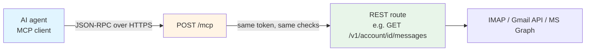

# Model Context Protocol (MCP)

EmailEngine ships an MCP server. Point an AI agent at `POST /mcp`, hand it an access token, and the agent can list mailboxes, search and read messages, file them, draft replies and send mail through the email accounts you have already connected.

[MCP](https://modelcontextprotocol.io/) is the protocol AI clients use to discover and call external tools. EmailEngine implements the server half of it, so any MCP-capable client - a desktop assistant, a coding agent, a web connector, your own application built on an agent framework - can work with email without you writing an integration for each one.

:::info Beta
MCP support shipped in EmailEngine v2.79.2 (2026-08-22) as a labeled beta. The endpoint is off by default, and the tool set may still change between releases. Everything below is stable enough to build on, but pin a version if you need the tool list to be frozen.
:::

## What an agent can do

The endpoint exposes a curated tool set over the accounts registered on the instance:

| Area | Tools |
|------|-------|
| Accounts | `list_accounts`, `get_account` |
| Folders | `list_mailboxes` |
| Reading | `list_messages`, `search_messages`, `get_message`, `get_message_text`, `get_attachment` |
| Organizing | `update_message`, `move_message`, `delete_message` |
| Writing | `create_draft`, `send_message` |
| Sending queue and templates | `get_outbox`, `list_templates` |

Each connected account is also published as an MCP resource (`emailengine://account/{account}`), so clients that browse resources can see what the credential reaches without calling a tool.

See the [Tools Reference](/docs/mcp/tools) for arguments, results and the REST endpoint behind each tool.

## How it works

An MCP tool call is an EmailEngine API request. The endpoint parses JSON-RPC, resolves the named tool to the route it wraps, and dispatches that route in-process with the caller's own credential:



Four consequences worth knowing up front:

- **Nothing bypasses REST enforcement.** Scopes, permission narrowing, account binding, IP and referrer restrictions, rate limits and the token audit log all apply to a tool call exactly as they apply to the equivalent REST call.
- **The agent never receives mail credentials.** IMAP passwords and OAuth2 refresh tokens stay in EmailEngine. The agent holds an EmailEngine access token, which you can narrow and revoke at any time.
- **The tool list is per credential.** `tools/list` only advertises tools the calling token can actually use, so an agent does not plan around a call that would come back as a 403. A token bound to one account gets simpler tools too: they stop asking which account to act on.
- **Bodies arrive ready to read.** Message text comes back as sanitized HTML with quoted reply history wrapped in a marked element, so a model can tell what the sender wrote this time from the thread quoted under it. See [Message bodies](/docs/mcp/tools#message-bodies).

## MCP or the REST API?

Both surfaces reach the same mailboxes, through the same enforcement. They answer different questions.

| | MCP | [REST API](/docs/api-reference) |
|---|---|---|
| Caller | An AI agent deciding what to call | Code you wrote, calling what you decided |
| Surface | 15 curated tools | Every endpoint |
| Discovery | The client fetches the tool list and schemas | You read the docs and write the calls |
| Best for | Assistants, inbox triage, drafting, ad-hoc questions about a mailbox | Applications, sync pipelines, transactional sending |

Build a product feature on the REST API. Use MCP when the caller is a model that has to choose the operation itself.

## Enable the endpoint

MCP is behind two switches, and both have to be on.

### 1. The deployment gate

`EENGINE_MCP_ENABLED` decides whether the `/mcp` routes are registered at all. It defaults to `true`, so there is usually nothing to do here. Set it to `false` to compile the surface out of an instance entirely - the routes then do not exist and the settings below have no effect:

```bash
EENGINE_MCP_ENABLED=false
```

The equivalent config file setting is `[mcp] enabled = false`, and the CLI flag is `--mcp.enabled=false`. Changing it requires a restart.

### 2. The runtime setting

`mcpEnabled` is the switch you actually flip. It starts out **off**, so a fresh instance never exposes a new surface until someone turns it on. In the admin interface, open **Configuration** > **MCP** and tick **Enable the MCP endpoint**:


_Configuration > MCP: the endpoint switch, and the OAuth sign-in switch used by web connectors_

The same setting over the API:

```bash
curl -X POST "https://emailengine.example.com/v1/settings" \
  -H "Authorization: Bearer $EE_TOKEN" \
  -H "Content-Type: application/json" \
  -d '{ "mcpEnabled": true }'
```

Or as [prepared settings](/docs/configuration/prepared-settings) at startup:

```bash
EENGINE_SETTINGS='{"mcpEnabled":true}'
```

The second checkbox, **Enable OAuth sign-in for MCP clients**, is only needed for clients that cannot be configured with a token you paste in. See [Connecting Agents](/docs/mcp/connect-clients#web-connectors-oauth-sign-in).

While the endpoint is off, every request to it answers `404` with a message naming the switch:

```json
{
  "statusCode": 404,
  "error": "Not Found",
  "message": "MCP support is not enabled on this instance. An admin can turn it on under Configuration > MCP, or by setting mcpEnabled"
}
```

## Check that it works

Any access token that opens the endpoint will do for a smoke test. `ping` is the cheapest call in the protocol:

```bash
curl -X POST "https://emailengine.example.com/mcp" \
  -H "Authorization: Bearer $EE_TOKEN" \
  -H "Content-Type: application/json" \
  -H "MCP-Protocol-Version: 2025-06-18" \
  -d '{ "jsonrpc": "2.0", "id": 1, "method": "ping" }'
```

```json
{ "jsonrpc": "2.0", "id": 1, "result": {} }
```

Then ask for the tool catalog the way a client would:

```bash
curl -X POST "https://emailengine.example.com/mcp" \
  -H "Authorization: Bearer $EE_TOKEN" \
  -H "Content-Type: application/json" \
  -H "MCP-Protocol-Version: 2025-06-18" \
  -d '{ "jsonrpc": "2.0", "id": 2, "method": "tools/list" }'
```

If the response lists fewer tools than you expect, that is the per-credential filtering at work - see [Access Control](/docs/mcp/access-control#what-a-credential-sees).

## Requirements

- **A running EmailEngine instance with at least one connected account.** MCP adds a surface over accounts you have already registered; it does not add accounts. See [Adding Email Accounts](/docs/accounts).
- **HTTPS for anything not on localhost.** MCP clients send a bearer token on every request, and hosted connectors will not accept a plain HTTP endpoint. Put EmailEngine behind [a TLS-terminating proxy](/docs/deployment/nginx-proxy).
- **A Service URL** (**Configuration** > **General**) if you plan to use OAuth sign-in. The OAuth metadata has to publish a fixed public address, which a request-derived one cannot provide.

## Where to go next

- [Connecting Agents](/docs/mcp/connect-clients) - generate a token, paste the configuration into a client, or let a web connector sign itself in
- [Tools Reference](/docs/mcp/tools) - every tool, its arguments and what it returns
- [Access Control](/docs/mcp/access-control) - scopes, access levels, account binding and what an agent can never reach
- [Protocol Reference](/docs/mcp/protocol) - protocol revisions, methods, error codes and the OAuth endpoints, for client developers

## See Also

- [Access Tokens](/docs/api-reference/access-tokens) - how EmailEngine credentials work in general
- [Adding Email Accounts](/docs/accounts) - connecting the mailboxes an agent will work with
- [AI and ChatGPT Integration](/docs/integrations/ai-chatgpt) - EmailEngine's built-in AI processing of incoming mail, which is a different feature
- [API Reference](/docs/api-reference) - the REST surface each tool dispatches to
