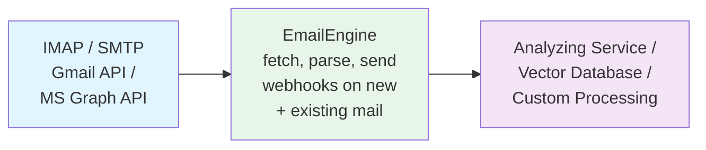

# Continuous Email Processing

Continuous email processing means a pipeline that analyzes, archives or acts on messages as they arrive, rather than a one-time [export](/docs/receiving/exporting). EmailEngine's part of it is the `messageNew` webhook: every message it sees for the first time is delivered to your endpoint as a JSON document, and the rest of the pipeline is yours. This page covers the settings that shape that feed, patterns for consuming it, and the cases where a message can be reported more than once.

## Why Continuous Processing?

**Real-Time Analysis**
- Feed emails to AI/ML models as they arrive
- Generate summaries and insights instantly
- Detect patterns and anomalies in real-time

**Always Up-to-Date**
- No manual export/import cycles
- Latest emails always available
- Automatic synchronization

**Scalable Automation**
- Process thousands of emails automatically
- Trigger workflows based on content
- Integrate with downstream systems

**Use Cases**
- Vector embeddings for semantic search
- Customer support automation
- Compliance monitoring
- Business intelligence
- Email analytics

## Architecture Overview



**EmailEngine acts as the bridge:**
1. Connects to email providers (IMAP, Gmail API, MS Graph)
2. Monitors for new and existing messages
3. Parses and normalizes email data
4. Sends webhooks to your processing service
5. Provides API for additional operations

## Setting Up Continuous Processing

### Step 1: Configure notifyFrom for Historical Emails

For IMAP accounts, EmailEngine can treat existing emails as "new" by setting `notifyFrom` to a past date using the [Register Account API endpoint](/docs/api/post-v-1-account):

```javascript
async function addAccountWithHistoricalProcessing(accountId, credentials) {
  const response = await fetch(
    'https://emailengine.example.com/v1/account',
    {
      method: 'POST',
      headers: {
        'Authorization': 'Bearer YOUR_ACCESS_TOKEN',
        'Content-Type': 'application/json'
      },
      body: JSON.stringify({
        account: accountId,
        name: credentials.name,
        email: credentials.email,
        // Process all emails since 1970 (effectively all emails)
        notifyFrom: '1970-01-01T00:00:00.000Z',
        imap: {
          auth: {
            user: credentials.username,
            pass: credentials.password
          },
          host: credentials.host,
          port: 993,
          secure: true
        }
      })
    }
  );

  return await response.json();
}

// Add account and process all historical emails
await addAccountWithHistoricalProcessing('example', {
  name: 'John Doe',
  email: 'john@example.com',
  username: 'john@example.com',
  password: 'password',
  host: 'imap.example.com'
});
```

### Step 2: Use Hosted Authentication (Alternative)

The [hosted authentication form](/docs/accounts/hosted-authentication) takes the same `notifyFrom` value, so an account the user connects themselves can start with history too. `redirectUrl` is the only required field; `type: "imap"` fixes the form to the account type `notifyFrom` applies to:

```javascript
async function generateAuthLink(accountId, redirectUrl) {
  const response = await fetch(
    'https://emailengine.example.com/v1/authentication/form',
    {
      method: 'POST',
      headers: {
        'Authorization': 'Bearer YOUR_ACCESS_TOKEN',
        'Content-Type': 'application/json'
      },
      body: JSON.stringify({
        account: accountId,
        type: 'imap',
        notifyFrom: '1970-01-01T00:00:00.000Z',
        redirectUrl: redirectUrl
      })
    }
  );

  const data = await response.json();
  return data.url; // Send this URL to the user
}

// Generate link
const authUrl = await generateAuthLink('example', 'https://myapp.com/callback');
console.log('User authentication URL:', authUrl);
```

### Step 3: Configure Webhooks

Enable webhooks and choose what each `messageNew` payload carries, using the [Update Settings API endpoint](/docs/api/post-v-1-settings). `webhookEvents` is an allowlist with no default, so it has to name `messageNew` (or `*`) or nothing is delivered. `notifyText` is what puts the message body into the payload; without it a pipeline has to fetch every body separately:

```bash
curl -X POST "https://emailengine.example.com/v1/settings" \
  -H "Authorization: Bearer YOUR_ACCESS_TOKEN" \
  -H "Content-Type: application/json" \
  -d '{
    "webhooks": "https://your-app.com/webhooks/emailengine",
    "webhooksEnabled": true,
    "webhookEvents": ["messageNew"],
    "notifyText": true,
    "notifyTextSize": 2097152,
    "notifyWebSafeHtml": true,
    "notifyHeaders": ["*"],
    "notifyCalendarEvents": true
  }'
```

| Setting | Effect on the payload |
|---------|-----------------------|
| `notifyText` | Include `text.plain` and `text.html` |
| `notifyTextSize` | Cap each text part at this many bytes |
| `notifyWebSafeHtml` | Replace `text.html` with the sanitized [web-safe rendering](/docs/receiving/web-safe-html) |
| `notifyHeaders` | Header names to include under `headers`; `["*"]` includes all of them |
| `notifyCalendarEvents` | Parse iCalendar attachments into `calendarEvent` |
| `notifyAttachments`, `notifyAttachmentSize` | Include attachment content as base64, see [Working with Attachments](/docs/receiving/attachments#attachments-in-webhook-payloads) |

The full payload is documented on the [messageNew reference](/docs/webhooks/messagenew).

### Step 4: Optimize for Processing Speed

A pipeline that only consumes new messages does not need EmailEngine to track flag changes and deletions. The `fast` IMAP indexer keeps one UID per folder instead of a record per message, still delivers `messageNew`, and skips `messageUpdated` and `messageDeleted`:

```bash
curl -X POST "https://emailengine.example.com/v1/settings" \
  -H "Authorization: Bearer YOUR_ACCESS_TOKEN" \
  -H "Content-Type: application/json" \
  -d '{
    "imapIndexer": "fast"
  }'
```

This is the instance-wide default; the same key on an account overrides it. [IMAP indexers](/docs/accounts/imap-indexers) compares the two indexers in detail.

## Processing Pipeline Implementations

### Basic Processing Pipeline

Simple webhook handler that processes all messages:

```javascript
const express = require('express');
const app = express();

app.use(express.json());

app.post('/webhooks/emailengine', async (req, res) => {
  const event = req.body;

  // Acknowledge immediately
  res.status(200).json({ success: true });

  // Process asynchronously
  if (event.event === 'messageNew') {
    await processMessage(event);
  }
});

async function processMessage(event) {
  const { account, data } = event;

  console.log(`Processing message from ${account}:`);
  console.log(`- Subject: ${data.subject}`);
  console.log(`- From: ${data.from.address}`);
  console.log(`- Date: ${data.date}`);

  try {
    // Extract text content
    const content = data.text?.plain || (data.text?.html ? stripHtml(data.text.html) : '');

    // Process the email
    await processEmailContent({
      accountId: account,
      messageId: data.id,
      subject: data.subject,
      from: data.from.address,
      date: data.date,
      content: content,
      hasAttachments: data.attachments && data.attachments.length > 0
    });

    console.log('SUCCESS: Processed successfully');
  } catch (err) {
    console.error('FAIL: Processing failed:', err.message);
  }
}

function stripHtml(html) {
  return html.replace(/<[^>]*>/g, ' ').replace(/\s+/g, ' ').trim();
}

app.listen(3000, () => {
  console.log('Processing pipeline running on port 3000');
});
```

### Vector Database Integration

Feed emails to a vector database for semantic search:

```javascript
const { OpenAI } = require('openai');
const { Pinecone } = require('@pinecone-database/pinecone');

const openai = new OpenAI({ apiKey: process.env.OPENAI_API_KEY });
const pinecone = new Pinecone({ apiKey: process.env.PINECONE_API_KEY });
const index = pinecone.index('emails');

async function processEmailContent(email) {
  // Generate embedding
  const text = `${email.subject} ${email.content}`;

  const embeddingResponse = await openai.embeddings.create({
    model: 'text-embedding-3-small',
    input: text.substring(0, 8000) // Token limit
  });

  const embedding = embeddingResponse.data[0].embedding;

  // Store in Pinecone
  await index.upsert([
    {
      id: email.messageId,
      values: embedding,
      metadata: {
        accountId: email.accountId,
        subject: email.subject,
        from: email.from,
        date: email.date,
        hasAttachments: email.hasAttachments
      }
    }
  ]);

  console.log(`Added to vector database: ${email.subject}`);
}
```

Message ids change when a message moves between folders, so key long-lived records on `emailId` or `messageId` where you can; see [Duplicate Detection](#duplicate-detection).

### AI Analysis Pipeline

Analyze emails with AI and store results:

```javascript
const { OpenAI } = require('openai');
const openai = new OpenAI({ apiKey: process.env.OPENAI_API_KEY });

async function processEmailContent(email) {
  const text = `${email.subject}\n\n${email.content}`;

  // Generate summary
  const summary = await generateSummary(text);

  // Extract entities
  const entities = await extractEntities(text);

  // Classify sentiment
  const sentiment = await analyzeSentiment(text);

  // Store analysis
  await storeAnalysis({
    messageId: email.messageId,
    accountId: email.accountId,
    subject: email.subject,
    from: email.from,
    date: email.date,
    summary: summary,
    entities: entities,
    sentiment: sentiment,
    processedAt: new Date()
  });

  console.log(`Analyzed: ${email.subject}`);
  console.log(`- Sentiment: ${sentiment}`);
  console.log(`- Entities: ${entities.join(', ')}`);
  console.log(`- Summary: ${summary.substring(0, 100)}...`);
}

async function generateSummary(text) {
  const response = await openai.chat.completions.create({
    model: 'gpt-4',
    messages: [
      {
        role: 'system',
        content: 'Summarize the following email in 2-3 sentences.'
      },
      {
        role: 'user',
        content: text.substring(0, 4000)
      }
    ],
    max_tokens: 150
  });

  return response.choices[0].message.content.trim();
}

async function extractEntities(text) {
  const response = await openai.chat.completions.create({
    model: 'gpt-4',
    messages: [
      {
        role: 'system',
        content: 'Extract key entities (people, companies, products) from this email. Return as comma-separated list.'
      },
      {
        role: 'user',
        content: text.substring(0, 4000)
      }
    ],
    max_tokens: 100
  });

  const entitiesStr = response.choices[0].message.content.trim();
  return entitiesStr.split(',').map(e => e.trim()).filter(e => e);
}

async function analyzeSentiment(text) {
  const response = await openai.chat.completions.create({
    model: 'gpt-4',
    messages: [
      {
        role: 'system',
        content: 'Analyze the sentiment of this email. Respond with only: positive, negative, or neutral.'
      },
      {
        role: 'user',
        content: text.substring(0, 4000)
      }
    ],
    max_tokens: 10
  });

  return response.choices[0].message.content.trim().toLowerCase();
}

async function storeAnalysis(analysis) {
  // Store in database
  await db.collection('email_analysis').insertOne(analysis);
}
```

### Queue-Based Processing

Use a message queue for reliable processing:

```javascript
const Bull = require('bull');
const processingQueue = new Bull('email-processing', {
  redis: {
    host: 'localhost',
    port: 6379
  }
});

// Webhook handler adds jobs to queue
app.post('/webhooks/emailengine', async (req, res) => {
  const event = req.body;

  res.status(200).json({ success: true });

  if (event.event === 'messageNew') {
    // Add to queue
    await processingQueue.add('process-email', {
      account: event.account,
      data: event.data
    }, {
      attempts: 3,
      backoff: {
        type: 'exponential',
        delay: 2000
      }
    });
  }
});

// Process jobs from queue
processingQueue.process('process-email', async (job) => {
  const { account, data } = job.data;

  console.log(`Processing queued message: ${data.subject}`);

  // Update progress
  job.progress(25);

  // Process email
  const content = data.text?.plain || stripHtml(data.text?.html || '');

  job.progress(50);

  await processEmailContent({
    accountId: account,
    messageId: data.id,
    subject: data.subject,
    from: data.from.address,
    content: content
  });

  job.progress(100);

  return { success: true, messageId: data.id };
});

// Monitor queue
processingQueue.on('completed', (job, result) => {
  console.log(`SUCCESS: Job ${job.id} completed: ${result.messageId}`);
});

processingQueue.on('failed', (job, err) => {
  console.error(`FAIL: Job ${job.id} failed:`, err.message);
});
```

## Handling Large Volumes

### Batch Processing

Process messages in batches for efficiency:

```javascript
const messageBatch = [];
const BATCH_SIZE = 50;
const BATCH_TIMEOUT = 5000; // 5 seconds

let batchTimer = null;

app.post('/webhooks/emailengine', async (req, res) => {
  const event = req.body;

  res.status(200).json({ success: true });

  if (event.event === 'messageNew') {
    messageBatch.push(event);

    // Process when batch is full or timeout
    if (messageBatch.length >= BATCH_SIZE) {
      clearTimeout(batchTimer);
      await processBatch();
    } else if (!batchTimer) {
      batchTimer = setTimeout(processBatch, BATCH_TIMEOUT);
    }
  }
});

async function processBatch() {
  if (messageBatch.length === 0) return;

  const batch = messageBatch.splice(0, messageBatch.length);
  batchTimer = null;

  console.log(`Processing batch of ${batch.length} messages`);

  try {
    // Process in parallel with concurrency limit
    const concurrency = 10;

    for (let i = 0; i < batch.length; i += concurrency) {
      const chunk = batch.slice(i, i + concurrency);

      await Promise.all(
        chunk.map(event => processMessage(event))
      );
    }

    console.log(`SUCCESS: Batch processed successfully`);
  } catch (err) {
    console.error(`FAIL: Batch processing failed:`, err);
  }
}
```

### Rate Limiting

Respect API rate limits for downstream services:

```javascript
const Bottleneck = require('bottleneck');

// Create rate limiter: 10 requests per second
const limiter = new Bottleneck({
  minTime: 100, // Min 100ms between requests
  maxConcurrent: 5 // Max 5 concurrent
});

async function processEmailContent(email) {
  // Wrap API calls with rate limiter
  return await limiter.schedule(async () => {
    const embedding = await generateEmbedding(email.content);
    await storeInDatabase(email, embedding);
  });
}
```

### Selective Processing

Process only relevant messages:

```javascript
async function processMessage(event) {
  const { data } = event;

  // Filter criteria
  if (!shouldProcess(data)) {
    console.log(`Skipping: ${data.subject}`);
    return;
  }

  await processEmailContent({
    accountId: event.account,
    messageId: data.id,
    subject: data.subject,
    from: data.from.address,
    content: data.text?.plain
  });
}

function shouldProcess(message) {
  // Skip spam
  if (message.labels && message.labels.includes('\\Junk')) {
    return false;
  }

  // Skip if no content
  if (!message.text?.plain && !message.text?.html) {
    return false;
  }

  // Process only recent messages
  const messageDate = new Date(message.date);
  const thirtyDaysAgo = new Date();
  thirtyDaysAgo.setDate(thirtyDaysAgo.getDate() - 30);

  if (messageDate < thirtyDaysAgo) {
    return false;
  }

  // Process only messages from specific domains
  const allowedDomains = ['example.com', 'company.com'];
  const fromDomain = message.from.address.split('@')[1];

  if (!allowedDomains.includes(fromDomain)) {
    return false;
  }

  return true;
}
```

## Monitoring and Observability

### Track Processing Metrics

```javascript
const metrics = {
  received: 0,
  processed: 0,
  failed: 0,
  skipped: 0,
  processingTime: []
};

async function processMessage(event) {
  metrics.received++;

  const startTime = Date.now();

  try {
    if (!shouldProcess(event.data)) {
      metrics.skipped++;
      return;
    }

    await processEmailContent({
      accountId: event.account,
      messageId: event.data.id,
      subject: event.data.subject,
      from: event.data.from.address,
      content: event.data.text?.plain
    });

    metrics.processed++;

    const duration = Date.now() - startTime;
    metrics.processingTime.push(duration);

    // Keep only last 1000 timings
    if (metrics.processingTime.length > 1000) {
      metrics.processingTime.shift();
    }
  } catch (err) {
    metrics.failed++;
    console.error('Processing error:', err);
  }
}

// Metrics endpoint
app.get('/metrics', (req, res) => {
  const avgTime = metrics.processingTime.length > 0
    ? metrics.processingTime.reduce((a, b) => a + b) / metrics.processingTime.length
    : 0;

  res.json({
    received: metrics.received,
    processed: metrics.processed,
    failed: metrics.failed,
    skipped: metrics.skipped,
    averageProcessingTime: Math.round(avgTime) + 'ms',
    successRate: ((metrics.processed / metrics.received) * 100).toFixed(2) + '%'
  });
});
```

### Health Checks

```javascript
let lastMessageReceived = Date.now();

app.post('/webhooks/emailengine', async (req, res) => {
  lastMessageReceived = Date.now();
  res.status(200).json({ success: true });

  if (req.body.event === 'messageNew') {
    await processMessage(req.body);
  }
});

app.get('/health', (req, res) => {
  const timeSinceLastMessage = Date.now() - lastMessageReceived;
  const fifteenMinutes = 15 * 60 * 1000;

  if (timeSinceLastMessage > fifteenMinutes) {
    return res.status(503).json({
      status: 'unhealthy',
      reason: 'No messages received in 15 minutes',
      lastMessageAt: new Date(lastMessageReceived).toISOString()
    });
  }

  res.json({
    status: 'healthy',
    lastMessageAt: new Date(lastMessageReceived).toISOString(),
    uptime: process.uptime()
  });
});
```

## Important Notes

### notifyFrom Behavior

**IMAP accounts:**
- `notifyFrom` is the date from which existing messages count as new. It defaults to the time the account was added, so by default only mail that arrives afterwards is reported
- On the first sync of each folder EmailEngine starts from the first message received on or after that date and reports each one with `messageNew`. Earlier messages are not indexed and never reported
- A message that turns up later with a date before `notifyFrom`, for example an old message moved into the folder, is indexed but produces no webhook
- To run history through an account that already exists, [flush it](/docs/api/put-v-1-account-account-flush): `PUT /v1/account/{account}/flush` clears the cached index and re-syncs from scratch, and takes its own `notifyFrom` for that re-sync (default `now`, meaning nothing already in the mailbox is reported)

**Gmail API and MS Graph accounts:**
- `notifyFrom` is ignored. These accounts follow the provider's own change tracking from the moment they first connect, so only messages that arrive after that produce `messageNew`
- To process history on such an account, run an [export](/docs/receiving/exporting) for the date range and feed its file through the same processing function

### Watching account state, and polling

Webhooks report messages. Whether an account is still connected and able to produce them is a separate feed: `GET /v1/changes` is a Server-Sent Events stream of account state transitions, the same one the admin dashboard uses, documented under [Streaming Account State Changes](/docs/api-reference/accounts-api#streaming-account-state-changes). It carries no message data, and a listener that was disconnected misses whatever happened in between, so treat it as a live signal and `GET /v1/account/{account}` as the record.

If your endpoint cannot receive webhooks at all, the fallback is to poll the listing. `GET /v1/account/{account}/messages?path=INBOX&pageSize=100` returns the newest messages first, so a poller keeps the newest `uid` it has processed per folder and stops paging as soon as it reaches it. That covers new mail only; it does not see flag changes or deletions, and a busy account is cheaper to follow through webhooks.

### Duplicate Detection

The same message can be reported more than once:

- **Retries.** A delivery that your endpoint did not acknowledge is retried with the same body. The `X-EE-Wh-Event-Id` request header is stable across retries of one event, so it is the key for exactly-once handling.
- **Moves.** Moving a message into a monitored folder makes it a new message there, with a new `id`, and it is reported again. The payload's `seemsLikeNew` is `false` when EmailEngine can tell the message was moved or copied rather than delivered.
- **Gmail labels over IMAP.** Gmail exposes every label as an IMAP folder, so a message that carries several labels is visible in several folders and is reported once per folder. Over the Gmail API the same message is one object with a `labels` array and is reported once.

To collapse those into one record, key on the message rather than on its location: `emailId` where the server provides one (Gmail, and IMAP servers with the `OBJECTID` extension), and the `Message-ID` header in `messageId` otherwise.

```javascript
const processedEvents = new Set();
const processedMessages = new Set();

app.post('/webhooks/emailengine', async (req, res) => {
  const eventId = req.get('X-EE-Wh-Event-Id');
  res.status(200).json({ success: true });

  if (processedEvents.has(eventId)) {
    return;
  }
  processedEvents.add(eventId);

  if (req.body.event === 'messageNew') {
    await processMessage(req.body);
  }
});

async function processMessage(event) {
  const { data } = event;

  if (data.seemsLikeNew === false) {
    console.log('Moved or copied, already seen elsewhere');
    return;
  }

  const messageKey = data.emailId || data.messageId;
  if (messageKey && processedMessages.has(messageKey)) {
    console.log('Already processed this message');
    return;
  }
  if (messageKey) {
    processedMessages.add(messageKey);
  }

  await processEmailContent({
    accountId: event.account,
    messageId: data.id,
    emailId: data.emailId,
    subject: data.subject,
    from: data.from.address,
    content: data.text?.plain || ''
  });

  // Keep the in-memory sets bounded
  for (const set of [processedEvents, processedMessages]) {
    if (set.size > 10000) {
      for (const key of Array.from(set).slice(0, 5000)) {
        set.delete(key);
      }
    }
  }
}
```

In-memory sets are lost on restart; a production pipeline keeps the same keys in its database.

## See Also

- [messageNew webhook](/docs/webhooks/messagenew) - The payload every example on this page consumes
- [Webhooks overview](/docs/webhooks/overview) - Delivery guarantees and retries for the events driving a pipeline
- [IMAP indexers](/docs/accounts/imap-indexers) - Choosing how much change detection a pipeline needs
- [Pre-processing](/docs/advanced/pre-processing) - Filtering events before they reach your endpoint
- [Exporting messages](/docs/receiving/exporting) - Backfilling history the pipeline did not see
