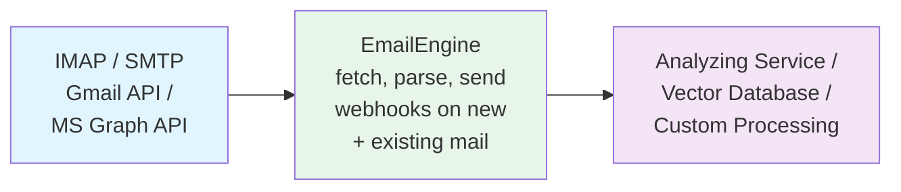

# Continuous Email Processing

Continuous email processing enables you to build real-time pipelines that analyze, archive, and act on emails as they arrive. Unlike one-time exports, continuous processing keeps your systems synchronized with the latest email data, making it ideal for AI analysis, vector databases, and automation workflows.

## Why Continuous Processing?

**Real-Time Analysis**
- Feed emails to AI/ML models as they arrive
- Generate summaries and insights instantly
- Detect patterns and anomalies in real-time

**Always Up-to-Date**
- No manual export/import cycles
- Latest emails always available
- Automatic synchronization

**Scalable Automation**
- Process thousands of emails automatically
- Trigger workflows based on content
- Integrate with downstream systems

**Use Cases**
- Vector embeddings for semantic search
- Customer support automation
- Compliance monitoring
- Business intelligence
- Email analytics

## Architecture Overview



**EmailEngine acts as the bridge:**
1. Connects to email providers (IMAP, Gmail API, MS Graph)
2. Monitors for new and existing messages
3. Parses and normalizes email data
4. Sends webhooks to your processing service
5. Provides API for additional operations

## Setting Up Continuous Processing

### Step 1: Configure notifyFrom for Historical Emails

For IMAP accounts, EmailEngine can treat existing emails as "new" by setting `notifyFrom` to a past date using the [Register Account API endpoint](/docs/api/post-v-1-account):

```javascript
async function addAccountWithHistoricalProcessing(accountId, credentials) {
  const response = await fetch(
    'https://emailengine.example.com/v1/account',
    {
      method: 'POST',
      headers: {
        'Authorization': 'Bearer YOUR_ACCESS_TOKEN',
        'Content-Type': 'application/json'
      },
      body: JSON.stringify({
        account: accountId,
        name: credentials.name,
        email: credentials.email,
        // Process all emails since 1970 (effectively all emails)
        notifyFrom: '1970-01-01T00:00:00.000Z',
        imap: {
          auth: {
            user: credentials.username,
            pass: credentials.password
          },
          host: credentials.host,
          port: 993,
          secure: true
        }
      })
    }
  );

  return await response.json();
}

// Add account and process all historical emails
await addAccountWithHistoricalProcessing('example', {
  name: 'John Doe',
  email: 'john@example.com',
  username: 'john@example.com',
  password: 'password',
  host: 'imap.example.com'
});
```

### Step 2: Use Hosted Authentication (Alternative)

Generate an authentication link with `notifyFrom`:

```javascript
async function generateAuthLink(accountId, redirectUrl) {
  const response = await fetch(
    'https://emailengine.example.com/v1/authentication/form',
    {
      method: 'POST',
      headers: {
        'Authorization': 'Bearer YOUR_ACCESS_TOKEN',
        'Content-Type': 'application/json'
      },
      body: JSON.stringify({
        account: accountId,
        notifyFrom: '1970-01-01T00:00:00.000Z',
        redirectUrl: redirectUrl
      })
    }
  );

  const data = await response.json();
  return data.url; // Send this URL to the user
}

// Generate link
const authUrl = await generateAuthLink('example', 'https://myapp.com/callback');
console.log('User authentication URL:', authUrl);
```

### Step 3: Configure Webhooks

Enable webhooks to receive email notifications using the [Update Settings API endpoint](/docs/api/post-v-1-settings):

```bash
curl -X POST "https://emailengine.example.com/v1/settings" \
  -H "Authorization: Bearer YOUR_ACCESS_TOKEN" \
  -H "Content-Type: application/json" \
  -d '{
    "webhooks": "https://your-app.com/webhooks/emailengine",
    "webhooksEnabled": true,
    "notifyHeaders": ["*"],
    "notifyTextSize": 2097152,
    "notifyWebSafeHtml": true,
    "notifyCalendarEvents": true
  }'
```

### Step 4: Optimize for Processing Speed

For pure processing pipelines (no UI needed), use "fast" indexing:

```bash
curl -X POST "https://emailengine.example.com/v1/settings" \
  -H "Authorization: Bearer YOUR_ACCESS_TOKEN" \
  -H "Content-Type: application/json" \
  -d '{
    "imapIndexer": "fast"
  }'
```

**Differences between indexing methods:**

| Feature | Full | Fast |
|---------|------|------|
| New message webhooks | Yes | Yes |
| Message update webhooks | Yes | No |
| Message delete webhooks | Yes | No |
| Flag change webhooks | Yes | No |
| Processing speed | Slower | Faster |
| Use case | Full sync | Processing only |

## Processing Pipeline Implementations

### Basic Processing Pipeline

Simple webhook handler that processes all messages:

```javascript
const express = require('express');
const app = express();

app.use(express.json());

app.post('/webhooks/emailengine', async (req, res) => {
  const event = req.body;

  // Acknowledge immediately
  res.status(200).json({ success: true });

  // Process asynchronously
  if (event.event === 'messageNew') {
    await processMessage(event);
  }
});

async function processMessage(event) {
  const { account, data } = event;

  console.log(`Processing message from ${account}:`);
  console.log(`- Subject: ${data.subject}`);
  console.log(`- From: ${data.from.address}`);
  console.log(`- Date: ${data.date}`);

  try {
    // Extract text content
    const content = data.text?.plain || (data.text?.html ? stripHtml(data.text.html) : '');

    // Process the email
    await processEmailContent({
      accountId: account,
      messageId: data.id,
      subject: data.subject,
      from: data.from.address,
      date: data.date,
      content: content,
      hasAttachments: data.attachments && data.attachments.length > 0
    });

    console.log('SUCCESS: Processed successfully');
  } catch (err) {
    console.error('FAIL: Processing failed:', err.message);
  }
}

function stripHtml(html) {
  return html.replace(/<[^>]*>/g, ' ').replace(/\s+/g, ' ').trim();
}

app.listen(3000, () => {
  console.log('Processing pipeline running on port 3000');
});
```

### Vector Database Integration

Feed emails to a vector database for semantic search:

```javascript
const { OpenAI } = require('openai');
const { PineconeClient } = require('@pinecone-database/pinecone');

const openai = new OpenAI({ apiKey: process.env.OPENAI_API_KEY });
const pinecone = new PineconeClient();

async function initializePinecone() {
  await pinecone.init({
    apiKey: process.env.PINECONE_API_KEY,
    environment: process.env.PINECONE_ENV
  });
}

async function processEmailContent(email) {
  // Generate embedding
  const text = `${email.subject} ${email.content}`;

  const embeddingResponse = await openai.embeddings.create({
    model: 'text-embedding-ada-002',
    input: text.substring(0, 8000) // Token limit
  });

  const embedding = embeddingResponse.data[0].embedding;

  // Store in Pinecone
  const index = pinecone.Index('emails');

  await index.upsert({
    vectors: [{
      id: email.messageId,
      values: embedding,
      metadata: {
        accountId: email.accountId,
        subject: email.subject,
        from: email.from,
        date: email.date,
        hasAttachments: email.hasAttachments
      }
    }]
  });

  console.log(`Added to vector database: ${email.subject}`);
}

// Initialize
initializePinecone().then(() => {
  console.log('Pinecone initialized');
});
```

### AI Analysis Pipeline

Analyze emails with AI and store results:

```javascript
const { OpenAI } = require('openai');
const openai = new OpenAI({ apiKey: process.env.OPENAI_API_KEY });

async function processEmailContent(email) {
  const text = `${email.subject}\n\n${email.content}`;

  // Generate summary
  const summary = await generateSummary(text);

  // Extract entities
  const entities = await extractEntities(text);

  // Classify sentiment
  const sentiment = await analyzeSentiment(text);

  // Store analysis
  await storeAnalysis({
    messageId: email.messageId,
    accountId: email.accountId,
    subject: email.subject,
    from: email.from,
    date: email.date,
    summary: summary,
    entities: entities,
    sentiment: sentiment,
    processedAt: new Date()
  });

  console.log(`Analyzed: ${email.subject}`);
  console.log(`- Sentiment: ${sentiment}`);
  console.log(`- Entities: ${entities.join(', ')}`);
  console.log(`- Summary: ${summary.substring(0, 100)}...`);
}

async function generateSummary(text) {
  const response = await openai.chat.completions.create({
    model: 'gpt-4',
    messages: [
      {
        role: 'system',
        content: 'Summarize the following email in 2-3 sentences.'
      },
      {
        role: 'user',
        content: text.substring(0, 4000)
      }
    ],
    max_tokens: 150
  });

  return response.choices[0].message.content.trim();
}

async function extractEntities(text) {
  const response = await openai.chat.completions.create({
    model: 'gpt-4',
    messages: [
      {
        role: 'system',
        content: 'Extract key entities (people, companies, products) from this email. Return as comma-separated list.'
      },
      {
        role: 'user',
        content: text.substring(0, 4000)
      }
    ],
    max_tokens: 100
  });

  const entitiesStr = response.choices[0].message.content.trim();
  return entitiesStr.split(',').map(e => e.trim()).filter(e => e);
}

async function analyzeSentiment(text) {
  const response = await openai.chat.completions.create({
    model: 'gpt-4',
    messages: [
      {
        role: 'system',
        content: 'Analyze the sentiment of this email. Respond with only: positive, negative, or neutral.'
      },
      {
        role: 'user',
        content: text.substring(0, 4000)
      }
    ],
    max_tokens: 10
  });

  return response.choices[0].message.content.trim().toLowerCase();
}

async function storeAnalysis(analysis) {
  // Store in database
  await db.collection('email_analysis').insertOne(analysis);
}
```

### Queue-Based Processing

Use a message queue for reliable processing:

```javascript
const Bull = require('bull');
const processingQueue = new Bull('email-processing', {
  redis: {
    host: 'localhost',
    port: 6379
  }
});

// Webhook handler adds jobs to queue
app.post('/webhooks/emailengine', async (req, res) => {
  const event = req.body;

  res.status(200).json({ success: true });

  if (event.event === 'messageNew') {
    // Add to queue
    await processingQueue.add('process-email', {
      account: event.account,
      data: event.data
    }, {
      attempts: 3,
      backoff: {
        type: 'exponential',
        delay: 2000
      }
    });
  }
});

// Process jobs from queue
processingQueue.process('process-email', async (job) => {
  const { account, data } = job.data;

  console.log(`Processing queued message: ${data.subject}`);

  // Update progress
  job.progress(25);

  // Process email
  const content = data.text?.plain || stripHtml(data.text?.html || '');

  job.progress(50);

  await processEmailContent({
    accountId: account,
    messageId: data.id,
    subject: data.subject,
    from: data.from.address,
    content: content
  });

  job.progress(100);

  return { success: true, messageId: data.id };
});

// Monitor queue
processingQueue.on('completed', (job, result) => {
  console.log(`SUCCESS: Job ${job.id} completed: ${result.messageId}`);
});

processingQueue.on('failed', (job, err) => {
  console.error(`FAIL: Job ${job.id} failed:`, err.message);
});
```

## Handling Large Volumes

### Batch Processing

Process messages in batches for efficiency:

```javascript
const messageBatch = [];
const BATCH_SIZE = 50;
const BATCH_TIMEOUT = 5000; // 5 seconds

let batchTimer = null;

app.post('/webhooks/emailengine', async (req, res) => {
  const event = req.body;

  res.status(200).json({ success: true });

  if (event.event === 'messageNew') {
    messageBatch.push(event);

    // Process when batch is full or timeout
    if (messageBatch.length >= BATCH_SIZE) {
      clearTimeout(batchTimer);
      await processBatch();
    } else if (!batchTimer) {
      batchTimer = setTimeout(processBatch, BATCH_TIMEOUT);
    }
  }
});

async function processBatch() {
  if (messageBatch.length === 0) return;

  const batch = messageBatch.splice(0, messageBatch.length);
  batchTimer = null;

  console.log(`Processing batch of ${batch.length} messages`);

  try {
    // Process in parallel with concurrency limit
    const concurrency = 10;

    for (let i = 0; i < batch.length; i += concurrency) {
      const chunk = batch.slice(i, i + concurrency);

      await Promise.all(
        chunk.map(event => processMessage(event))
      );
    }

    console.log(`SUCCESS: Batch processed successfully`);
  } catch (err) {
    console.error(`FAIL: Batch processing failed:`, err);
  }
}
```

### Rate Limiting

Respect API rate limits for downstream services:

```javascript
const Bottleneck = require('bottleneck');

// Create rate limiter: 10 requests per second
const limiter = new Bottleneck({
  minTime: 100, // Min 100ms between requests
  maxConcurrent: 5 // Max 5 concurrent
});

async function processEmailContent(email) {
  // Wrap API calls with rate limiter
  return await limiter.schedule(async () => {
    const embedding = await generateEmbedding(email.content);
    await storeInDatabase(email, embedding);
  });
}
```

### Selective Processing

Process only relevant messages:

```javascript
async function processMessage(event) {
  const { data } = event;

  // Filter criteria
  if (!shouldProcess(data)) {
    console.log(`Skipping: ${data.subject}`);
    return;
  }

  await processEmailContent({
    accountId: event.account,
    messageId: data.id,
    subject: data.subject,
    from: data.from.address,
    content: data.text?.plain
  });
}

function shouldProcess(message) {
  // Skip spam
  if (message.labels && message.labels.includes('\\Junk')) {
    return false;
  }

  // Skip if no content
  if (!message.text?.plain && !message.text?.html) {
    return false;
  }

  // Process only recent messages
  const messageDate = new Date(message.date);
  const thirtyDaysAgo = new Date();
  thirtyDaysAgo.setDate(thirtyDaysAgo.getDate() - 30);

  if (messageDate < thirtyDaysAgo) {
    return false;
  }

  // Process only messages from specific domains
  const allowedDomains = ['example.com', 'company.com'];
  const fromDomain = message.from.address.split('@')[1];

  if (!allowedDomains.includes(fromDomain)) {
    return false;
  }

  return true;
}
```

## Monitoring and Observability

### Track Processing Metrics

```javascript
const metrics = {
  received: 0,
  processed: 0,
  failed: 0,
  skipped: 0,
  processingTime: []
};

async function processMessage(event) {
  metrics.received++;

  const startTime = Date.now();

  try {
    if (!shouldProcess(event.data)) {
      metrics.skipped++;
      return;
    }

    await processEmailContent({
      accountId: event.account,
      messageId: event.data.id,
      subject: event.data.subject,
      from: event.data.from.address,
      content: event.data.text?.plain
    });

    metrics.processed++;

    const duration = Date.now() - startTime;
    metrics.processingTime.push(duration);

    // Keep only last 1000 timings
    if (metrics.processingTime.length > 1000) {
      metrics.processingTime.shift();
    }
  } catch (err) {
    metrics.failed++;
    console.error('Processing error:', err);
  }
}

// Metrics endpoint
app.get('/metrics', (req, res) => {
  const avgTime = metrics.processingTime.length > 0
    ? metrics.processingTime.reduce((a, b) => a + b) / metrics.processingTime.length
    : 0;

  res.json({
    received: metrics.received,
    processed: metrics.processed,
    failed: metrics.failed,
    skipped: metrics.skipped,
    averageProcessingTime: Math.round(avgTime) + 'ms',
    successRate: ((metrics.processed / metrics.received) * 100).toFixed(2) + '%'
  });
});
```

### Health Checks

```javascript
let lastMessageReceived = Date.now();

app.post('/webhooks/emailengine', async (req, res) => {
  lastMessageReceived = Date.now();
  // ... process webhook
});

app.get('/health', (req, res) => {
  const timeSinceLastMessage = Date.now() - lastMessageReceived;
  const fifteenMinutes = 15 * 60 * 1000;

  if (timeSinceLastMessage > fifteenMinutes) {
    return res.status(503).json({
      status: 'unhealthy',
      reason: 'No messages received in 15 minutes',
      lastMessageAt: new Date(lastMessageReceived).toISOString()
    });
  }

  res.json({
    status: 'healthy',
    lastMessageAt: new Date(lastMessageReceived).toISOString(),
    uptime: process.uptime()
  });
});
```

## Important Notes

### notifyFrom Behavior

**IMAP Accounts:**
- `notifyFrom` treats existing messages as "new"
- Webhooks sent for all messages newer than date
- Works for initial processing of historical data

**Gmail API / MS Graph:**
- `notifyFrom` does NOT work (API limitation)
- Only new messages trigger webhooks
- Historical processing requires different approach

### Duplicate Detection

Messages can appear "new" in multiple scenarios:

**Moving messages:**
- Moving a message creates a "new" message in destination folder
- Use `emailId` to detect duplicates

**Multiple labels (Gmail):**
- A message with multiple labels appears in each labeled folder
- EmailEngine sends separate webhooks for each location

```javascript
const processedEmailIds = new Set();

async function processMessage(event) {
  const { data } = event;

  // Deduplicate by emailId
  if (processedEmailIds.has(data.emailId)) {
    console.log('Already processed this email');
    return;
  }

  processedEmailIds.add(data.emailId);

  await processEmailContent({
    accountId: event.account,
    messageId: data.id,
    emailId: data.emailId,
    subject: data.subject,
    content: data.text
  });

  // Clean up old IDs periodically
  if (processedEmailIds.size > 10000) {
    const toRemove = Array.from(processedEmailIds).slice(0, 5000);
    toRemove.forEach(id => processedEmailIds.delete(id));
  }
}
```

## See Also

- [Webhooks overview](/docs/webhooks/overview) - Delivery guarantees and retries for the events driving a pipeline
- [IMAP indexers](/docs/accounts/imap-indexers) - Choosing how much change detection a pipeline needs
- [Pre-processing](/docs/advanced/pre-processing) - Filtering events before they reach your endpoint
- [Exporting messages](/docs/receiving/exporting) - Backfilling history the pipeline did not see
