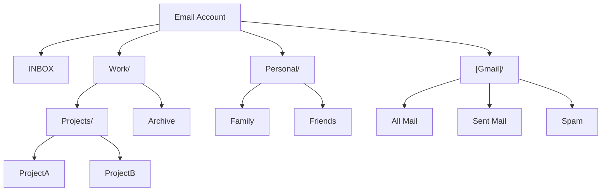

# Mailbox Operations

Mailbox operations in EmailEngine allow you to list, manage, and work with email folders (also called mailboxes in IMAP terminology). Understanding folder structure and special-use folders is essential for properly routing messages and building email applications.

## Understanding Mailboxes

### What is a Mailbox?

In IMAP terms, a "mailbox" is what most users think of as a "folder." Each mailbox can contain:

- Email messages
- Sub-mailboxes (nested folders)
- Metadata (message count, flags, etc.)

For Gmail API accounts a mailbox is a label, and for Microsoft Graph accounts it is a mail folder. EmailEngine presents all three through the same listing shape.

### The Special INBOX

**INBOX is unique:**

- It's the **only guaranteed folder** on every account
- Name is **case-insensitive** (INBOX, Inbox, inbox all work)
- All other folder names are **case-sensitive**
- Cannot be deleted

It's entirely valid for an account to have only INBOX and no other folders.

### Folder Hierarchies

Folders can be nested using a delimiter (usually `/` or `.`):



Gmail API and Microsoft Graph accounts always report `/` as the delimiter. IMAP servers report their own, and a server may report `null` when it uses no hierarchy at all.

## Special-Use Folders

### What are Special-Use Folders?

Special-use folders indicate a folder's intended purpose regardless of its name. This solves the multi-language problem where "Sent Mail" might be "Saadetud kirjad" in Estonian or "Correo enviado" in Spanish.

### Special-Use Flags

EmailEngine recognizes these special-use flags:

| Flag       | Purpose              | Example Names                        |
| ---------- | -------------------- | ------------------------------------ |
| `\Inbox`   | Main inbox           | INBOX                                |
| `\Flagged` | Starred/flagged      | Starred, Flagged                     |
| `\Sent`    | Sent emails          | Sent Mail, Saadetud kirjad, Enviados |
| `\Drafts`  | Draft emails         | Drafts, Mustandid, Borradores        |
| `\Trash`   | Deleted emails       | Trash, Prügikast, Papelera           |
| `\Junk`    | Spam emails          | Junk, Rämps, Spam                    |
| `\Archive` | Archived emails      | Archive, Arhiiv, Archivo             |
| `\All`     | All emails (virtual) | All Mail, Todos                      |

Which flags an account can carry depends on the backend:

- **IMAP** accounts can carry any of the eight. `\Flagged`, `\Archive` and `\All` only come from IMAP servers that expose such folders, Gmail's IMAP endpoint among them (`[Gmail]/Starred`, `[Gmail]/All Mail`).
- **Gmail API** accounts map the system labels `INBOX`, `SENT`, `DRAFT`, `TRASH` and `SPAM` to `\Inbox`, `\Sent`, `\Drafts`, `\Trash` and `\Junk`, and add a virtual `\All` entry. The `STARRED` and `IMPORTANT` system labels and the `CATEGORY_*` tab labels are not listed as folders.
- **Microsoft Graph** accounts map the well-known folders `inbox`, `sentitems`, `drafts`, `deleteditems` and `junkemail` to `\Inbox`, `\Sent`, `\Drafts`, `\Trash` and `\Junk`, and add a virtual `\All` entry.

### Special-Use Sources

EmailEngine indicates how it determined a folder's special-use flag in `specialUseSource`:

**`extension`** - The server reported it (most reliable)

```json
{
  "path": "[Gmail]/Sent Mail",
  "specialUse": "\\Sent",
  "specialUseSource": "extension"
}
```

For IMAP accounts this means the server advertised the folder's role through the SPECIAL-USE extension ([RFC 6154](https://www.rfc-editor.org/rfc/rfc6154)) or Gmail's older XLIST. Gmail API and Microsoft Graph accounts always report `extension`, because the label or well-known folder name carries the role.

**`name`** - Matched against known folder names (fallback)

```json
{
  "path": "Sent Items",
  "specialUse": "\\Sent",
  "specialUseSource": "name"
}
```

Used for IMAP servers that do not advertise SPECIAL-USE. The match runs against a list of folder names in common languages, so a folder named in a language the list does not cover, or named unconventionally, gets no flag or the wrong one.

**`user`** - You configured it (highest priority)

```json
{
  "path": "My Custom Sent Folder",
  "specialUse": "\\Sent",
  "specialUseSource": "user"
}
```

:::warning Localized folder names on servers without SPECIAL-USE
When a server does not report folder roles and EmailEngine has to guess from the name, check the listing once after connecting the account. If a special folder is missing or wrong, set it explicitly with `imap.sentMailPath`, `imap.draftsMailPath`, `imap.junkMailPath`, `imap.trashMailPath` or `imap.archiveMailPath`. See [Overriding Special-Use Folders](#overriding-special-use-folders).
:::

## Listing Mailboxes

### Basic Listing

List all mailboxes for an account using the [mailboxes API](/docs/api/get-v-1-account-account-mailboxes):

```bash
curl "https://emailengine.example.com/v1/account/example/mailboxes" \
  -H "Authorization: Bearer YOUR_ACCESS_TOKEN"
```

**Response:**

```json
{
  "mailboxes": [
    {
      "path": "INBOX",
      "delimiter": "/",
      "parentPath": "",
      "name": "INBOX",
      "listed": true,
      "subscribed": true,
      "specialUse": "\\Inbox",
      "specialUseSource": "name",
      "noInferiors": false,
      "messages": 1523,
      "uidNext": 12456
    },
    {
      "path": "[Gmail]/Sent Mail",
      "delimiter": "/",
      "parentPath": "[Gmail]",
      "name": "Sent Mail",
      "listed": true,
      "subscribed": true,
      "specialUse": "\\Sent",
      "specialUseSource": "extension",
      "noInferiors": false,
      "messages": 891,
      "uidNext": 2485
    },
    {
      "path": "Work/Projects",
      "delimiter": "/",
      "parentPath": "Work",
      "name": "Projects",
      "listed": true,
      "subscribed": true,
      "noInferiors": false,
      "messages": 45,
      "uidNext": 78
    }
  ]
}
```

For a connected IMAP account EmailEngine runs a LIST on the live connection and merges the result with its stored folder tree; while the account is disconnected it returns the stored tree alone, and answers 503 if the account has never connected (code `NotYetConnected`) or syncing is switched off (`NotSyncing`). `messages` and `uidNext` are the values EmailEngine last saw for the folder, and are `false` when it has not synced that folder yet.

### Response Fields

| Field              | Description                                                                                                                     |
| ------------------ | ------------------------------------------------------------------------------------------------------------------------------- |
| `path`             | Full folder path (use this for API calls)                                                                                       |
| `id`               | Stable folder identifier. Gmail API (the label ID) and Microsoft Graph (the folder ID) accounts only                            |
| `delimiter`        | Hierarchy delimiter (usually `/` or `.`), or `null` when the server uses none                                                   |
| `parentPath`       | Parent folder path (empty for top-level)                                                                                        |
| `name`             | Display name (last part of path)                                                                                                |
| `listed`           | Whether folder is listed (vs hidden)                                                                                            |
| `subscribed`       | Whether user is subscribed to folder                                                                                            |
| `noSelect`         | `true` for folders that cannot be opened, such as the virtual `\All` entry on Gmail API and Graph accounts                     |
| `specialUse`       | Special-use flag if applicable (`\Sent`, `\Drafts`, etc.)                                                                       |
| `specialUseSource` | How special-use was determined (`extension`, `name`, `user`)                                                                    |
| `noInferiors`      | Whether this mailbox can contain child mailboxes (IMAP)                                                                         |
| `messages`         | Message count from EmailEngine's index (IMAP). `false` when not yet known                                                      |
| `uidNext`          | Next expected UID from EmailEngine's index (IMAP). `false` when not yet known                                                  |
| `status`           | Live counters, only with `counters=true`: `messages` and `unseen`, or `error` if the server refused the STATUS for this folder |

### Live Counters

Add `counters=true` to get the current message and unseen counts straight from the server:

```bash
curl "https://emailengine.example.com/v1/account/example/mailboxes?counters=true" \
  -H "Authorization: Bearer YOUR_ACCESS_TOKEN"
```

Each entry then carries a `status` object:

```json
{
  "path": "INBOX",
  "name": "INBOX",
  "specialUse": "\\Inbox",
  "messages": 1523,
  "uidNext": 12456,
  "status": {
    "messages": 1524,
    "unseen": 12
  }
}
```

For IMAP accounts this runs a LIST and a STATUS per folder on the live connection, so it is slower than the default listing and needs the account to be connected. Gmail API accounts fetch each label's detail (cached for 60 seconds), and Graph accounts refresh their folder cache.

### Using Special-Use Folders

Find the sent folder regardless of name:

```javascript
async function getSentFolder(accountId) {
  const response = await fetch(`https://emailengine.example.com/v1/account/${accountId}/mailboxes`, {
    headers: { Authorization: "Bearer YOUR_ACCESS_TOKEN" },
  });

  const data = await response.json();

  // Find folder with \Sent special-use flag
  const sentFolder = data.mailboxes.find((mailbox) => mailbox.specialUse === "\\Sent");

  return sentFolder ? sentFolder.path : null;
}
```

List all messages from the sent folder:

```javascript
async function listSentMessagesManual(accountId) {
  const sentPath = await getSentFolder(accountId);

  if (!sentPath) {
    throw new Error("Sent folder not found");
  }

  const response = await fetch(`https://emailengine.example.com/v1/account/${accountId}/messages?path=${encodeURIComponent(sentPath)}`, {
    headers: { Authorization: "Bearer YOUR_ACCESS_TOKEN" },
  });

  return await response.json();
}
```

List all messages from the sent folder using special-use flag alias:

```javascript
async function listSentMessages(accountId) {
  // Use special-use flag directly - EmailEngine resolves the actual path
  const response = await fetch(`https://emailengine.example.com/v1/account/${accountId}/messages?path=${encodeURIComponent("\\Sent")}`, {
    headers: { Authorization: "Bearer YOUR_ACCESS_TOKEN" },
  });

  return await response.json();
}
```

:::tip Special-Use Flag Aliases
The message endpoints accept `\Inbox`, `\Sent`, `\Drafts`, `\Trash` and `\Junk` as the `path` parameter and resolve the alias to the folder's real path before running the operation. `\All` is accepted for Gmail IMAP, Gmail API and Microsoft Graph accounts and covers every message in the account. `\Archive` and `\Flagged` are not aliases: read the folder's path from the listing, as above.
:::

## Creating Mailboxes

### Create a New Folder

Create a mailbox folder using the [create mailbox API](/docs/api/post-v-1-account-account-mailbox):

```bash
curl -X POST "https://emailengine.example.com/v1/account/example/mailbox" \
  -H "Authorization: Bearer YOUR_ACCESS_TOKEN" \
  -H "Content-Type: application/json" \
  -d '{
    "path": ["Work", "NewProject"]
  }'
```

**Response:**

```json
{
  "path": "Work/NewProject",
  "mailboxId": "1439876283476",
  "created": true
}
```

`mailboxId` is included when the server provides one (Gmail API and Graph accounts, and IMAP servers with the OBJECTID extension). `created` is `false` when the folder already existed on a Gmail API or Graph account, or when an IMAP server refuses with a bare `NO`. An IMAP server that attaches a response code to its refusal, `[ALREADYEXISTS]` for an existing folder, gets a 400 instead, with that code in `code` and the server's text in `details.response`.

:::tip Array Syntax for Subfolders
Use array syntax `["Parent", "Child"]` instead of string `"Parent/Child"` when creating nested folders. Different servers use different delimiters (`/` vs `.`), and the array syntax works universally across all IMAP servers.
:::

### Automatic Namespace Handling

If the IMAP account uses a personal namespace prefix, EmailEngine adds it when it is missing from the requested path. On a server whose namespace is `INBOX.`, creating `{ "path": "test" }` creates `INBOX.test`.

### Nested Folders and Missing Parents

What happens when a parent in the path does not exist depends on the backend:

- **IMAP**: the request is passed to the server. Most servers create the missing parents as part of the CREATE, but that is the server's decision, not EmailEngine's.
- **Gmail API**: EmailEngine sends the joined path (`Personal/Finance/2025`) as the label name. How the `/` characters nest the label is Gmail's interpretation of the name.
- **Microsoft Graph**: the parent folder must already exist. A missing parent fails the request with a 404 and the message "Not able to find parent folder".

Create the levels one at a time when the code has to work on every backend:

```javascript
async function createFolder(accountId, folderPath) {
  const response = await fetch(`https://emailengine.example.com/v1/account/${accountId}/mailbox`, {
    method: "POST",
    headers: {
      Authorization: "Bearer YOUR_ACCESS_TOKEN",
      "Content-Type": "application/json",
    },
    body: JSON.stringify({ path: folderPath }),
  });

  const result = await response.json();

  if (!response.ok) {
    // An IMAP server may refuse an existing folder with a 400 and the code ALREADYEXISTS
    if (result.code === "ALREADYEXISTS") {
      return { path: folderPath.join("/"), created: false };
    }
    throw new Error(result.message);
  }

  return result;
}

// Creates Personal, then Personal/Finance, then Personal/Finance/2025.
// Levels that already exist come back with created: false.
const levels = ["Personal", "Finance", "2025"];
for (let depth = 1; depth <= levels.length; depth++) {
  await createFolder("example", levels.slice(0, depth));
}
```

## Renaming Mailboxes

### Rename a Folder

Rename a mailbox using the [modify mailbox API](/docs/api/put-v-1-account-account-mailbox):

```bash
curl -X PUT "https://emailengine.example.com/v1/account/example/mailbox" \
  -H "Authorization: Bearer YOUR_ACCESS_TOKEN" \
  -H "Content-Type: application/json" \
  -d '{
    "path": "Work/OldProject",
    "newPath": ["Work", "CompletedProject"]
  }'
```

**Response:**

```json
{
  "path": "Work/OldProject",
  "newPath": "Work/CompletedProject",
  "renamed": true
}
```

Gmail API and Graph accounts also return `mailboxId`. On a Gmail API account only user labels can be renamed; a system label such as `INBOX` or `SENT` comes back with `renamed: false`.

The same endpoint changes the subscription state of an IMAP folder with `"subscribed": true` or `false`. A rename that does not mention `subscribed` subscribes the renamed folder. Only IMAP has a subscription list, so the field is ignored for Gmail API and Graph accounts. Subscription affects which folders a mail client that lists subscribed folders shows; it does not affect what EmailEngine syncs.

### Rename with Children

On an IMAP server, renaming a folder that has subfolders renames the subfolders with it, as [RFC 3501](https://www.rfc-editor.org/rfc/rfc3501#section-6.3.5) requires:

```javascript
// Rename Work/Projects to Work/Archive
// Also renames:
//   Work/Projects/ProjectA -> Work/Archive/ProjectA
//   Work/Projects/ProjectB -> Work/Archive/ProjectB

await fetch(`https://emailengine.example.com/v1/account/example/mailbox`, {
  method: "PUT",
  headers: {
    Authorization: "Bearer YOUR_ACCESS_TOKEN",
    "Content-Type": "application/json",
  },
  body: JSON.stringify({
    path: "Work/Projects",
    newPath: ["Work", "Archive"],
  }),
});
```

## Deleting Mailboxes

### Delete a Folder

Delete a mailbox using the [delete mailbox API](/docs/api/delete-v-1-account-account-mailbox):

```bash
curl -X DELETE "https://emailengine.example.com/v1/account/example/mailbox?path=Work%2FOldProject" \
  -H "Authorization: Bearer YOUR_ACCESS_TOKEN"
```

**Response:**

```json
{
  "path": "Work/OldProject",
  "deleted": true
}
```

### What Delete Does Per Backend

- **IMAP**: EmailEngine issues a DELETE and reports `deleted: false` if the server refuses. INBOX cannot be deleted, and whether a folder with subfolders or messages can be is the server's rule. What happens to the messages inside a deleted folder is also the server's decision; do not rely on them being moved to Trash.
- **Gmail API**: the folder is a label. Deleting a user label removes that label from its messages; the messages remain in the account. System labels cannot be deleted and come back with `deleted: false`.
- **Microsoft Graph**: the folder is deleted through the Graph API. A path that does not resolve fails with a 404.

When the code has to work everywhere, delete the deepest folders first, so the request never depends on how a server treats subfolders:

```javascript
async function deleteFolder(accountId, folderPath) {
  const response = await fetch(
    `https://emailengine.example.com/v1/account/${accountId}/mailbox?path=${encodeURIComponent(folderPath)}`,
    {
      method: "DELETE",
      headers: { Authorization: "Bearer YOUR_ACCESS_TOKEN" },
    }
  );

  return await response.json();
}

await deleteFolder("example", "Work/Projects/ProjectA");
await deleteFolder("example", "Work/Projects/ProjectB");
await deleteFolder("example", "Work/Projects");
```

## Overriding Special-Use Folders

Set the special folders yourself when the server does not report them or EmailEngine guessed wrong. The five `imap.*MailPath` fields on the account do this; [Custom special folder paths](/docs/accounts/imap-smtp#custom-special-folder-paths) documents each one.

```bash
curl -X PUT "https://emailengine.example.com/v1/account/example" \
  -H "Authorization: Bearer YOUR_ACCESS_TOKEN" \
  -H "Content-Type: application/json" \
  -d '{
    "imap": {
      "partial": true,
      "sentMailPath": "Custom/Sent Emails",
      "draftsMailPath": "Custom/Drafts",
      "junkMailPath": "Custom/Spam",
      "trashMailPath": "Custom/Trash",
      "archiveMailPath": "Custom/Archive"
    }
  }'
```

`"partial": true` merges these fields into the existing IMAP configuration. Without it the `imap` object replaces the stored one, credentials included. A folder set this way is listed with `specialUseSource: "user"`.

## Working with Gmail Labels and Outlook Categories

EmailEngine uses the `labels` array on a message for both Gmail labels and Microsoft Outlook categories, but the two are different things.

### Gmail Labels

Gmail uses labels instead of folders. EmailEngine lists each label as a folder, and a message that carries several labels appears in each of those folders. The path of a system folder differs between Gmail's IMAP endpoint and the Gmail API:

| Special use | Gmail IMAP path   | Gmail API path |
| ----------- | ----------------- | -------------- |
| `\Inbox`    | INBOX             | INBOX          |
| `\Sent`     | [Gmail]/Sent Mail | SENT           |
| `\Drafts`   | [Gmail]/Drafts    | DRAFT          |
| `\Trash`    | [Gmail]/Trash     | TRASH          |
| `\Junk`     | [Gmail]/Spam      | SPAM           |
| `\All`      | [Gmail]/All Mail  | \All (virtual) |

Use the special-use flag rather than either path when the code has to work on both.

**Multiple Labels:**

A Gmail message can have multiple labels, which EmailEngine represents in the `labels` array. System labels appear as special-use flags, user labels by name:

```json
{
  "id": "AAAAAQAAMqo",
  "path": "[Gmail]/All Mail",
  "labels": ["\\Inbox", "Work", "Invoices"],
  "specialUse": "\\All"
}
```

**Gmail label characteristics:**

- A label is a folder in the listing. Create, rename and delete labels with the mailbox endpoints above
- A message keeps every label it carries, so "moving" it between labels is an add and a remove
- Available on Gmail IMAP and Gmail API accounts

### Microsoft Outlook Categories

For accounts using the **Microsoft Graph API** backend, the `labels` array carries the message's Outlook categories (added in v2.58.0):

```json
{
  "id": "AAMkADU1...",
  "path": "Inbox",
  "labels": ["Blue category", "Red category"]
}
```

**Outlook category characteristics:**

- A category is a tag on the message, not a folder. It does not appear in the mailbox listing and does not change where the message is
- EmailEngine writes the category names to the message. It does not manage the mailbox's master category list, so names, colors, renames and deletions of categories themselves are done in Outlook
- Only available on Microsoft Graph accounts; Outlook accounts connected over IMAP have no categories

## Common Folder Patterns

### Finding Inbox

```javascript
async function getInboxPath(accountId) {
  const response = await fetch(`https://emailengine.example.com/v1/account/${accountId}/mailboxes`, {
    headers: { Authorization: "Bearer YOUR_ACCESS_TOKEN" },
  });

  const data = await response.json();

  // Every backend flags the inbox, whatever it is called ("INBOX", "Inbox")
  const inbox = data.mailboxes.find((m) => m.specialUse === "\\Inbox");

  return inbox.path;
}
```

### Finding All Special-Use Folders

```javascript
async function getSpecialUseFolders(accountId) {
  const response = await fetch(`https://emailengine.example.com/v1/account/${accountId}/mailboxes`, {
    headers: { Authorization: "Bearer YOUR_ACCESS_TOKEN" },
  });

  const data = await response.json();

  const specialFolders = {};

  data.mailboxes.forEach((mailbox) => {
    if (mailbox.specialUse) {
      const key = mailbox.specialUse.replace(/\\/g, "").toLowerCase();
      specialFolders[key] = mailbox.path;
    }
  });

  return specialFolders;
}

// Returns, for a Gmail IMAP account:
// {
//   inbox: "INBOX",
//   sent: "[Gmail]/Sent Mail",
//   drafts: "[Gmail]/Drafts",
//   trash: "[Gmail]/Trash",
//   junk: "[Gmail]/Spam",
//   flagged: "[Gmail]/Starred",
//   all: "[Gmail]/All Mail"
// }
```

## See Also

- [Message operations](/docs/receiving/message-operations) - Working with what is inside a folder
- [Custom special folder paths](/docs/accounts/imap-smtp#custom-special-folder-paths) - Overriding a folder EmailEngine guessed wrong
- [mailboxNew and mailboxDeleted](/docs/webhooks/mailboxnew) - Being told when the folder tree changes
- [Mailbox API](/docs/api/get-v-1-account-account-mailboxes) - The endpoint reference
